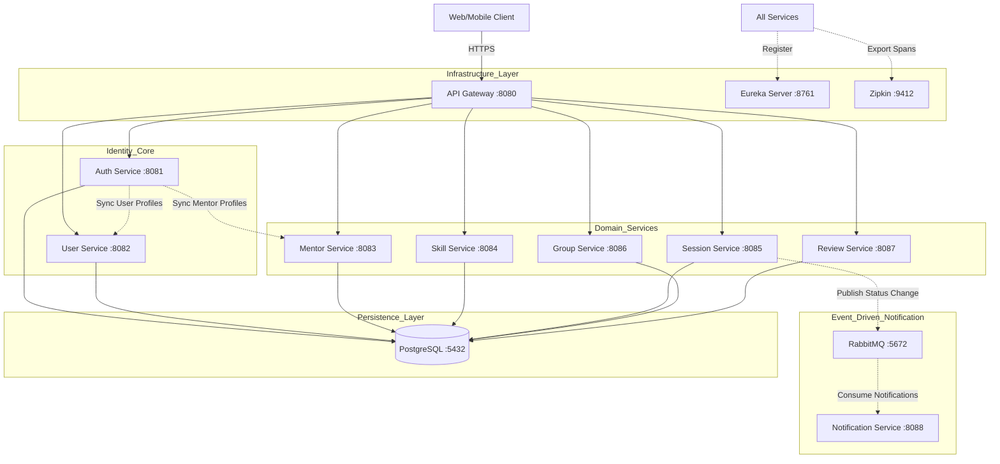
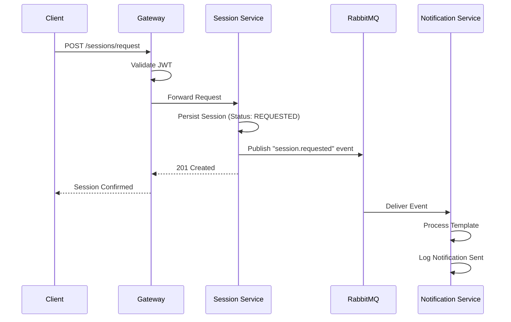
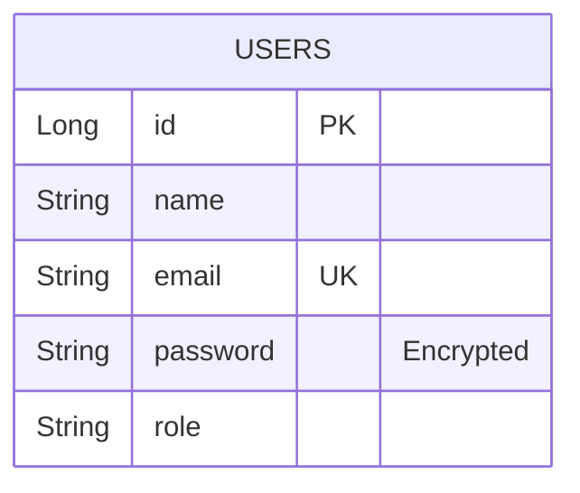
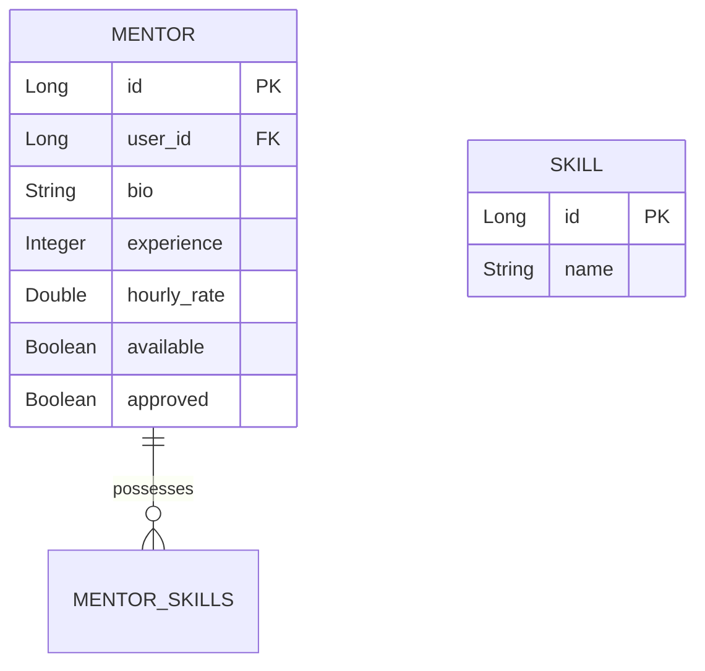
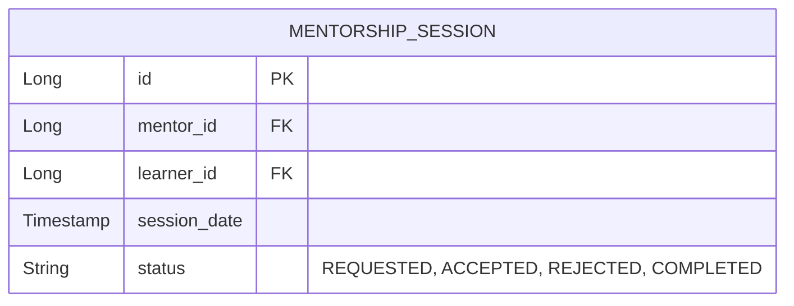

# SkillSync High-Level Design (HLD)

## 1. Introduction & Executive Summary
SkillSync is a state-of-the-art microservices-based platform designed to bridge the gap between mentors and learners. In the modern era of rapid skill acquisition, the platform provides a seamless, secure, and scalable environment for scheduling sessions, managing skill catalogs, and facilitating community-driven learning through study groups and reviews.

This document provides a comprehensive overview of the system's architecture, architectural patterns, technology stack, and the strategic rationale behind every design choice.

### 1.1 Project Goals
- **Accessibility**: Provide a low-latency interface for global users.
- **Scalability**: Handle thousands of concurrent users across multiple regions.
- **Security**: Implement a Zero-Trust security model using JWT and localized RBAC.
- **Resilience**: Ensure high availability through service discovery and circuit breaking.
- **Observability**: Maintain full visibility into distributed request flows.

---

## 2. System Architecture Overview
SkillSync follows a distributed microservices pattern, leveraging the Spring Cloud ecosystem for infrastructure management.

### 2.1 Core Architectural Patterns
- **Database Per Service**: Each service owns its schema to prevent tight coupling.
- **API Gateway**: A single entry point for all client requests, handling routing and security.
- **Service Discovery**: Netflix Eureka facilitates dynamic service registration and lookup.
- **Asynchronous Messaging**: RabbitMQ handles non-blocking background tasks like notifications.
- **Externalized Configuration**: Environment-backed properties for cloud-readiness.

### 2.2 System Components Diagram

---

## 3. Technology Stack Analysis
The platform utilizes a curated selection of modern technologies chosen for performance, stability, and developer ergonomics.

| Category | Technology | Rationale |
| :--- | :--- | :--- |
| **Runtime** | Java 21 | Long-Term Support (LTS) release with modern feature set (Virtual Threads, etc.) |
| **Framework** | Spring Boot 3.5.x | Industry standard for enterprise-grade Java applications |
| **Microservices** | Spring Cloud 2025.x | Comprehensive toolkit for building distributed systems |
| **Database** | PostgreSQL 16 | ACID-compliant relational DB with advanced JSON/array support |
| **Messaging** | RabbitMQ | Robust AMQP-compliant message broker for reliable event delivery |
| **Discovery** | Netflix Eureka | battle-tested service registration and discovery |
| **Gateway** | Spring Cloud Gateway | Built on Project Reactor for high-performance non-blocking routing |
| **Security** | Spring Security | Powerful, customizable authentication and access control |
| **Auth Token** | JJWT (io.jsonwebtoken) | Lightweight library for secure JWT creation and parsing |
| **Persistence** | Spring Data JPA | Abstracts repository implementation and simplifies DB operations |
| **Mapper** | Lombok | Reduces boilerplate code (Getters, Setters, Builders) |
| **Documentation** | SpringDoc OpenAPI | Automated Swagger-UI generation for API testing |
| **Tracing** | Brave & Zipkin | Distributed tracing following the OpenZipkin specification |
| **Container** | Docker & Compose | Consistent environment parity between dev and production |

---

## 4. In-Depth Component Analysis

### 4.1 API Gateway (:8080)
- **Role**: The gatekeeper. All client-side traffic enters the system here.
- **Why**: Prevents direct exposure of microservices, enables centralized CORS management, and simplifies client interaction by providing a single hostname.
- **How**: Uses Predicates (to match paths) and Filters (to modify requests/responses).
- **Flow**: Client Request -> Path Matching -> Eureka Lookup -> Load Balancer -> Downstream Forwarding.

### 4.2 Eureka Server (:8761)
- **Role**: The phonebook of the system.
- **Why**: In a containerized environment, IP addresses are dynamic. Eureka allows services to find each other by name (e.g., `lb://USER-SERVICE`) instead of static IPs.
- **Implementation**: A standalone Spring Boot app with `@EnableEurekaServer`.

### 4.3 Auth Service (:8081)
- **Role**: The Identity Provider (IdP).
- **Why**: Centralizes authentication logic to ensure security consistency.
- **How**: Implements JWT issuance and handles registration cascades.
- **Synchronous Logic**: On registration, it uses **Feign Clients** to push user data to `User Service` and `Mentor Service` concurrently.

### 4.4 Domain Services (User, Mentor, Session, Skill, Group, Review)
- **Role**: Business logic encapsulation.
- **Pattern**: Every service is built as a self-contained Spring Boot application with its own database schema.
- **Communication**: Services use Feign for synchronous "need to know" calls and RabbitMQ for "something happened" events.

### 4.5 Notification Service (:8088)
- **Role**: Asynchronous consumer.
- **Why**: Sending emails or push notifications can be slow. Moving this to a background service ensures that the core user experience (like clicking "Request Session") is instantaneous.

---

## 5. Distributed Tracing & Monitoring

### 5.1 Zipkin Integration
- **Mechanism**: Every request is assigned a `traceId`. As the request moves through the system (Gateway -> Auth -> User), the `traceId` is passed in the headers.
- **Benefit**: Allows developers to find exactly which service caused a delay or crash in a complex call chain.

### 5.2 Logging Patterns
- **Implementation**: Uses SLF4J with Logback.
- **Format**: `[%5p] [%t] [%X{traceId:-},%X{spanId:-}] %c{1}: %m%n`
- **Output**: Logs are streamed to STDOUT, where Docker or a logging aggregator (ELK/Splunk) can collect them.

---

## 6. Resilience Implementation (Resilience4j)
To prevent "cascading failures," where one slow service brings down the entire system, SkillSync implements Circuit Breakers.

### 6.1 Circuit Breaker Logic
- **Closed State**: Normal operation; calls are allowed through.
- **Open State**: Service is failing; calls are blocked immediately to save resources.
- **Half-Open State**: Test calls are allowed to see if the service has recovered.
- **Config**: Failure rate threshold is set to 50% over a sliding window of 10 calls.

---

## 8. Network Topology & Traffic Flow
The SkillSync project utilizes multiple networking layers to ensure request isolation and security.

### 8.1 Internal Connectivity (The Virtual Network)
When deployed using Docker Compose, all 10+ services reside on a private bridge network (e.g., `skillsync-network`). 
- **Internal Visibility**: Every service can see every other service via its container name or Eureka hostname.
- **External Exposure**: Only the `API Gateway (:8080)`, `Eureka Server (:8761)`, and `Zipkin (:9412)` expose their ports to the host machine. This minimizes the attack surface.

### 8.2 Request Lifecycle Trace
1.  **Ingress**: The client hits the Gateway at `:8080/auth/login`.
2.  **Routing**: The Gateway checks the path `/auth/**`. It identifies that this belongs to the `AUTH-SERVICE`.
3.  **Discovery**: Gateway queries Eureka: "Where is `AUTH-SERVICE`?". Eureka returns one or more active IP addresses.
4.  **Load Balancing**: Gateway uses Spring Cloud LoadBalancer to pick an instance.
5.  **Forwarding**: Gateway adds X-Forwarded headers and forwards the request.
6.  **Processing**: Auth Service validates credentials.
7.  **Egress**: Auth Service returns a 200 OK with a JWT.

---

## 9. Security Model: Zero-Trust Approach
Even though services are on a private network, SkillSync treats every request as potentially untrusted.

### 9.1 The Identity Layer (JWT)
- **Token Structure**: Header, Payload (Claims), and Signature.
- **Claims Included**: `sub` (email), `userId`, `role`, `iat` (issued at), `exp` (expiration).
- **Statelessness**: No session data is stored on the server. The server only validates the signature using the `JWT_SECRET`.

### 9.2 Role-Based Access Control (RBAC) Matrix
| Service | Resource | ADMIN | MENTOR | LEARNER |
| :--- | :--- | :--- | :--- | :--- |
| **Auth** | Register/Login | Yes | Yes | Yes |
| **User** | Update Profile | Own | Own | Own |
| **Mentor** | Approve Mentor | Yes | No | No |
| **Session** | Request Session | No | No | Yes |
| **Session** | Accept Session | No | Yes | No |

### 9.3 Cross-Cutting Security Concerns
- **CORS**: Configured at the Gateway level to prevent Cross-Origin Resource Sharing attacks while allowing valid web/mobile clients.
- **CSRF**: Disabled because JWTs are typically sent in the `Authorization` header rather than cookies, making CSRF attacks impossible.

---

## 10. Messaging Topology: RabbitMQ Deep Dive
The notification system is built on a decoupled, reliable messaging backbone.

### 10.1 Components of the Notification Flow
- **Exchange**: `session-events-exchange` (Topic Exchange).
- **Routing Key**: `session.requested`, `session.accepted`, `session.rejected`.
- **Queues**: `notification-queue`, `logging-queue`.
- **Binding**: The Notification Service binds its queue to the exchange using the wildcard `session.#`.

### 10.2 Reliability Features
- **Publisher Confirms**: The Session Service ensures the broker received the message.
- **Dead Letter Exchanges (DLX)**: Failed notification attempts are moved to a `session-dlx` for later inspection or retry.
- **Persistence**: Messages are marked as persistent so they survive a RabbitMQ restart.

---

## 11. Data Management & Consistency
In a microservices world, maintaining data consistency without distributed transactions (XA) is challenging. SkillSync uses the **Choreography Sage Pattern** for certain flows.

### 11.1 The Registration Saga
1.  **Auth Service** saves the credential record.
2.  **Auth Service** calls `User Service` (Sync).
3.  **Auth Service** calls `Mentor Service` (Sync).
4.  **Rollback**: If `Mentor Service` is down, `Auth Service` catches the exception and **deletes** the credential record, effectively rolling back the entire registration to maintain consistency.

---

## 12. Fault Tolerance & Recovery 
The system is designed to "fail fast" and "recover gracefully."

### 12.1 Failure Scenarios
| Failure | System Response |
| :--- | :--- |
| **Eureka Server Goes Down** | Services have a "self-preservation" mode and cache the last known registry locally, allowing limited routing to continue. |
| **DB for Mentor Service Down** | `Auth Service`'s Circuit Breaker trips. Registrations for Mentors are blocked, while Learner registrations (using `User Service`) continue to work. |
| **RabbitMQ Down** | Session Service logs an error and potentially caches the event locally (outbox pattern candidate), but core session booking remains functional. |

---

## 13. Scalability Strategy
- **Horizontal Scaling**: All microservices are stateless and can be scaled horizontally by running more Docker container instances behind the Gateway.
- **Database Scaling**: PostgreSQL can be scaled using Read Replicas for heavy read operations (e.g., searching for skills/mentors).

---

## 14. Performance Optimization
- **Non-blocking I/O**: The API Gateway uses Project Reactor to handle thousands of concurrent requests with a small number of threads.
- **Indexing**: Frequent lookup fields like `user_id` and `email` are indexed in their respective PostgreSQL schemas.
- **Connection Pooling**: Uses HikariCP for efficient database connection management.

---

## 16. Detailed Microservice Catalog

### 16.1 Auth Service (Identity Layer)
- **Base Port**: 8081
- **Primary Responsibility**: Token issuance, password encryption, and cross-service profile synchronization.
- **Database Tables**:
    - `users`: Stores core credentials (id, name, email, password, role).
- **Critical Dependencies**: `spring-boot-starter-security`, `jjwt-api`, `spring-cloud-starter-openfeign`.
- **Logic Flow**: On registration, `AuthService` performs a synchronous cascade to push data to the `User` and `Mentor` services via Feign. This ensures that the user exists in all relevant domain contexts simultaneously.

### 16.2 User Service (Profile Management)
- **Base Port**: 8082
- **Primary Responsibility**: Learner profile data, profile pictures, and biography management.
- **Database Tables**:
    - `users_profile`: Stores extended user data (id, bio, profile_image, etc.).
- **Relationship**: Shares a logical `userId` with the Auth Service's `users` table.

### 16.3 Mentor Service (Consultancy Logic)
- **Base Port**: 8083
- **Primary Responsibility**: Mentor application processing, skill verification, and availability management.
- **Database Tables**:
    - `mentors`: Stores professional details (id, bio, experience, hourly_rate, availability_status).
    - `mentor_skills`: Mapping table for skills associated with a mentor.
- **Core Workflow**: A user becomes a mentor by submitting an application. This is then reviewed by an ADMIN via the `/mentors/{id}/approve` endpoint.

### 16.4 Skill Service (Category Management)
- **Base Port**: 8084
- **Primary Responsibility**: Global skill catalog management.
- **Database Tables**:
    - `skills`: Stores canonical skill names and categories (e.g., "Java", "Programming").
- **Integration**: Provides a source of truth for all other services referencing skills.

### 16.5 Session Service (Core Business Engine)
- **Base Port**: 8085
- **Primary Responsibility**: Mentorship booking, status lifecycle (REQUESTED -> ACCEPTED -> COMPLETED), and event publishing.
- **Database Tables**:
    - `mentorship_sessions`: Stores session metadata (id, mentor_id, learner_id, session_date, status).
- **Asynchronous Logic**: Every status change triggers a `SessionEvent` sent to RabbitMQ.

### 16.6 Group Service (Community Hub)
- **Base Port**: 8086
- **Primary Responsibility**: Study group creation and membership management.
- **Database Tables**:
    - `study_groups`: Stores group info (id, name, description, created_by).
    - `group_memberships`: Mapping table for users within groups.

### 16.7 Review Service (Feedback Loop)
- **Base Port**: 8087
- **Primary Responsibility**: Rating and reviewing mentor performance.
- **Database Tables**:
    - `mentor_reviews`: Stores review data (id, mentor_id, reviewer_id, rating, comment).

---

## 17. Infrastructure Manifest (Port/Endpoint Map)

| Component | Host Port | Internal Port | Access Level |
| :--- | :--- | :--- | :--- |
| **API Gateway** | 8080 | 8080 | PUBLIC |
| **Eureka Server** | 8761 | 8761 | RESTRICTED |
| **Zipkin UI** | 9412 | 9411 | INTERNAL |
| **PostgreSQL** | 5432 | 5432 | INTERNAL |
| **RabbitMQ UI** | 15672 | 15672 | INTERNAL |
| **RabbitMQ Broker** | 5672 | 5672 | INTERNAL |
| **Auth Service** | - | 8081 | GATEWAY ONLY |
| **User Service** | - | 8082 | GATEWAY ONLY |
| **Mentor Service** | - | 8083 | GATEWAY ONLY |

---

## 18. Interaction Sequence: The Booking Flow
This diagram illustrates the complex interplay between four services when a learner books a session.

---

## 19. Data Consistency & Constraints
- **UUID vs Serial ID**: The system primarily uses Long Auto-increment IDs for performance within single-database contexts, but propagates IDs as foreign keys in other services.
- **Referential Integrity**: While cross-service foreign keys cannot be enforced by the DB (PostgreSQL), the `Saga Rollback` logic in `AuthService` ensures orphaned profiles are mostly prevented.

---

## 20. Technical Debt & Future Architecture
- **API Versioning**: Currently uses path-based versioning or unversioned endpoints; potential for `/v1/` prefixing in the future.
- **Caching**: Future implementation of Redis for `Skill Service` to reduce DB load for the global catalog.
- **Security Expansion**: Potential migration from a shared secret JWT to an RSA (Public/Private Key) pair for enhanced service-to-service trust.

---

## 21. Developer Implementation Workflow
This section provides a step-by-step guide for developers to add new functionality or services to the SkillSync ecosystem while maintaining architectural integrity.

### 21.1 Adding a New Microservice
1.  **Bootstrap**: Use Spring Initializr to create a Boot 3.5.x app with `Cloud Discovery`, `Feign`, `Config Client`, and `Actuator`.
2.  **Naming**: Define `spring.application.name` in `application.properties` (e.g., `payment-service`).
3.  **Registry**: Annotate the main class with `@EnableDiscoveryClient`.
4.  **Security**: Copy the standard `JwtAuthenticationFilter` and `SecurityConfig` to ensure consistent auth across the mesh.
5.  **Database**: Create a new schema in PostgreSQL and update the datasource URL.
6.  **Tracing**: Ensure `micrometer-tracing` and `zipkin-reporter` are in the POM to enable distributed tracking.

### 21.2 Implementing a Cross-Service Call (Feign)
1.  Add `spring-cloud-starter-openfeign`.
2.  Annotate the configuration with `@EnableFeignClients`.
3.  Create an interface with `@FeignClient(name = "target-service")`.
4.  Define method signatures matching the target service's controller endpoints.

---

## 22. Core Database Schemas (Logical View)

### 22.1 Auth Service Schema

### 22.2 Mentor Service Schema

### 22.3 Session Service Schema

---

## 23. Operational & Maintenance Guide

### 23.1 Health & Liveness Checks
Every service exposes standard Actuator endpoints:
- `GET /actuator/health`: General system health.
- `GET /actuator/info`: Application version and metadata.
- `GET /actuator/circuitbreakers`: Current state of all Resilience4j instances.

### 23.2 Troubleshooting Common Issues
- **Service Not Registered**: Check if Eureka is reachable at `:8761` and if the service's `eureka.client.service-url` is correct.
- **403 Forbidden**: Verify the JWT expiration and ensure the `JWT_SECRET` matches across the gateway and downstream services.
- **Feign Timeout**: Adjust `resilience4j.circuitbreaker` settings if the downstream service is under heavy load.

---

## 24. Performance Benchmarks (Estimated)
- **Gateway Overhead**: < 10ms per request.
- **Auth Validation**: < 5ms per token check.
- **Message Latency**: < 50ms from Publish to Consumption (RabbitMQ).

---

## 26. Development Environment Setup
To ensure a consistent experience for all contributors, SkillSync provides a pre-configured environment.

### 26.1 Prerequisites
- **Java 21**: Required for compiling all microservices.
- **Maven 3.9+**: For dependency management.
- **Docker & Docker Compose**: For container orchestration.
- **Postgres Client**: To verify data across the 10+ schemas.

### 26.2 Setup Steps
1.  **Clone**: `git clone <repository_url>`
2.  **Config**: Create a `.env` file based on `.env.example`.
3.  **Build**: Run `mvn clean install` in the root (or in each directory).
4.  **Deploy**: Run `docker-compose up -d` to start the infrastructure.
5.  **Verify**: Visit `:8761` to ensure all services have registered with Eureka.

---

## 27. CI/CD Pipeline Design (Conceptual)
Although the current implementation is local-first, the architecture is designed for a modern DevOps pipeline.

### 27.1 The Continuous Integration Flow
- **Stage 1: Build**: Every pull request triggers a `mvn compile`.
- **Stage 2: Test**: Execution of JUnit/Mockito tests across all modules.
- **Stage 3: Quality**: SonarQube analysis for code smells and security vulnerabilities.
- **Stage 4: Package**: Docker images are built and pushed to a private registry (e.g., AWS ECR).

### 27.2 The Continuous Deployment Flow
- **Stage 5: Staging**: Images are deployed to a Kubernetes (K8s) or ECS cluster for integration testing.
- **Stage 6: Approval**: Manual gate for production release.
- **Stage 7: Production**: Blue-Green or Canary deployment to minimize downtime.

---

## 28. Resource Allocation & Infrastructure Limits
To ensure stability in a shared container environment, each service is assigned specific resource constraints.

### 28.1 CPU & Memory Matrix
- **Gateway**: 512MB RAM, 0.5 CPU (High throughput, low logic).
- **Core Services (Auth, User)**: 1GB RAM, 1.0 CPU (Heavy encryption/DB load).
- **Domain Services**: 768MB RAM, 0.5 CPU.
- **Postgres**: 2GB RAM, 2.0 CPU (Disk I/O intensive).

### 28.2 Persistence & Scaling
- **Volumes**: Data is persisted outside the containers using Docker Volumes to prevent data loss during restarts.
- **Replicas**: While currently single-node, the HLD supports an `N+1` redundancy model where critical services like `Auth` and `Gateway` can be scaled to 3+ instances.

---

## 29. Future Roadmap & Strategic Vision
The current iteration of SkillSync is just the beginning. Future versions will explore:
- **AI-Powered Matching**: Using machine learning to suggest the perfect mentor based on a learner's past reviews and skill gaps.
- **Real-time Collaboration**: Integrating WebSockets or WebRTC for live coding sessions within the platform.
- **Mobile Integration**: Developing a React Native or Flutter mobile client to provide learning on the go.

---

## 30. Summary & Acknowledgments
The documentation of the SkillSync HLD highlights a robust architecture capable of supporting modern learning paradigms. Through the careful application of Spring Cloud patterns, the system achieves a balance of modularity, speed, and reliability.
