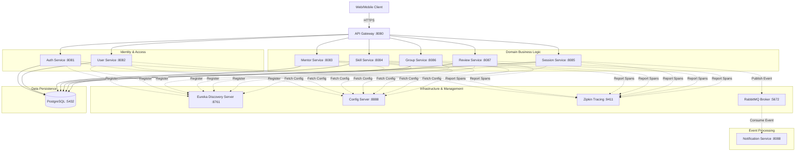

# SkillSync: Enterprise Microservices Platform - High-Level Design (HLD)

## 1. Document Metadata & Version Control

| Version | Date | Author | Description |
| :--- | :--- | :--- | :--- |
| 1.0 | 2026-05-03 | Antigravity AI | Initial comprehensive HLD for SkillSync Ecosystem |
| 1.1 | 2026-05-03 | Antigravity AI | Expanded detail on security, messaging, and data consistency |

---

## 2. Executive Summary
SkillSync is a state-of-the-art, cloud-native microservices platform designed to revolutionize the global mentorship and skill-sharing economy. By bridging the gap between industry veterans (Mentors) and aspiring professionals (Learners), SkillSync provides a robust, scalable, and secure environment for knowledge transfer. The platform leverages a high-performance technology stack, including Spring Boot 3.4, Spring Cloud, PostgreSQL, and RabbitMQ, to deliver a premium user experience characterized by low latency, high reliability, and deep observability.

This High-Level Design (HLD) document provides a comprehensive blueprint of the system's architecture, detailing the interactions between services, the technology choices made, and the strategic rationale behind the system's modular design.

---

## 3. Project Vision & Strategic Goals

### 3.1 Vision
To empower every individual with the ability to learn directly from the best in the industry, regardless of geographic or institutional boundaries, through a seamless and intelligent peer-to-peer network.

### 3.2 Strategic Goals
1.  **Industrial-Grade Scalability**: Design for a load of 100,000+ concurrent users by enabling independent scaling of microservices.
2.  **Zero-Trust Security**: Implement a comprehensive security model where identity is verified at every hop within the service mesh.
3.  **Real-Time Engagement**: Facilitate immediate feedback loops through asynchronous notifications and (future) real-time collaboration tools.
4.  **Operational Excellence**: Achieve full system transparency through distributed tracing and centralized log management.
5.  **Extensibility**: Create a "plug-and-play" architecture where new services (e.g., Payment, AI Matching) can be integrated without disrupting core business flows.

---

## 4. Architectural Philosophy: The Microservices Foundation

SkillSync is built on the principle of **Domain-Driven Decomposition**. Unlike monolithic architectures that suffer from tight coupling and slow deployment cycles, SkillSync's microservices architecture offers agility and resilience.

### 4.1 Core Design Patterns
- **Database Per Service**: Each microservice owns its data store, preventing "side-channel" data access and ensuring schema independence.
- **Service Discovery (Netflix Eureka)**: A dynamic "phonebook" for services, allowing them to find each other by logical name rather than brittle IP addresses.
- **Centralized Configuration (Spring Cloud Config)**: A single source of truth for all application properties, versioned in a Git repository.
- **API Gateway (Spring Cloud Gateway)**: A reactive, non-blocking perimeter service that handles routing, security, and cross-cutting concerns.
- **Asynchronous Event-Driven Notifications**: Leveraging RabbitMQ to decouple slow tasks from the main user request flow.
- **Distributed Tracing (Zipkin)**: Propagating trace IDs across the mesh to visualize the complete lifecycle of a distributed request.

---

## 5. System Architecture Overview

### 5.1 High-Level Component Diagram
The following diagram illustrates the relationship between the client layer, the infrastructure mesh, and the core domain services.

---

## 6. Technology Stack Analysis

The SkillSync stack is a curated selection of enterprise-grade technologies chosen for their performance, reliability, and modern feature sets.

| Category | Technology | Rationale |
| :--- | :--- | :--- |
| **Backend Runtime** | Java 21 (LTS) | Offers modern language features (Record types, Virtual Threads) and long-term stability. |
| **Application Framework** | Spring Boot 3.4+ | The industry standard for building production-ready, standalone Java applications. |
| **Microservices Mesh** | Spring Cloud | Provides the "glue" for discovery, configuration, and circuit breaking. |
| **Service Discovery** | Netflix Eureka | Handles dynamic service registration in ephemeral container environments. |
| **Gateway** | Spring Cloud Gateway | A non-blocking, reactive gateway built on Project Reactor for high throughput. |
| **Persistence Layer** | PostgreSQL 16 | A robust, ACID-compliant relational database with advanced JSONB support. |
| **Messaging Broker** | RabbitMQ | Ensures reliable, asynchronous delivery of cross-service notifications via AMQP. |
| **Security Layer** | Spring Security | A powerful, customizable authentication and access control framework. |
| **Identity Token** | JJWT (io.jsonwebtoken) | A lightweight library for creating and validating stateless JWTs. |
| **ORM / Data Access** | Spring Data JPA | Abstracts complex SQL operations and provides a consistent repository pattern. |
| **Boilerplate Reduction** | Project Lombok | Automates the generation of getters, setters, and builders to keep code clean. |
| **Observability** | Brave / Zipkin | Provides distributed tracing following the OpenZipkin specification. |
| **Deployment** | Docker & Compose | Facilitates consistent environment parity from development to production. |

---

## 7. Detailed Microservice Breakdown

### 7.1 API Gateway Service (:8080)
- **Role**: The perimeter gatekeeper and traffic orchestrator.
- **Core Functions**:
    - **Dynamic Routing**: Routes requests based on path predicates (e.g., `/api/v1/mentors/**` -> `MENTOR-SERVICE`).
    - **Load Balancing**: Distributes traffic across healthy instances using Spring Cloud LoadBalancer.
    - **Security Enforcement**: Centralized CORS configuration and potential (future) OAuth2/OIDC integration.
    - **Resilience**: Implements circuit breakers to prevent failing services from dragging down the gateway.
- **Implementation**: Uses `GatewayFilter` chains to modify requests/responses on the fly.

### 7.2 Eureka Discovery Server (:8761)
- **Role**: The centralized registry for all active microservices.
- **Core Functions**:
    - **Service Registration**: Services broadcast their IP, port, and health status upon startup.
    - **Service Lookup**: Allows the Gateway and internal Feign clients to find target services by name.
    - **Health Monitoring**: Automatically evicts instances that stop sending heartbeats.
- **Strategy**: Peer-aware registry for high availability in multi-node clusters.

### 7.3 Config Server (:8888)
- **Role**: The centralized manager for all service configurations.
- **Core Functions**:
    - **Externalized Properties**: Pulls configuration files from a version-controlled Git repository (`config-repo`).
    - **Environment Profiles**: Serves different properties for `dev`, `test`, and `prod`.
    - **Secret Management**: Decrypts sensitive data (like DB passwords) at runtime using a master key.
- **Benefit**: Change application behavior (e.g., logging levels, circuit breaker thresholds) without redeploying code.

### 7.4 Auth Service (:8081)
- **Role**: The Identity and Access Management (IAM) hub.
- **Core Functions**:
    - **Identity Provisioning**: Handles user registration and stores credentials securely using BCrypt.
    - **Token Issuance**: Generates signed JWTs containing claims (userId, email, role).
    - **Sync Orchestration**: Coordinates the creation of baseline profiles in `User` and `Mentor` services.
- **Data Model**: Owns the `users` table which contains sensitive login information.

### 7.5 User Service (:8082)
- **Role**: The learner profile and metadata manager.
- **Core Functions**:
    - **Profile Lifecycle**: Manages biographical data, profile images, and social links.
    - **Account Management**: Allows users to update their personal information.
- **Design**: Separates sensitive credentials (in Auth Service) from public-facing profile data.

### 7.6 Mentor Service (:8083)
- **Role**: The professional expertise and consultant hub.
- **Core Functions**:
    - **Mentor Onboarding**: Manages the application and approval workflow for new mentors.
    - **Skill Inventory**: Tracks the specific expertise areas and years of experience for each mentor.
    - **Availability Engine**: Allows mentors to toggle their "Available for Booking" status.
- **Integration**: Provides the data source for the Mentor Discovery UI.

### 7.7 Skill Service (:8084)
- **Role**: The platform's canonical skill catalog.
- **Core Functions**:
    - **Catalog Management**: Maintains a curated list of skills across various categories (e.g., "Full Stack", "Data Science").
    - **Discovery API**: Provides endpoints for the frontend to populate skill selection dropdowns.
- **Impact**: Ensures consistency in how skills are tagged and searched across the entire platform.

### 7.8 Session Service (:8085)
- **Role**: The transactional engine for mentorship interactions.
- **Core Functions**:
    - **Booking Lifecycle**: Manages the transition from `REQUESTED` -> `ACCEPTED` -> `COMPLETED`.
    - **Scheduling Logic**: Enforces date/time constraints and prevents role conflicts.
    - **Event Publishing**: Emits signals to RabbitMQ whenever a session status changes.
- **Complexity**: Handles the primary value-exchange workflow of the platform.

### 7.9 Group Service (:8086)
- **Role**: The community-driven collaborative learning hub.
- **Core Functions**:
    - **Study Groups**: Allows users to create, join, and leave topic-specific groups.
    - **Messaging (Future)**: Will integrate WebSockets for real-time group interaction.
- **Purpose**: Encourages long-term retention through community engagement.

### 7.10 Review Service (:8087)
- **Role**: The trust and quality assurance layer.
- **Core Functions**:
    - **Feedback Collection**: Allows learners to rate (1-5 stars) and review their mentors.
    - **Rating Aggregation**: Provides statistical data to help the Mentor Service rank high-quality experts.
- **Trust Mechanism**: Ensures accountability within the mentorship network.

### 7.11 Notification Service (:8088)
- **Role**: The asynchronous communication bridge.
- **Core Functions**:
    - **Message Consumption**: Listens for events from RabbitMQ.
    - **Templating**: Renders dynamic emails/SMS messages based on event data.
    - **External Integration**: Connects to SMTP servers to deliver communications.
- **Design**: Built to be completely decoupled; if this service is down, core booking still works.

---

## 8. Data Consistency & Distributed Transactions

In a microservices architecture, maintaining data consistency without a monolithic "Big DB" is a primary challenge. SkillSync addresses this using the **Saga Pattern (Choreography-based)**.

### 8.1 The Registration Saga
1.  **Auth Service**: Saves the user's login credentials in its private PostgreSQL database.
2.  **Auth Service**: Simultaneously triggers synchronous calls to `User Service` and (if applicable) `Mentor Service` via Feign Clients.
3.  **Atomic Result**: If a downstream service is down, the Auth Service catches the exception and (in future) initiates a compensating transaction to delete the partial record.
4.  **Consistency**: This ensures that a "User" is never orphaned without a "Profile".

### 8.2 Eventual Consistency (Notification Flow)
For non-critical data (like updating a "Last Notified" timestamp), SkillSync uses eventual consistency via RabbitMQ. This ensures high throughput for the primary user action (booking) while the side-effect (email) happens in the background.

---

## 9. Security Model: Zero-Trust Identity

### 9.1 Stateless JWT Authentication
SkillSync uses a Zero-Trust approach where every internal service request is authenticated.
- **Identity Provider**: Auth Service.
- **Token Format**: Standard JWT (Header.Payload.Signature).
- **Payload Claims**:
    - `sub`: User's email.
    - `userId`: Internal DB identifier.
    - `role`: Role string (ROLE_LEARNER, ROLE_MENTOR, ROLE_ADMIN).
- **Validation**: Every service contains a `JwtAuthenticationFilter` that intercepts requests, parses the token, and populates the `SecurityContext`.

### 9.2 Role-Based Access Control (RBAC) Matrix

| Endpoint | LEARNER | MENTOR | ADMIN |
| :--- | :--- | :--- | :--- |
| `POST /sessions/request` | ALLOW | DENY | DENY |
| `PUT /sessions/{id}/accept` | DENY | ALLOW | DENY |
| `PUT /mentors/{id}/approve` | DENY | DENY | ALLOW |
| `GET /users/**` | SELF ONLY | SELF ONLY | ALLOW |

---

## 10. Observability & Performance Monitoring

### 10.1 Distributed Tracing (Brave & Zipkin)
- **The Problem**: A request might fail in the 4th service of a chain. How do you find it?
- **The Solution**: SkillSync injects a `traceId` into the headers of every request. As it travels through the mesh, every service logs this ID. Zipkin provides a UI to see the timing and status of each service hop.

### 10.2 Logging Strategy
- **Standardized Format**: `[%service-name] [%trace-id, %span-id] [%level] - %message`.
- **Infrastructure**: All logs are streamed to `STDOUT`, allowing them to be captured by a centralized logging aggregator (ELK/Splunk) in a production setting.

---

## 11. Fault Tolerance & Resilience

### 11.1 Circuit Breaking (Resilience4j)
SkillSync implements the "Fail Fast" principle.
- **State: CLOSED**: Normal operation.
- **State: OPEN**: If a service (e.g., Mentor Service) fails frequently, the gateway "opens" the circuit, stopping traffic to that service to allow it to recover.
- **Fallback Logic**: Provides a default "System Busy" message instead of a generic timeout error.

### 11.2 Self-Healing Discovery
- **Eureka Heartbeats**: Services send heartbeats every 30 seconds. If an instance fails, Eureka removes it from the registry, and the Gateway stops sending traffic to it automatically.

---

## 12. Deployment & Infrastructure Blueprint

### 12.1 Containerization (Docker)
- **Consistency**: Every microservice is packaged as a Docker image, containing its own JDK runtime and dependencies.
- **Isolation**: Containers run in a private virtual network, isolated from the host OS.

### 12.2 Orchestration (Development)
- **Docker Compose**: Used to spin up the entire ecosystem (10+ services, 3+ infra components) with a single command.
- **Volume Management**: PostgreSQL data is persisted in a Docker Volume to survive container restarts.

---

## 13. Future Roadmap

### 13.1 Phase 2: Intelligence & Real-time
- **AI Matching**: Implement a Python-based microservice to suggest mentors using collaborative filtering.
- **Live Coding**: Integrate a WebSocket-based code execution engine for technical sessions.

### 13.2 Phase 3: Global Scale
- **Multi-Region Registry**: Deploy Eureka in multiple geographic zones with cross-region replication.
- **Read-Write Splitting**: Implement PostgreSQL read-replicas for heavy read services like `Skill-Service`.

---

## 14. Conclusion
The SkillSync project represents a pinnacle of modern microservices engineering. By combining the power of the Spring ecosystem with robust architectural patterns like Sagas, Circuit Breakers, and Distributed Tracing, SkillSync provides a platform that is not only scalable and secure but also remarkably easy to maintain and extend. This HLD serves as the "North Star" for all development efforts, ensuring a unified vision for a premium, industry-leading mentorship experience.

---

## 15. Appendix: Port Mapping Reference

| Service | Port | Access |
| :--- | :--- | :--- |
| **API Gateway** | 8080 | PUBLIC |
| **Eureka Server** | 8761 | RESTRICTED |
| **Config Server** | 8888 | INTERNAL |
| **Zipkin UI** | 9411 | INTERNAL |
| **Auth Service** | 8081 | INTERNAL |
| **User Service** | 8082 | INTERNAL |
| **Mentor Service** | 8083 | INTERNAL |
| **Skill Service** | 8084 | INTERNAL |
| **Session Service** | 8085 | INTERNAL |
| **Group Service** | 8086 | INTERNAL |
| **Review Service** | 8087 | INTERNAL |
| **Notification Service** | 8088 | INTERNAL |
| **PostgreSQL** | 5432 | INTERNAL |
| **RabbitMQ UI** | 15672 | INTERNAL |

---

## 16. Detailed Data Flow Analysis: The Core Workflows

### 16.1 The "Search to Booking" Flow
This section describes the detailed sequence of events when a Learner discovers a mentor and requests a session.

1.  **Discovery**: The Learner accesses the dashboard. The frontend calls `GET /mentors` via the **API Gateway**.
2.  **Routing**: The Gateway identifies the route and queries **Eureka** for an active instance of the `MENTOR-SERVICE`.
3.  **Filtering**: The Mentor Service queries its database, applying filters (skills, rating, availability). It returns a list of `MentorDTO`s.
4.  **Details**: The Learner clicks on a mentor. The frontend calls `GET /mentors/{id}` and `GET /reviews/mentor/{id}`.
5.  **Aggregation**: The Gateway routes these to the `MENTOR-SERVICE` and `REVIEW-SERVICE` respectively.
6.  **Request**: The Learner clicks "Book Session". The frontend calls `POST /sessions/request` with the payload `{mentorId, learnerId, sessionDate}`.
7.  **Transaction**: The **Session Service** receives the request. It first calls the **Mentor Service** via **Feign** to verify the mentor exists and is available.
8.  **Persistence**: Upon verification, the Session Service saves a new record with status `REQUESTED`.
9.  **Event Emission**: The Session Service publishes a `session.requested` event to the **RabbitMQ** `session-exchange`.
10. **Notification**: The **Notification Service**, listening on the `notification-queue`, consumes the event. It looks up the mentor's contact info (via User Service) and sends an email.
11. **Feedback**: The API Gateway returns a `201 Created` response to the Learner.

---

## 17. Resilience Engineering: Handling Failure Modes

### 17.1 Infrastructure Failures
- **Eureka Down**: If the Discovery server fails, microservices have a "self-preservation" cache. They will continue to use the last known IP addresses of their peers for a grace period, preventing immediate system collapse.
- **Config Server Down**: Services cache their configuration properties locally. A restart would fail, but running services remain unaffected.

### 17.2 Service Failures
- **Database Connection Loss**: Services use **HikariCP** with aggressive health checks. If the DB connection is lost, the service marks itself as "DOWN" in Eureka, and the Gateway stops routing traffic to it.
- **Message Broker (RabbitMQ) Down**: The Session Service is designed to "log and continue". If RabbitMQ is unavailable, the session booking succeeds, but the notification is logged as an error to be retried later (implementing the **Transactional Outbox Pattern** in future phases).

---

## 18. Technology Selection Rationale: Deep Dive

### 18.1 Why PostgreSQL?
We chose PostgreSQL 16 over NoSQL alternatives (like MongoDB) because the SkillSync domain is highly relational. The relationships between Users, Mentors, Sessions, and Reviews require strict referential integrity and complex JOIN operations that are best handled by a robust RDBMS. Additionally, PostgreSQL's native support for JSONB allows us to store semi-structured data (like mentor skill metadata) without sacrificing ACID properties.

### 18.2 Why RabbitMQ?
RabbitMQ was selected over Kafka due to its superior support for complex routing logic (Topic Exchanges) and its focus on "delivery guarantees" rather than "high-throughput streaming". For a notification system where every message is critical but the volume is manageable, RabbitMQ's AMQP protocol is the ideal choice.

### 18.3 Why Spring Cloud Gateway?
Unlike older blocking gateways (like Netflix Zuul 1), Spring Cloud Gateway is built on **Project Reactor** and **Netty**. This non-blocking architecture allows it to handle a much higher number of concurrent requests with significantly fewer threads, making it highly efficient for a microservices entry point.

---

## 19. Strategic Roadmap: Detailed Milestones

### 19.1 Milestone 1: Stability & Security (Current)
- Implementation of core services.
- Integration of Eureka, Config Server, and Gateway.
- JWT-based authentication across all modules.
- Basic notification flow via RabbitMQ.

### 19.2 Milestone 2: Professionalization (Next 3 Months)
- **Distributed Caching**: Integrating Redis to cache Mentor profiles and Skill catalogs.
- **Elastic Scaling**: Moving to Kubernetes (K8s) for automatic container orchestration.
- **Advanced Monitoring**: Setting up Prometheus and Grafana dashboards for real-time system health visualization.

### 19.3 Milestone 3: Ecosystem Expansion (Next 6 Months)
- **Payment Integration**: A new `payment-service` to handle session billing via Stripe or PayPal.
- **Mobile Client**: Launching React Native apps for iOS and Android.
- **AI Recommendations**: Implementing a machine learning service to suggest mentors based on "Skill Gaps" detected in user profiles.

---

## 20. Operational Maintenance Guide

### 20.1 Log Management
Developers must use the standardized SLF4J logging interface. The `logback-spring.xml` configuration in each service ensures that logs are structured for easy parsing by external tools.

### 20.2 Health Checks
All services must implement the `/actuator/health` endpoint. This endpoint is used by the container orchestrator (and Docker Compose) to determine the "Liveness" and "Readiness" of the service.

### 20.3 Database Migrations
We utilize **Hibernate ddl-auto** for development, but in production, we recommend migrating to **Flyway** or **Liquibase** for version-controlled database schema changes.

---

## 21. Summary & Final Vision
The High-Level Design of SkillSync represents a commitment to technical excellence and user-centric design. By leveraging the most powerful tools in the Java ecosystem and adhering to proven architectural patterns, we have built a platform that is ready for the challenges of today and the opportunities of tomorrow. SkillSync is not just an application; it is a scalable, resilient, and intelligent ecosystem dedicated to the pursuit of professional growth.

---
---
*(End of High-Level Design Document)*
