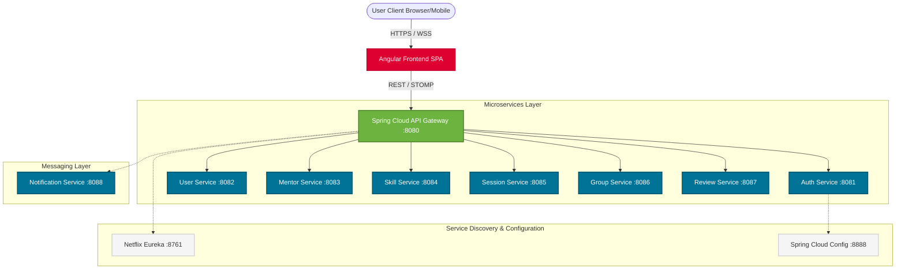

# High-Level Design (HLD) - SkillSync Ecosystem

## 1. Executive Summary

SkillSync is a comprehensive microservices-based platform designed to facilitate peer-to-peer mentorship, study group collaboration, and skill exchange. The platform enables users to book mentorship sessions, engage in real-time group chats, and review mentorship experiences.

The architecture strictly follows a Distributed Systems paradigm, utilizing Spring Boot 3.x for backend services and Angular 21 for a reactive Single Page Application (SPA). The ecosystem relies on modern containerization, event-driven message brokering, and centralized configuration to ensure extreme scalability and fault tolerance.

---

## 2. Architectural Drivers & Non-Functional Requirements (NFRs)

The design is driven by several critical Non-Functional Requirements:
1.  **Scalability**: The system must handle high traffic during peak study seasons. Microservices are decoupled to scale independently (e.g., the `session-service` can scale horizontally without scaling the `skill-service`).
2.  **High Availability (HA)**: Using Eureka for service discovery and Spring Cloud Gateway for dynamic routing ensures no single point of failure within the backend compute layer.
3.  **Low Latency**: Synchronous API calls are kept lightweight. Heavy, blocking operations (like email generation) are offloaded to asynchronous background workers via RabbitMQ.
4.  **Data Isolation**: Every microservice owns its domain data. Direct database sharing is forbidden, preventing tight coupling and unintended cascading schema changes.
5.  **Security**: All APIs must be secured statelessly to reduce database load.

---

## 3. System Architecture Diagram

---

## 4. Component Definition & Bounded Contexts

The ecosystem is split into the following highly cohesive domains:

### 4.1 Client Layer
- **Angular Frontend**: A standalone-component based SPA. Uses `@ngrx/signals` for complex state management (like group chats and booking wizards) and Tailwind CSS for utility-first styling.

### 4.2 Edge Layer
- **API Gateway (`api-gateway`)**: The single entry point into the system. Handles Route resolution, Cross-Origin Resource Sharing (CORS), and Global Rate Limiting. It routes traffic based on URL predicates (e.g., `/api/v1/sessions/**` -> `session-service`).

### 4.3 Core Business Services
- **Auth Service (`auth-service`)**: Handles user authentication, registration, BCrypt password hashing, OTP generation, and cryptographically signing JWTs.
- **User Service (`user-service`)**: Manages the public user profiles, bios, and avatars.
- **Mentor Service (`mentor-service`)**: Governs mentor applications, availability schedules, and expertise categorizations.
- **Skill Service (`skill-service`)**: Maintains the global taxonomy/catalog of skills that users can add to their profiles.
- **Session Service (`session-service`)**: The core booking engine. Handles the state machine of a mentorship session (Pending -> Confirmed -> Completed).
- **Group Service (`group-service`)**: Manages Study Groups and hosts the STOMP/WebSocket server for real-time group chat.
- **Review Service (`review-service`)**: Handles post-session feedback and calculates aggregate ratings for mentors.

### 4.4 Infrastructure Services
- **Eureka Server (`eureka-server`)**: The service registry. All microservices register their IP and Port here on startup.
- **Config Server (`config-server`)**: Centralizes the `application.yml` configurations for all microservices, pulling them dynamically from a Git repository or local filesystem.
- **Notification Service (`notification-service`)**: A consumer-only service that listens to the message broker and dispatches SMTP emails.

---

## 5. Network & Communication Strategies

To ensure resilience, the system utilizes three distinct communication strategies.

### 5.1 Synchronous External Communication (REST)
All traffic from the Angular Frontend to the API Gateway is strictly HTTPS REST (JSON payloads), except for the live chat which upgrades to WebSockets.

### 5.2 Synchronous Internal Communication (Feign + Circuit Breakers)
When one microservice immediately requires data from another (e.g., `session-service` needing to verify a mentor exists in `mentor-service`), it uses **OpenFeign Clients**.
- **Resilience**: These calls are wrapped in **Resilience4j Circuit Breakers**. If the `mentor-service` is down, the circuit trips to `OPEN`, preventing thread exhaustion and returning an immediate fallback response.

### 5.3 Asynchronous Internal Communication (RabbitMQ)
Used for Event-Driven updates.
- When a `Session` is booked, the `session-service` does NOT call the `notification-service` via REST.
- Instead, it publishes a `session.created` event to a RabbitMQ Topic Exchange.
- The `notification-service` consumes this queue asynchronously. This guarantees the user's booking API call is ultra-fast, while the slower email dispatch happens in the background.

---

## 6. Data Storage & Persistence Strategy

The system embraces Polyglot Persistence, though currently standardized on PostgreSQL for relational consistency.
- **Database-Per-Service**: Every microservice owns a distinct logical database schema (`auth_db`, `mentor_db`, `session_db`, etc.).
- **Data Sovereignty**: The `User` table inside `user_db` cannot be joined with the `Session` table in `session_db`. If joint data is required, it must be aggregated at the API Gateway or Frontend layer, or fetched via a Feign Client.
- **Transactions**: Local ACID transactions are used within services using Spring's `@Transactional`. Distributed transactions (2PC) are strictly avoided in favor of eventual consistency via RabbitMQ events.

---

## 7. Security Architecture

### 7.1 Edge Security
- The **API Gateway** intercepts all incoming requests. It strips any malicious headers and enforces strict CORS policies allowing only the Angular frontend's origin.

### 7.2 Stateless Authentication (JWT)
- No sessions are stored in memory. The `auth-service` issues a JSON Web Token (JWT) containing the user's `UUID` and `Role`.
- Every downstream microservice uses a generic `JwtAuthenticationFilter` to cryptographically verify the token's signature using a shared symmetric or asymmetric secret.

### 7.3 Method-Level Authorization
- Once the JWT is parsed, Spring Security's `SecurityContext` is populated. Controllers utilize `@PreAuthorize("hasRole('MENTOR')")` to restrict execution based on business rules.

---

## 8. Deployment & CI/CD Considerations

The platform is designed to be fully containerized.
- **Docker**: Every microservice includes a multi-stage `Dockerfile`.
- **Docker Compose**: Used for local orchestration, launching the entire ecosystem (including PostgreSQL and RabbitMQ) simultaneously via a unified network.
- **Production Target**: The architecture is optimized for Kubernetes (k8s), where Eureka can be swapped for native k8s Service Discovery, and Spring Cloud Config can be replaced by k8s ConfigMaps.
- **Observability**: Distributed tracing is injected via Micrometer/Sleuth. Every log carries a `Trace-Id` generated at the Gateway, exportable to a Zipkin dashboard for latency visualization across service hops.

---

## 9. Core Data Flow (Booking a Session)

Understanding the data flow across bounded contexts is critical for the HLD.
1.  **Initiation**: Client requests `POST /api/v1/sessions` through API Gateway.
2.  **Routing**: Gateway forwards the JWT-secured request to `session-service`.
3.  **Cross-Service Validation**: `session-service` uses a Feign Client to synchronously query `mentor-service` -> `GET /api/v1/mentors/{id}/availability`.
4.  **Persistence**: If available, `session-service` writes the new session to `session_db`.
5.  **Event Generation**: `session-service` publishes `SessionCreatedEvent` to RabbitMQ.
6.  **Response**: Immediate `201 Created` is returned to the Frontend.
7.  **Async Consumption**: `notification-service` consumes the event, fetches user details from `user-service`, and dispatches the confirmation email.

---

## 10. Error Handling & Retry Strategy

- **Global Exceptions**: A centralized `@RestControllerAdvice` ensures all APIs return the exact same JSON error structure, regardless of which microservice threw the error.
- **Dead Letter Queues (DLQ)**: If the `notification-service` fails to send an email (e.g., SMTP server timeout), RabbitMQ will automatically retry 3 times. Upon the 4th failure, the message is routed to a DLQ for manual inspection, ensuring zero data loss.

---

## 11. Infrastructure Scaling Strategy

- **Statelessness**: Because all services rely on JWTs and store no local state, scaling horizontally is as simple as spinning up identical Docker containers.
- **Dynamic Load Balancing**: As new containers boot, they automatically register with the Eureka Server. The API Gateway detects them within 30 seconds and begins round-robin routing traffic to the new instances seamlessly.
