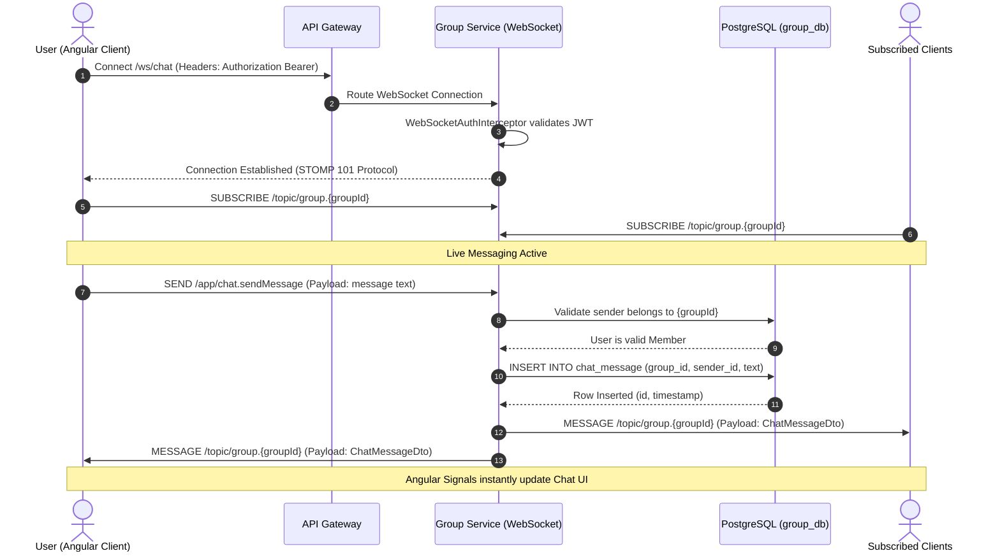
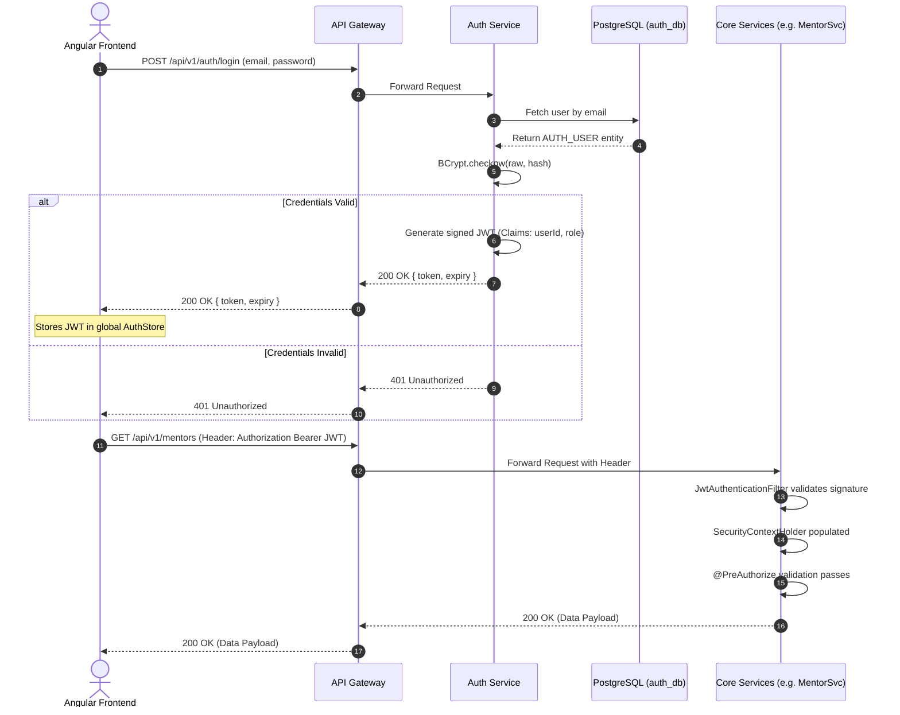

# SkillSync Architecture Diagrams

This document contains 5 professional-grade Mermaid diagrams representing the core architectural components and flows of the SkillSync platform.

## 1. High-Level System Architecture Diagram
*Visualizes the full ecosystem including the Angular frontend, Spring Cloud Gateway, microservices, databases, messaging bus, and observability tools.*

```mermaid
flowchart TD
    classDef frontend fill:#dd0031,stroke:#c3002f,stroke-width:2px,color:#fff;
    classDef gateway fill:#6db33f,stroke:#4a822b,stroke-width:2px,color:#fff;
    classDef microservice fill:#007396,stroke:#005269,stroke-width:2px,color:#fff;
    classDef db fill:#336791,stroke:#244a69,stroke-width:2px,color:#fff;
    classDef broker fill:#ff6600,stroke:#cc5200,stroke-width:2px,color:#fff;
    classDef infra fill:#f5f5f5,stroke:#d4d4d4,stroke-width:2px,color:#333;

    User([User Client]) -->|HTTPS / WSS| WebApp[Angular Frontend]:::frontend
    WebApp -->|REST / STOMP| Gateway[API Gateway :8080]:::gateway

    subgraph Infrastructure [Service Infrastructure]
        Eureka[Eureka Registry :8761]:::infra
        Config[Config Server :8888]:::infra
        Zipkin[Zipkin Tracing :9411]:::infra
    end

    subgraph Microservices [Spring Boot Services]
        Gateway --> Auth[Auth Service :8081]:::microservice
        Gateway --> UserSvc[User Service :8082]:::microservice
        Gateway --> Mentor[Mentor Service :8083]:::microservice
        Gateway --> Skill[Skill Service :8084]:::microservice
        Gateway --> Session[Session Service :8085]:::microservice
        Gateway --> Group[Group Service :8086]:::microservice
        Gateway --> Review[Review Service :8087]:::microservice
        Gateway -.-> Notification[Notification Service :8088]:::microservice
    end

    subgraph Messaging [Event Bus]
        Session -->|Publish Event| RabbitMQ[(RabbitMQ)]:::broker
        Group -->|Publish Event| RabbitMQ
        RabbitMQ -->|Consume Event| Notification
    end

    subgraph Data Layer [PostgreSQL 16]
        Auth --> DBAuth[(auth_db)]:::db
        UserSvc --> DBUser[(user_db)]:::db
        Mentor --> DBMentor[(mentor_db)]:::db
        Skill --> DBSkill[(skill_db)]:::db
        Session --> DBSession[(session_db)]:::db
        Group --> DBGroup[(group_db)]:::db
        Review --> DBReview[(review_db)]:::db
    end

    %% Internal Communications & Tooling
    Gateway -.->|Register/Discover| Eureka
    Auth -.->|Fetch Config| Config
    Session -.->|Export Spans| Zipkin
```



---

## 2. Database Entity-Relationship (ER) Diagram
*Illustrates the logical schema design across the isolated microservices.*

```mermaid
erDiagram
    %% Auth and User Management Domain
    AUTH_USER {
        UUID id PK
        String email UK
        String password_hash
        String role "ENUM: USER, MENTOR, ADMIN"
        Boolean is_active
        Timestamp created_at
    }
    
    USER_PROFILE {
        UUID id PK
        UUID auth_user_id FK UK
        String full_name
        String bio
        String avatar_url
    }
    
    %% Skills Domain
    SKILL_CATALOG {
        UUID id PK
        String name UK
        String category
    }
    
    USER_SKILLS {
        UUID user_id FK
        UUID skill_id FK
        Integer proficiency_level
    }
    
    %% Groups & Chat Domain
    STUDY_GROUP {
        UUID id PK
        String name
        String topic
        UUID creator_id FK
        Timestamp created_at
    }
    
    GROUP_MEMBERS {
        UUID group_id FK
        UUID user_id FK
        String role "ENUM: ADMIN, MEMBER"
        Timestamp joined_at
    }
    
    CHAT_MESSAGE {
        UUID id PK
        UUID group_id FK
        UUID sender_id FK
        Text message_content
        Timestamp sent_at
        String status "ENUM: SENT, DELIVERED, READ"
    }
    
    %% Sessions & Reviews Domain
    MENTORSHIP_SESSION {
        UUID id PK
        UUID mentor_id FK
        UUID mentee_id FK
        Timestamp scheduled_time
        String status "ENUM: PENDING, CONFIRMED, COMPLETED"
    }
    
    SESSION_REVIEW {
        UUID id PK
        UUID session_id FK UK
        UUID reviewer_id FK
        Integer rating
        Text feedback_comment
    }

    %% Entity Relationships
    AUTH_USER ||--|| USER_PROFILE : "secures"
    USER_PROFILE ||--o{ USER_SKILLS : "possesses"
    SKILL_CATALOG ||--o{ USER_SKILLS : "categorizes"
    USER_PROFILE ||--o{ MENTORSHIP_SESSION : "books/hosts"
    USER_PROFILE ||--o{ GROUP_MEMBERS : "joins"
    STUDY_GROUP ||--o{ GROUP_MEMBERS : "contains"
    STUDY_GROUP ||--o{ CHAT_MESSAGE : "hosts"
    USER_PROFILE ||--o{ CHAT_MESSAGE : "authors"
    MENTORSHIP_SESSION ||--o| SESSION_REVIEW : "results in"
```

---

## 3. Sequence Diagram for Real-Time Group Chat
*Details the WebSocket STOMP communication workflow from a user sending a message to the UI updating on subscriber clients.*



---

## 4. Authentication Flow Diagram
*Shows the end-to-end lifecycle of JWT generation, gateway routing, and stateless request authorization.*



---

## 5. RabbitMQ Event-Driven Workflow Diagram
*Outlines the asynchronous process of session creation, event queuing, retry logic, and DLQ handling.*

```mermaid
flowchart TD
    classDef client fill:#f9f,stroke:#333,stroke-width:2px;
    classDef service fill:#007396,stroke:#005269,stroke-width:2px,color:#fff;
    classDef broker fill:#ff6600,stroke:#cc5200,stroke-width:2px,color:#fff;
    classDef dlq fill:#e63946,stroke:#a8dadc,stroke-width:2px,color:#fff;

    Client([Client Book Session]) -->|POST /api/v1/sessions| SessionSvc[Session Service]:::service
    
    SessionSvc -->|1. Save to DB| DB[(PostgreSQL)]
    SessionSvc -->|2. Publish SessionEvent| Exchange{skillsync.topic Exchange}:::broker
    SessionSvc -.->|3. Fast Return (201 Created)| Client
    
    Exchange -->|Routing Key: session.created| Queue[notification.email.queue]:::broker
    
    Queue -->|Consume Async| NotifSvc[Notification Service]:::service
    
    NotifSvc -->|Generate HTML Email| SMTP[External SMTP Server]
    
    SMTP -- Success --> UserInbox[User Inbox]
    
    SMTP -- Connection Timeout / Failure --> Retry{Retry Strategy}
    Retry -- Retry count < 3 --> Queue
    Retry -- Retry count >= 3 --> DLQ[Dead Letter Queue]:::dlq
    
    DLQ --> AdminAlert[Admin Alert / Manual Intervention]
```
