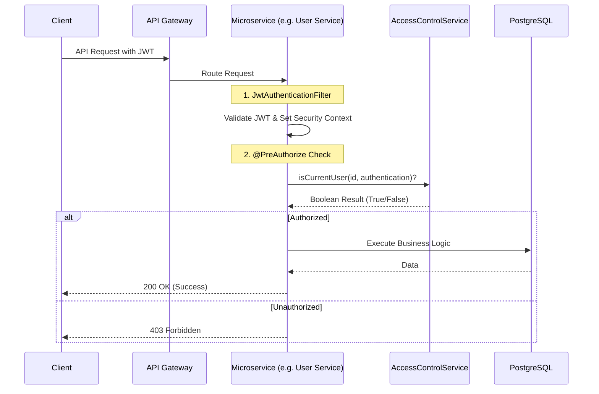

# SkillSync: Full Architecture & Access Control Flow

This document provides a deep dive into the end-to-end request flow of the SkillSync platform, emphasizing the multi-layered **Access Control** mechanism that ensures security and data privacy.

## 1. High-Level Architecture Flow

SkillSync uses a **Zero-Trust** security architecture. Every single request is authenticated and authorized, even within the internal network.



## 2. The Three Layers of Access Control

The project implements safety at three distinct levels:

### Level 1: Authentication (Who are you?)
- **Location**: `JwtAuthenticationFilter`
- **Mechanism**: The filter extracts the JWT from the `Authorization: Bearer` header.
- **Verification**: It checks the signature using the `JWT_SECRET`.
- **Result**: It populates the `JwtPrincipal` object with the user's `id`, `email`, and `role`. If the token is invalid, the request is rejected immediately (401 Unauthorized).

### Level 2: Application RBAC (What is your broad role?)
- **Location**: `@PreAuthorize` on Controller Methods.
- **Mechanism**: Uses standard Spring Security `hasRole('ADMIN')`, `hasRole('MENTOR')`, or `hasRole('LEARNER')`.
- **Usage**: Controls access to broad administrative functions (e.g., viewing all users, approving mentors).

### Level 3: Fine-Grained Domain Authorization (Do you own this data?)
- **Location**: `@PreAuthorize` with Custom SpEL Expressions.
- **Mechanism**: Calls methods in the local `AccessControlService` bean.
- **Example (`UserController.java`)**:
  ```java
  @GetMapping("/{id}")
  @PreAuthorize("hasRole('ADMIN') or @accessControlService.isCurrentUser(#id, authentication)")
  public ResponseEntity<UserDto> getUserById(@PathVariable Long id) { ... }
  ```
- **Logic**:
  - If you are an **ADMIN**, access is granted.
  - If not, the system checks if the `id` in the URL matches the `userId` inside your JWT.
  - This prevents User A from viewing User B's private profile.

## 3. Implementation Matrix: Service-Specific Access

| Microservice | Access Control Logic | Typical Rule |
| :--- | :--- | :--- |
| **User Service** | Ownership via `userId` | `isCurrentUser(id)` |
| **Mentor Service** | Ownership / Status Check | `isMentorOwner(id)` |
| **Session Service** | Participant Check | `isMentorOrLearner(sessionId)` |
| **Group Service** | Membership Check | `isGroupMember(groupId)` |
| **Review Service** | Reviewer Check | `isReviewOwner(reviewId)` |

## 4. Key Security Components

1.  **`JwtUtil`**: The foundation. Handles the math of signing and parsing tokens.
2.  **`JwtAuthenticationFilter`**: The gatekeeper for every single request in every microservice.
3.  **`AccessControlService`**: The business logic for "who can do what" based on entity ownership.
4.  **`SecurityConfig`**: Defines the "Public" vs "Private" paths (e.g., Swagger is public, `/api/**` is private).

---

### Key Files to Explore:
- [AccessControlService.java (user-service)](file:///c:/Users/santh/Advance_Java_MicroServices/SkillSync/user-service/src/main/java/com/capgemini/user/security/AccessControlService.java)
- [UserController.java (user-service)](file:///c:/Users/santh/Advance_Java_MicroServices/SkillSync/user-service/src/main/java/com/capgemini/user/controller/UserController.java) - See `@PreAuthorize` usage.
- [JwtAuthenticationFilter.java (auth-service)](file:///c:/Users/santh/Advance_Java_MicroServices/SkillSync/auth-service/src/main/java/com/capgemini/auth/security/JwtAuthenticationFilter.java)
