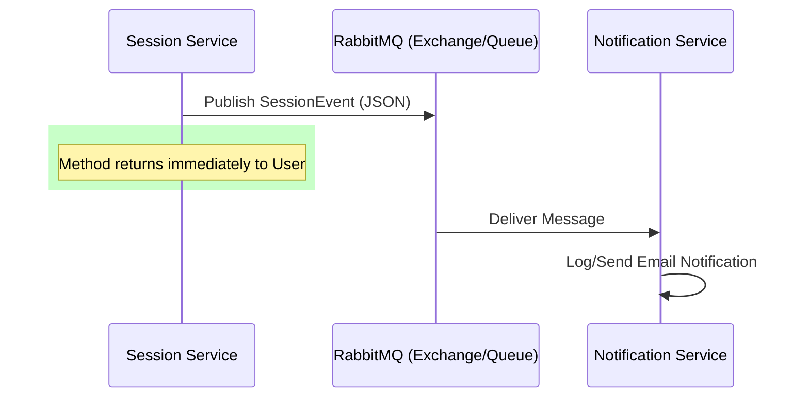

# SkillSync RabbitMQ Guide: Event-Driven Communication

This guide explains how **RabbitMQ** is used for asynchronous, event-driven communication between microservices in the SkillSync project, specifically for handling notifications.

## 1. Why RabbitMQ?
In a microservices architecture, sometimes one service needs to trigger an action in another service without waiting for it to finish. 
- **Example**: When a learner books a session, the **Session Service** should return a "Success" message immediately. It shouldn't wait for the **Notification Service** to actually send an email (which could take several seconds).
- **Solution**: We use RabbitMQ as a "Message Broker". The Session Service drops a message in the queue and moves on.

## 2. The Implementation Flow

### A. The Producer: `session-service`
When a session status changes (Requested, Accepted, etc.), the `SessionMessagePublisher` sends an event.

1. **Event Object**: `SessionEvent` (contains id, learnerId, mentorId, and status).
2. **Conversion**: The object is converted to **JSON** using `Jackson2JsonMessageConverter`.
3. **Publishing**: `RabbitTemplate` sends the message to a specific **Exchange** using a **Routing Key**.

### B. The Message Broker: RabbitMQ
- **Exchange**: A post-office that receives messages and decides which queue to put them in.
- **Queue**: A holding area for messages until they are consumed.
- **Routing Key**: A "destination address" used by the exchange to route messages.

### C. The Consumer: `notification-service`
This service "listens" for messages coming from RabbitMQ.

1. **Listener**: `NotificationListener` uses the `@RabbitListener` annotation to monitor a specific queue.
2. **Processing**: When a message arrives, the `handleSessionEvent()` method is triggered automatically.
3. **Action**: It parses the `SessionEvent` and simulates sending an email based on the status (REQUESTED, ACCEPTED, etc.).

## 3. Configuration

The configuration is externalized in `application.properties` of both services:
- `rabbitmq.exchange`: The name of the exchange.
- `rabbitmq.queue`: The name of the queue.
- `rabbitmq.routingkey`: The key used for routing.

## 4. Visual Flow

---

### Key Files to Explore:
- [SessionMessagePublisher.java (session-service)](file:///c:/Users/santh/Advance_Java_MicroServices/SkillSync/session-service/src/main/java/com/capgemini/session/service/SessionMessagePublisher.java) - The sender.
- [NotificationListener.java (notification-service)](file:///c:/Users/santh/Advance_Java_MicroServices/SkillSync/notification-service/src/main/java/com/capgemini/notification/service/NotificationListener.java) - The receiver.
- [RabbitMQConfig.java (session-service)](file:///c:/Users/santh/Advance_Java_MicroServices/SkillSync/session-service/src/main/java/com/capgemini/session/config/RabbitMQConfig.java) - The setup.
