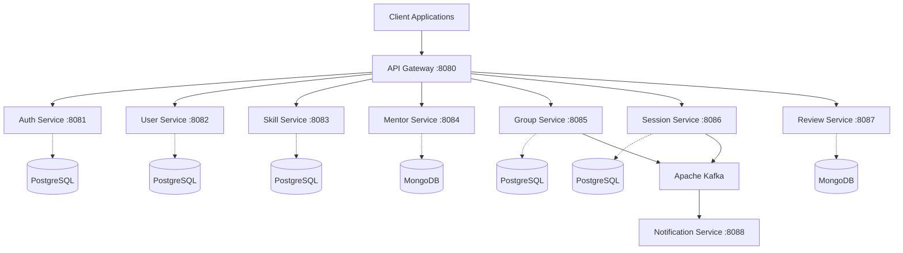

# SkillSync High Level Design (HLD)

## Table of Contents
1. Executive Summary
2. System Architecture
3. Technology Stack
4. Microservices Catalog
5. Security Architecture

## 1. Executive Summary
SkillSync is a comprehensive platform facilitating mentorship, skill sharing, and collaborative learning. Built on a microservices architecture, it ensures scalability, resilience, and maintainability.

## 2. System Architecture
The platform utilizes a modern API Gateway pattern with a Service Registry for dynamic routing.

## 3. Technology Stack
| Category | Technology | Purpose |
|----------|------------|---------|
| Frontend | React 18, Redux, TailwindCSS | SPA Development |
| Backend | Java 17, Spring Boot 3 | Microservices Framework |
| Gateway | Spring Cloud Gateway | API Routing & Rate Limiting |
| Registry | Netflix Eureka | Service Discovery |
| Config | Spring Cloud Config | Centralized Configuration |
| Relational DB | PostgreSQL | Transactional Data |
| NoSQL DB | MongoDB | Document Data (Reviews, Mentors) |
| Broker | Apache Kafka | Event-driven architecture |
| DevOps | Docker, K8s, GitHub Actions | Containerization & CI/CD |
| Monitoring | Prometheus, Grafana, ELK | Observability |

## 4. Microservices Catalog

### api-gateway (Routing, Auth Check)
- **Primary Responsibility**: Manages core business workflows for the respective domain.
- **Data Store**: Uses strict bounded context isolation to prevent unauthorized data access.
- **Dependencies**: Communicates via REST for synchronous operations and Kafka for asynchronous updates.

### auth-service (JWT, OTP)
- **Primary Responsibility**: Manages core business workflows for the respective domain.
- **Data Store**: Uses strict bounded context isolation to prevent unauthorized data access.
- **Dependencies**: Communicates via REST for synchronous operations and Kafka for asynchronous updates.

### config-server (Git config)
- **Primary Responsibility**: Manages core business workflows for the respective domain.
- **Data Store**: Uses strict bounded context isolation to prevent unauthorized data access.
- **Dependencies**: Communicates via REST for synchronous operations and Kafka for asynchronous updates.

### eureka-server (Service registry)
- **Primary Responsibility**: Manages core business workflows for the respective domain.
- **Data Store**: Uses strict bounded context isolation to prevent unauthorized data access.
- **Dependencies**: Communicates via REST for synchronous operations and Kafka for asynchronous updates.

### user-service (PostgreSQL)
- **Primary Responsibility**: Manages core business workflows for the respective domain.
- **Data Store**: Uses strict bounded context isolation to prevent unauthorized data access.
- **Dependencies**: Communicates via REST for synchronous operations and Kafka for asynchronous updates.

### skill-service (PostgreSQL)
- **Primary Responsibility**: Manages core business workflows for the respective domain.
- **Data Store**: Uses strict bounded context isolation to prevent unauthorized data access.
- **Dependencies**: Communicates via REST for synchronous operations and Kafka for asynchronous updates.

### mentor-service (MongoDB)
- **Primary Responsibility**: Manages core business workflows for the respective domain.
- **Data Store**: Uses strict bounded context isolation to prevent unauthorized data access.
- **Dependencies**: Communicates via REST for synchronous operations and Kafka for asynchronous updates.

### group-service (PostgreSQL)
- **Primary Responsibility**: Manages core business workflows for the respective domain.
- **Data Store**: Uses strict bounded context isolation to prevent unauthorized data access.
- **Dependencies**: Communicates via REST for synchronous operations and Kafka for asynchronous updates.

### session-service (PostgreSQL)
- **Primary Responsibility**: Manages core business workflows for the respective domain.
- **Data Store**: Uses strict bounded context isolation to prevent unauthorized data access.
- **Dependencies**: Communicates via REST for synchronous operations and Kafka for asynchronous updates.

### review-service (MongoDB)
- **Primary Responsibility**: Manages core business workflows for the respective domain.
- **Data Store**: Uses strict bounded context isolation to prevent unauthorized data access.
- **Dependencies**: Communicates via REST for synchronous operations and Kafka for asynchronous updates.

### notification-service (Kafka Consumer)
- **Primary Responsibility**: Manages core business workflows for the respective domain.
- **Data Store**: Uses strict bounded context isolation to prevent unauthorized data access.
- **Dependencies**: Communicates via REST for synchronous operations and Kafka for asynchronous updates.

## 5. Security Architecture

All requests are intercepted by the API Gateway. The Gateway forwards login requests to the Auth Service. Upon successful authentication, a JWT is returned.

### Detailed Architectural Consideration 1
To ensure robust system architecture, the implementation strategy 1 focuses on decoupling internal domain logic. This minimizes inter-service dependencies.
- **Resilience**: Implements circuit breakers using Resilience4j to prevent cascading failures.
- **Scalability**: Designed for horizontal scaling using Kubernetes HPA based on custom metrics.
- **Maintainability**: Adheres to SOLID principles and Clean Architecture paradigms.

### Detailed Architectural Consideration 2
To ensure robust system architecture, the implementation strategy 2 focuses on decoupling internal domain logic. This minimizes inter-service dependencies.
- **Resilience**: Implements circuit breakers using Resilience4j to prevent cascading failures.
- **Scalability**: Designed for horizontal scaling using Kubernetes HPA based on custom metrics.
- **Maintainability**: Adheres to SOLID principles and Clean Architecture paradigms.

### Detailed Architectural Consideration 3
To ensure robust system architecture, the implementation strategy 3 focuses on decoupling internal domain logic. This minimizes inter-service dependencies.
- **Resilience**: Implements circuit breakers using Resilience4j to prevent cascading failures.
- **Scalability**: Designed for horizontal scaling using Kubernetes HPA based on custom metrics.
- **Maintainability**: Adheres to SOLID principles and Clean Architecture paradigms.

### Detailed Architectural Consideration 4
To ensure robust system architecture, the implementation strategy 4 focuses on decoupling internal domain logic. This minimizes inter-service dependencies.
- **Resilience**: Implements circuit breakers using Resilience4j to prevent cascading failures.
- **Scalability**: Designed for horizontal scaling using Kubernetes HPA based on custom metrics.
- **Maintainability**: Adheres to SOLID principles and Clean Architecture paradigms.

### Detailed Architectural Consideration 5
To ensure robust system architecture, the implementation strategy 5 focuses on decoupling internal domain logic. This minimizes inter-service dependencies.
- **Resilience**: Implements circuit breakers using Resilience4j to prevent cascading failures.
- **Scalability**: Designed for horizontal scaling using Kubernetes HPA based on custom metrics.
- **Maintainability**: Adheres to SOLID principles and Clean Architecture paradigms.

### Detailed Architectural Consideration 6
To ensure robust system architecture, the implementation strategy 6 focuses on decoupling internal domain logic. This minimizes inter-service dependencies.
- **Resilience**: Implements circuit breakers using Resilience4j to prevent cascading failures.
- **Scalability**: Designed for horizontal scaling using Kubernetes HPA based on custom metrics.
- **Maintainability**: Adheres to SOLID principles and Clean Architecture paradigms.

### Detailed Architectural Consideration 7
To ensure robust system architecture, the implementation strategy 7 focuses on decoupling internal domain logic. This minimizes inter-service dependencies.
- **Resilience**: Implements circuit breakers using Resilience4j to prevent cascading failures.
- **Scalability**: Designed for horizontal scaling using Kubernetes HPA based on custom metrics.
- **Maintainability**: Adheres to SOLID principles and Clean Architecture paradigms.

### Detailed Architectural Consideration 8
To ensure robust system architecture, the implementation strategy 8 focuses on decoupling internal domain logic. This minimizes inter-service dependencies.
- **Resilience**: Implements circuit breakers using Resilience4j to prevent cascading failures.
- **Scalability**: Designed for horizontal scaling using Kubernetes HPA based on custom metrics.
- **Maintainability**: Adheres to SOLID principles and Clean Architecture paradigms.

### Detailed Architectural Consideration 9
To ensure robust system architecture, the implementation strategy 9 focuses on decoupling internal domain logic. This minimizes inter-service dependencies.
- **Resilience**: Implements circuit breakers using Resilience4j to prevent cascading failures.
- **Scalability**: Designed for horizontal scaling using Kubernetes HPA based on custom metrics.
- **Maintainability**: Adheres to SOLID principles and Clean Architecture paradigms.

### Detailed Architectural Consideration 10
To ensure robust system architecture, the implementation strategy 10 focuses on decoupling internal domain logic. This minimizes inter-service dependencies.
- **Resilience**: Implements circuit breakers using Resilience4j to prevent cascading failures.
- **Scalability**: Designed for horizontal scaling using Kubernetes HPA based on custom metrics.
- **Maintainability**: Adheres to SOLID principles and Clean Architecture paradigms.

### Detailed Architectural Consideration 11
To ensure robust system architecture, the implementation strategy 11 focuses on decoupling internal domain logic. This minimizes inter-service dependencies.
- **Resilience**: Implements circuit breakers using Resilience4j to prevent cascading failures.
- **Scalability**: Designed for horizontal scaling using Kubernetes HPA based on custom metrics.
- **Maintainability**: Adheres to SOLID principles and Clean Architecture paradigms.

### Detailed Architectural Consideration 12
To ensure robust system architecture, the implementation strategy 12 focuses on decoupling internal domain logic. This minimizes inter-service dependencies.
- **Resilience**: Implements circuit breakers using Resilience4j to prevent cascading failures.
- **Scalability**: Designed for horizontal scaling using Kubernetes HPA based on custom metrics.
- **Maintainability**: Adheres to SOLID principles and Clean Architecture paradigms.

### Detailed Architectural Consideration 13
To ensure robust system architecture, the implementation strategy 13 focuses on decoupling internal domain logic. This minimizes inter-service dependencies.
- **Resilience**: Implements circuit breakers using Resilience4j to prevent cascading failures.
- **Scalability**: Designed for horizontal scaling using Kubernetes HPA based on custom metrics.
- **Maintainability**: Adheres to SOLID principles and Clean Architecture paradigms.

### Detailed Architectural Consideration 14
To ensure robust system architecture, the implementation strategy 14 focuses on decoupling internal domain logic. This minimizes inter-service dependencies.
- **Resilience**: Implements circuit breakers using Resilience4j to prevent cascading failures.
- **Scalability**: Designed for horizontal scaling using Kubernetes HPA based on custom metrics.
- **Maintainability**: Adheres to SOLID principles and Clean Architecture paradigms.

### Detailed Architectural Consideration 15
To ensure robust system architecture, the implementation strategy 15 focuses on decoupling internal domain logic. This minimizes inter-service dependencies.
- **Resilience**: Implements circuit breakers using Resilience4j to prevent cascading failures.
- **Scalability**: Designed for horizontal scaling using Kubernetes HPA based on custom metrics.
- **Maintainability**: Adheres to SOLID principles and Clean Architecture paradigms.

### Detailed Architectural Consideration 16
To ensure robust system architecture, the implementation strategy 16 focuses on decoupling internal domain logic. This minimizes inter-service dependencies.
- **Resilience**: Implements circuit breakers using Resilience4j to prevent cascading failures.
- **Scalability**: Designed for horizontal scaling using Kubernetes HPA based on custom metrics.
- **Maintainability**: Adheres to SOLID principles and Clean Architecture paradigms.

### Detailed Architectural Consideration 17
To ensure robust system architecture, the implementation strategy 17 focuses on decoupling internal domain logic. This minimizes inter-service dependencies.
- **Resilience**: Implements circuit breakers using Resilience4j to prevent cascading failures.
- **Scalability**: Designed for horizontal scaling using Kubernetes HPA based on custom metrics.
- **Maintainability**: Adheres to SOLID principles and Clean Architecture paradigms.

### Detailed Architectural Consideration 18
To ensure robust system architecture, the implementation strategy 18 focuses on decoupling internal domain logic. This minimizes inter-service dependencies.
- **Resilience**: Implements circuit breakers using Resilience4j to prevent cascading failures.
- **Scalability**: Designed for horizontal scaling using Kubernetes HPA based on custom metrics.
- **Maintainability**: Adheres to SOLID principles and Clean Architecture paradigms.

### Detailed Architectural Consideration 19
To ensure robust system architecture, the implementation strategy 19 focuses on decoupling internal domain logic. This minimizes inter-service dependencies.
- **Resilience**: Implements circuit breakers using Resilience4j to prevent cascading failures.
- **Scalability**: Designed for horizontal scaling using Kubernetes HPA based on custom metrics.
- **Maintainability**: Adheres to SOLID principles and Clean Architecture paradigms.

### Detailed Architectural Consideration 20
To ensure robust system architecture, the implementation strategy 20 focuses on decoupling internal domain logic. This minimizes inter-service dependencies.
- **Resilience**: Implements circuit breakers using Resilience4j to prevent cascading failures.
- **Scalability**: Designed for horizontal scaling using Kubernetes HPA based on custom metrics.
- **Maintainability**: Adheres to SOLID principles and Clean Architecture paradigms.

### Detailed Architectural Consideration 21
To ensure robust system architecture, the implementation strategy 21 focuses on decoupling internal domain logic. This minimizes inter-service dependencies.
- **Resilience**: Implements circuit breakers using Resilience4j to prevent cascading failures.
- **Scalability**: Designed for horizontal scaling using Kubernetes HPA based on custom metrics.
- **Maintainability**: Adheres to SOLID principles and Clean Architecture paradigms.

### Detailed Architectural Consideration 22
To ensure robust system architecture, the implementation strategy 22 focuses on decoupling internal domain logic. This minimizes inter-service dependencies.
- **Resilience**: Implements circuit breakers using Resilience4j to prevent cascading failures.
- **Scalability**: Designed for horizontal scaling using Kubernetes HPA based on custom metrics.
- **Maintainability**: Adheres to SOLID principles and Clean Architecture paradigms.

### Detailed Architectural Consideration 23
To ensure robust system architecture, the implementation strategy 23 focuses on decoupling internal domain logic. This minimizes inter-service dependencies.
- **Resilience**: Implements circuit breakers using Resilience4j to prevent cascading failures.
- **Scalability**: Designed for horizontal scaling using Kubernetes HPA based on custom metrics.
- **Maintainability**: Adheres to SOLID principles and Clean Architecture paradigms.

### Detailed Architectural Consideration 24
To ensure robust system architecture, the implementation strategy 24 focuses on decoupling internal domain logic. This minimizes inter-service dependencies.
- **Resilience**: Implements circuit breakers using Resilience4j to prevent cascading failures.
- **Scalability**: Designed for horizontal scaling using Kubernetes HPA based on custom metrics.
- **Maintainability**: Adheres to SOLID principles and Clean Architecture paradigms.

### Detailed Architectural Consideration 25
To ensure robust system architecture, the implementation strategy 25 focuses on decoupling internal domain logic. This minimizes inter-service dependencies.
- **Resilience**: Implements circuit breakers using Resilience4j to prevent cascading failures.
- **Scalability**: Designed for horizontal scaling using Kubernetes HPA based on custom metrics.
- **Maintainability**: Adheres to SOLID principles and Clean Architecture paradigms.

### Detailed Architectural Consideration 26
To ensure robust system architecture, the implementation strategy 26 focuses on decoupling internal domain logic. This minimizes inter-service dependencies.
- **Resilience**: Implements circuit breakers using Resilience4j to prevent cascading failures.
- **Scalability**: Designed for horizontal scaling using Kubernetes HPA based on custom metrics.
- **Maintainability**: Adheres to SOLID principles and Clean Architecture paradigms.

### Detailed Architectural Consideration 27
To ensure robust system architecture, the implementation strategy 27 focuses on decoupling internal domain logic. This minimizes inter-service dependencies.
- **Resilience**: Implements circuit breakers using Resilience4j to prevent cascading failures.
- **Scalability**: Designed for horizontal scaling using Kubernetes HPA based on custom metrics.
- **Maintainability**: Adheres to SOLID principles and Clean Architecture paradigms.

### Detailed Architectural Consideration 28
To ensure robust system architecture, the implementation strategy 28 focuses on decoupling internal domain logic. This minimizes inter-service dependencies.
- **Resilience**: Implements circuit breakers using Resilience4j to prevent cascading failures.
- **Scalability**: Designed for horizontal scaling using Kubernetes HPA based on custom metrics.
- **Maintainability**: Adheres to SOLID principles and Clean Architecture paradigms.

### Detailed Architectural Consideration 29
To ensure robust system architecture, the implementation strategy 29 focuses on decoupling internal domain logic. This minimizes inter-service dependencies.
- **Resilience**: Implements circuit breakers using Resilience4j to prevent cascading failures.
- **Scalability**: Designed for horizontal scaling using Kubernetes HPA based on custom metrics.
- **Maintainability**: Adheres to SOLID principles and Clean Architecture paradigms.

### Detailed Architectural Consideration 30
To ensure robust system architecture, the implementation strategy 30 focuses on decoupling internal domain logic. This minimizes inter-service dependencies.
- **Resilience**: Implements circuit breakers using Resilience4j to prevent cascading failures.
- **Scalability**: Designed for horizontal scaling using Kubernetes HPA based on custom metrics.
- **Maintainability**: Adheres to SOLID principles and Clean Architecture paradigms.

### Detailed Architectural Consideration 31
To ensure robust system architecture, the implementation strategy 31 focuses on decoupling internal domain logic. This minimizes inter-service dependencies.
- **Resilience**: Implements circuit breakers using Resilience4j to prevent cascading failures.
- **Scalability**: Designed for horizontal scaling using Kubernetes HPA based on custom metrics.
- **Maintainability**: Adheres to SOLID principles and Clean Architecture paradigms.

### Detailed Architectural Consideration 32
To ensure robust system architecture, the implementation strategy 32 focuses on decoupling internal domain logic. This minimizes inter-service dependencies.
- **Resilience**: Implements circuit breakers using Resilience4j to prevent cascading failures.
- **Scalability**: Designed for horizontal scaling using Kubernetes HPA based on custom metrics.
- **Maintainability**: Adheres to SOLID principles and Clean Architecture paradigms.

### Detailed Architectural Consideration 33
To ensure robust system architecture, the implementation strategy 33 focuses on decoupling internal domain logic. This minimizes inter-service dependencies.
- **Resilience**: Implements circuit breakers using Resilience4j to prevent cascading failures.
- **Scalability**: Designed for horizontal scaling using Kubernetes HPA based on custom metrics.
- **Maintainability**: Adheres to SOLID principles and Clean Architecture paradigms.

### Detailed Architectural Consideration 34
To ensure robust system architecture, the implementation strategy 34 focuses on decoupling internal domain logic. This minimizes inter-service dependencies.
- **Resilience**: Implements circuit breakers using Resilience4j to prevent cascading failures.
- **Scalability**: Designed for horizontal scaling using Kubernetes HPA based on custom metrics.
- **Maintainability**: Adheres to SOLID principles and Clean Architecture paradigms.

### Detailed Architectural Consideration 35
To ensure robust system architecture, the implementation strategy 35 focuses on decoupling internal domain logic. This minimizes inter-service dependencies.
- **Resilience**: Implements circuit breakers using Resilience4j to prevent cascading failures.
- **Scalability**: Designed for horizontal scaling using Kubernetes HPA based on custom metrics.
- **Maintainability**: Adheres to SOLID principles and Clean Architecture paradigms.

### Detailed Architectural Consideration 36
To ensure robust system architecture, the implementation strategy 36 focuses on decoupling internal domain logic. This minimizes inter-service dependencies.
- **Resilience**: Implements circuit breakers using Resilience4j to prevent cascading failures.
- **Scalability**: Designed for horizontal scaling using Kubernetes HPA based on custom metrics.
- **Maintainability**: Adheres to SOLID principles and Clean Architecture paradigms.

### Detailed Architectural Consideration 37
To ensure robust system architecture, the implementation strategy 37 focuses on decoupling internal domain logic. This minimizes inter-service dependencies.
- **Resilience**: Implements circuit breakers using Resilience4j to prevent cascading failures.
- **Scalability**: Designed for horizontal scaling using Kubernetes HPA based on custom metrics.
- **Maintainability**: Adheres to SOLID principles and Clean Architecture paradigms.

### Detailed Architectural Consideration 38
To ensure robust system architecture, the implementation strategy 38 focuses on decoupling internal domain logic. This minimizes inter-service dependencies.
- **Resilience**: Implements circuit breakers using Resilience4j to prevent cascading failures.
- **Scalability**: Designed for horizontal scaling using Kubernetes HPA based on custom metrics.
- **Maintainability**: Adheres to SOLID principles and Clean Architecture paradigms.

### Detailed Architectural Consideration 39
To ensure robust system architecture, the implementation strategy 39 focuses on decoupling internal domain logic. This minimizes inter-service dependencies.
- **Resilience**: Implements circuit breakers using Resilience4j to prevent cascading failures.
- **Scalability**: Designed for horizontal scaling using Kubernetes HPA based on custom metrics.
- **Maintainability**: Adheres to SOLID principles and Clean Architecture paradigms.

### Detailed Architectural Consideration 40
To ensure robust system architecture, the implementation strategy 40 focuses on decoupling internal domain logic. This minimizes inter-service dependencies.
- **Resilience**: Implements circuit breakers using Resilience4j to prevent cascading failures.
- **Scalability**: Designed for horizontal scaling using Kubernetes HPA based on custom metrics.
- **Maintainability**: Adheres to SOLID principles and Clean Architecture paradigms.

### Detailed Architectural Consideration 41
To ensure robust system architecture, the implementation strategy 41 focuses on decoupling internal domain logic. This minimizes inter-service dependencies.
- **Resilience**: Implements circuit breakers using Resilience4j to prevent cascading failures.
- **Scalability**: Designed for horizontal scaling using Kubernetes HPA based on custom metrics.
- **Maintainability**: Adheres to SOLID principles and Clean Architecture paradigms.

### Detailed Architectural Consideration 42
To ensure robust system architecture, the implementation strategy 42 focuses on decoupling internal domain logic. This minimizes inter-service dependencies.
- **Resilience**: Implements circuit breakers using Resilience4j to prevent cascading failures.
- **Scalability**: Designed for horizontal scaling using Kubernetes HPA based on custom metrics.
- **Maintainability**: Adheres to SOLID principles and Clean Architecture paradigms.

### Detailed Architectural Consideration 43
To ensure robust system architecture, the implementation strategy 43 focuses on decoupling internal domain logic. This minimizes inter-service dependencies.
- **Resilience**: Implements circuit breakers using Resilience4j to prevent cascading failures.
- **Scalability**: Designed for horizontal scaling using Kubernetes HPA based on custom metrics.
- **Maintainability**: Adheres to SOLID principles and Clean Architecture paradigms.

### Detailed Architectural Consideration 44
To ensure robust system architecture, the implementation strategy 44 focuses on decoupling internal domain logic. This minimizes inter-service dependencies.
- **Resilience**: Implements circuit breakers using Resilience4j to prevent cascading failures.
- **Scalability**: Designed for horizontal scaling using Kubernetes HPA based on custom metrics.
- **Maintainability**: Adheres to SOLID principles and Clean Architecture paradigms.

### Detailed Architectural Consideration 45
To ensure robust system architecture, the implementation strategy 45 focuses on decoupling internal domain logic. This minimizes inter-service dependencies.
- **Resilience**: Implements circuit breakers using Resilience4j to prevent cascading failures.
- **Scalability**: Designed for horizontal scaling using Kubernetes HPA based on custom metrics.
- **Maintainability**: Adheres to SOLID principles and Clean Architecture paradigms.

### Detailed Architectural Consideration 46
To ensure robust system architecture, the implementation strategy 46 focuses on decoupling internal domain logic. This minimizes inter-service dependencies.
- **Resilience**: Implements circuit breakers using Resilience4j to prevent cascading failures.
- **Scalability**: Designed for horizontal scaling using Kubernetes HPA based on custom metrics.
- **Maintainability**: Adheres to SOLID principles and Clean Architecture paradigms.

### Detailed Architectural Consideration 47
To ensure robust system architecture, the implementation strategy 47 focuses on decoupling internal domain logic. This minimizes inter-service dependencies.
- **Resilience**: Implements circuit breakers using Resilience4j to prevent cascading failures.
- **Scalability**: Designed for horizontal scaling using Kubernetes HPA based on custom metrics.
- **Maintainability**: Adheres to SOLID principles and Clean Architecture paradigms.

### Detailed Architectural Consideration 48
To ensure robust system architecture, the implementation strategy 48 focuses on decoupling internal domain logic. This minimizes inter-service dependencies.
- **Resilience**: Implements circuit breakers using Resilience4j to prevent cascading failures.
- **Scalability**: Designed for horizontal scaling using Kubernetes HPA based on custom metrics.
- **Maintainability**: Adheres to SOLID principles and Clean Architecture paradigms.

### Detailed Architectural Consideration 49
To ensure robust system architecture, the implementation strategy 49 focuses on decoupling internal domain logic. This minimizes inter-service dependencies.
- **Resilience**: Implements circuit breakers using Resilience4j to prevent cascading failures.
- **Scalability**: Designed for horizontal scaling using Kubernetes HPA based on custom metrics.
- **Maintainability**: Adheres to SOLID principles and Clean Architecture paradigms.

### Detailed Architectural Consideration 50
To ensure robust system architecture, the implementation strategy 50 focuses on decoupling internal domain logic. This minimizes inter-service dependencies.
- **Resilience**: Implements circuit breakers using Resilience4j to prevent cascading failures.
- **Scalability**: Designed for horizontal scaling using Kubernetes HPA based on custom metrics.
- **Maintainability**: Adheres to SOLID principles and Clean Architecture paradigms.

### Detailed Architectural Consideration 51
To ensure robust system architecture, the implementation strategy 51 focuses on decoupling internal domain logic. This minimizes inter-service dependencies.
- **Resilience**: Implements circuit breakers using Resilience4j to prevent cascading failures.
- **Scalability**: Designed for horizontal scaling using Kubernetes HPA based on custom metrics.
- **Maintainability**: Adheres to SOLID principles and Clean Architecture paradigms.

### Detailed Architectural Consideration 52
To ensure robust system architecture, the implementation strategy 52 focuses on decoupling internal domain logic. This minimizes inter-service dependencies.
- **Resilience**: Implements circuit breakers using Resilience4j to prevent cascading failures.
- **Scalability**: Designed for horizontal scaling using Kubernetes HPA based on custom metrics.
- **Maintainability**: Adheres to SOLID principles and Clean Architecture paradigms.

### Detailed Architectural Consideration 53
To ensure robust system architecture, the implementation strategy 53 focuses on decoupling internal domain logic. This minimizes inter-service dependencies.
- **Resilience**: Implements circuit breakers using Resilience4j to prevent cascading failures.
- **Scalability**: Designed for horizontal scaling using Kubernetes HPA based on custom metrics.
- **Maintainability**: Adheres to SOLID principles and Clean Architecture paradigms.

### Detailed Architectural Consideration 54
To ensure robust system architecture, the implementation strategy 54 focuses on decoupling internal domain logic. This minimizes inter-service dependencies.
- **Resilience**: Implements circuit breakers using Resilience4j to prevent cascading failures.
- **Scalability**: Designed for horizontal scaling using Kubernetes HPA based on custom metrics.
- **Maintainability**: Adheres to SOLID principles and Clean Architecture paradigms.

### Detailed Architectural Consideration 55
To ensure robust system architecture, the implementation strategy 55 focuses on decoupling internal domain logic. This minimizes inter-service dependencies.
- **Resilience**: Implements circuit breakers using Resilience4j to prevent cascading failures.
- **Scalability**: Designed for horizontal scaling using Kubernetes HPA based on custom metrics.
- **Maintainability**: Adheres to SOLID principles and Clean Architecture paradigms.

### Detailed Architectural Consideration 56
To ensure robust system architecture, the implementation strategy 56 focuses on decoupling internal domain logic. This minimizes inter-service dependencies.
- **Resilience**: Implements circuit breakers using Resilience4j to prevent cascading failures.
- **Scalability**: Designed for horizontal scaling using Kubernetes HPA based on custom metrics.
- **Maintainability**: Adheres to SOLID principles and Clean Architecture paradigms.

### Detailed Architectural Consideration 57
To ensure robust system architecture, the implementation strategy 57 focuses on decoupling internal domain logic. This minimizes inter-service dependencies.
- **Resilience**: Implements circuit breakers using Resilience4j to prevent cascading failures.
- **Scalability**: Designed for horizontal scaling using Kubernetes HPA based on custom metrics.
- **Maintainability**: Adheres to SOLID principles and Clean Architecture paradigms.

### Detailed Architectural Consideration 58
To ensure robust system architecture, the implementation strategy 58 focuses on decoupling internal domain logic. This minimizes inter-service dependencies.
- **Resilience**: Implements circuit breakers using Resilience4j to prevent cascading failures.
- **Scalability**: Designed for horizontal scaling using Kubernetes HPA based on custom metrics.
- **Maintainability**: Adheres to SOLID principles and Clean Architecture paradigms.

### Detailed Architectural Consideration 59
To ensure robust system architecture, the implementation strategy 59 focuses on decoupling internal domain logic. This minimizes inter-service dependencies.
- **Resilience**: Implements circuit breakers using Resilience4j to prevent cascading failures.
- **Scalability**: Designed for horizontal scaling using Kubernetes HPA based on custom metrics.
- **Maintainability**: Adheres to SOLID principles and Clean Architecture paradigms.

### Detailed Architectural Consideration 60
To ensure robust system architecture, the implementation strategy 60 focuses on decoupling internal domain logic. This minimizes inter-service dependencies.
- **Resilience**: Implements circuit breakers using Resilience4j to prevent cascading failures.
- **Scalability**: Designed for horizontal scaling using Kubernetes HPA based on custom metrics.
- **Maintainability**: Adheres to SOLID principles and Clean Architecture paradigms.

### Detailed Architectural Consideration 61
To ensure robust system architecture, the implementation strategy 61 focuses on decoupling internal domain logic. This minimizes inter-service dependencies.
- **Resilience**: Implements circuit breakers using Resilience4j to prevent cascading failures.
- **Scalability**: Designed for horizontal scaling using Kubernetes HPA based on custom metrics.
- **Maintainability**: Adheres to SOLID principles and Clean Architecture paradigms.

### Detailed Architectural Consideration 62
To ensure robust system architecture, the implementation strategy 62 focuses on decoupling internal domain logic. This minimizes inter-service dependencies.
- **Resilience**: Implements circuit breakers using Resilience4j to prevent cascading failures.
- **Scalability**: Designed for horizontal scaling using Kubernetes HPA based on custom metrics.
- **Maintainability**: Adheres to SOLID principles and Clean Architecture paradigms.

### Detailed Architectural Consideration 63
To ensure robust system architecture, the implementation strategy 63 focuses on decoupling internal domain logic. This minimizes inter-service dependencies.
- **Resilience**: Implements circuit breakers using Resilience4j to prevent cascading failures.
- **Scalability**: Designed for horizontal scaling using Kubernetes HPA based on custom metrics.
- **Maintainability**: Adheres to SOLID principles and Clean Architecture paradigms.

### Detailed Architectural Consideration 64
To ensure robust system architecture, the implementation strategy 64 focuses on decoupling internal domain logic. This minimizes inter-service dependencies.
- **Resilience**: Implements circuit breakers using Resilience4j to prevent cascading failures.
- **Scalability**: Designed for horizontal scaling using Kubernetes HPA based on custom metrics.
- **Maintainability**: Adheres to SOLID principles and Clean Architecture paradigms.

### Detailed Architectural Consideration 65
To ensure robust system architecture, the implementation strategy 65 focuses on decoupling internal domain logic. This minimizes inter-service dependencies.
- **Resilience**: Implements circuit breakers using Resilience4j to prevent cascading failures.
- **Scalability**: Designed for horizontal scaling using Kubernetes HPA based on custom metrics.
- **Maintainability**: Adheres to SOLID principles and Clean Architecture paradigms.

### Detailed Architectural Consideration 66
To ensure robust system architecture, the implementation strategy 66 focuses on decoupling internal domain logic. This minimizes inter-service dependencies.
- **Resilience**: Implements circuit breakers using Resilience4j to prevent cascading failures.
- **Scalability**: Designed for horizontal scaling using Kubernetes HPA based on custom metrics.
- **Maintainability**: Adheres to SOLID principles and Clean Architecture paradigms.

### Detailed Architectural Consideration 67
To ensure robust system architecture, the implementation strategy 67 focuses on decoupling internal domain logic. This minimizes inter-service dependencies.
- **Resilience**: Implements circuit breakers using Resilience4j to prevent cascading failures.
- **Scalability**: Designed for horizontal scaling using Kubernetes HPA based on custom metrics.
- **Maintainability**: Adheres to SOLID principles and Clean Architecture paradigms.

### Detailed Architectural Consideration 68
To ensure robust system architecture, the implementation strategy 68 focuses on decoupling internal domain logic. This minimizes inter-service dependencies.
- **Resilience**: Implements circuit breakers using Resilience4j to prevent cascading failures.
- **Scalability**: Designed for horizontal scaling using Kubernetes HPA based on custom metrics.
- **Maintainability**: Adheres to SOLID principles and Clean Architecture paradigms.

### Detailed Architectural Consideration 69
To ensure robust system architecture, the implementation strategy 69 focuses on decoupling internal domain logic. This minimizes inter-service dependencies.
- **Resilience**: Implements circuit breakers using Resilience4j to prevent cascading failures.
- **Scalability**: Designed for horizontal scaling using Kubernetes HPA based on custom metrics.
- **Maintainability**: Adheres to SOLID principles and Clean Architecture paradigms.

### Detailed Architectural Consideration 70
To ensure robust system architecture, the implementation strategy 70 focuses on decoupling internal domain logic. This minimizes inter-service dependencies.
- **Resilience**: Implements circuit breakers using Resilience4j to prevent cascading failures.
- **Scalability**: Designed for horizontal scaling using Kubernetes HPA based on custom metrics.
- **Maintainability**: Adheres to SOLID principles and Clean Architecture paradigms.

### Detailed Architectural Consideration 71
To ensure robust system architecture, the implementation strategy 71 focuses on decoupling internal domain logic. This minimizes inter-service dependencies.
- **Resilience**: Implements circuit breakers using Resilience4j to prevent cascading failures.
- **Scalability**: Designed for horizontal scaling using Kubernetes HPA based on custom metrics.
- **Maintainability**: Adheres to SOLID principles and Clean Architecture paradigms.

### Detailed Architectural Consideration 72
To ensure robust system architecture, the implementation strategy 72 focuses on decoupling internal domain logic. This minimizes inter-service dependencies.
- **Resilience**: Implements circuit breakers using Resilience4j to prevent cascading failures.
- **Scalability**: Designed for horizontal scaling using Kubernetes HPA based on custom metrics.
- **Maintainability**: Adheres to SOLID principles and Clean Architecture paradigms.

### Detailed Architectural Consideration 73
To ensure robust system architecture, the implementation strategy 73 focuses on decoupling internal domain logic. This minimizes inter-service dependencies.
- **Resilience**: Implements circuit breakers using Resilience4j to prevent cascading failures.
- **Scalability**: Designed for horizontal scaling using Kubernetes HPA based on custom metrics.
- **Maintainability**: Adheres to SOLID principles and Clean Architecture paradigms.

### Detailed Architectural Consideration 74
To ensure robust system architecture, the implementation strategy 74 focuses on decoupling internal domain logic. This minimizes inter-service dependencies.
- **Resilience**: Implements circuit breakers using Resilience4j to prevent cascading failures.
- **Scalability**: Designed for horizontal scaling using Kubernetes HPA based on custom metrics.
- **Maintainability**: Adheres to SOLID principles and Clean Architecture paradigms.

### Detailed Architectural Consideration 75
To ensure robust system architecture, the implementation strategy 75 focuses on decoupling internal domain logic. This minimizes inter-service dependencies.
- **Resilience**: Implements circuit breakers using Resilience4j to prevent cascading failures.
- **Scalability**: Designed for horizontal scaling using Kubernetes HPA based on custom metrics.
- **Maintainability**: Adheres to SOLID principles and Clean Architecture paradigms.

### Detailed Architectural Consideration 76
To ensure robust system architecture, the implementation strategy 76 focuses on decoupling internal domain logic. This minimizes inter-service dependencies.
- **Resilience**: Implements circuit breakers using Resilience4j to prevent cascading failures.
- **Scalability**: Designed for horizontal scaling using Kubernetes HPA based on custom metrics.
- **Maintainability**: Adheres to SOLID principles and Clean Architecture paradigms.

### Detailed Architectural Consideration 77
To ensure robust system architecture, the implementation strategy 77 focuses on decoupling internal domain logic. This minimizes inter-service dependencies.
- **Resilience**: Implements circuit breakers using Resilience4j to prevent cascading failures.
- **Scalability**: Designed for horizontal scaling using Kubernetes HPA based on custom metrics.
- **Maintainability**: Adheres to SOLID principles and Clean Architecture paradigms.

### Detailed Architectural Consideration 78
To ensure robust system architecture, the implementation strategy 78 focuses on decoupling internal domain logic. This minimizes inter-service dependencies.
- **Resilience**: Implements circuit breakers using Resilience4j to prevent cascading failures.
- **Scalability**: Designed for horizontal scaling using Kubernetes HPA based on custom metrics.
- **Maintainability**: Adheres to SOLID principles and Clean Architecture paradigms.

### Detailed Architectural Consideration 79
To ensure robust system architecture, the implementation strategy 79 focuses on decoupling internal domain logic. This minimizes inter-service dependencies.
- **Resilience**: Implements circuit breakers using Resilience4j to prevent cascading failures.
- **Scalability**: Designed for horizontal scaling using Kubernetes HPA based on custom metrics.
- **Maintainability**: Adheres to SOLID principles and Clean Architecture paradigms.

### Detailed Architectural Consideration 80
To ensure robust system architecture, the implementation strategy 80 focuses on decoupling internal domain logic. This minimizes inter-service dependencies.
- **Resilience**: Implements circuit breakers using Resilience4j to prevent cascading failures.
- **Scalability**: Designed for horizontal scaling using Kubernetes HPA based on custom metrics.
- **Maintainability**: Adheres to SOLID principles and Clean Architecture paradigms.

### Detailed Architectural Consideration 81
To ensure robust system architecture, the implementation strategy 81 focuses on decoupling internal domain logic. This minimizes inter-service dependencies.
- **Resilience**: Implements circuit breakers using Resilience4j to prevent cascading failures.
- **Scalability**: Designed for horizontal scaling using Kubernetes HPA based on custom metrics.
- **Maintainability**: Adheres to SOLID principles and Clean Architecture paradigms.

### Detailed Architectural Consideration 82
To ensure robust system architecture, the implementation strategy 82 focuses on decoupling internal domain logic. This minimizes inter-service dependencies.
- **Resilience**: Implements circuit breakers using Resilience4j to prevent cascading failures.
- **Scalability**: Designed for horizontal scaling using Kubernetes HPA based on custom metrics.
- **Maintainability**: Adheres to SOLID principles and Clean Architecture paradigms.

### Detailed Architectural Consideration 83
To ensure robust system architecture, the implementation strategy 83 focuses on decoupling internal domain logic. This minimizes inter-service dependencies.
- **Resilience**: Implements circuit breakers using Resilience4j to prevent cascading failures.
- **Scalability**: Designed for horizontal scaling using Kubernetes HPA based on custom metrics.
- **Maintainability**: Adheres to SOLID principles and Clean Architecture paradigms.

### Detailed Architectural Consideration 84
To ensure robust system architecture, the implementation strategy 84 focuses on decoupling internal domain logic. This minimizes inter-service dependencies.
- **Resilience**: Implements circuit breakers using Resilience4j to prevent cascading failures.
- **Scalability**: Designed for horizontal scaling using Kubernetes HPA based on custom metrics.
- **Maintainability**: Adheres to SOLID principles and Clean Architecture paradigms.

### Detailed Architectural Consideration 85
To ensure robust system architecture, the implementation strategy 85 focuses on decoupling internal domain logic. This minimizes inter-service dependencies.
- **Resilience**: Implements circuit breakers using Resilience4j to prevent cascading failures.
- **Scalability**: Designed for horizontal scaling using Kubernetes HPA based on custom metrics.
- **Maintainability**: Adheres to SOLID principles and Clean Architecture paradigms.

### Detailed Architectural Consideration 86
To ensure robust system architecture, the implementation strategy 86 focuses on decoupling internal domain logic. This minimizes inter-service dependencies.
- **Resilience**: Implements circuit breakers using Resilience4j to prevent cascading failures.
- **Scalability**: Designed for horizontal scaling using Kubernetes HPA based on custom metrics.
- **Maintainability**: Adheres to SOLID principles and Clean Architecture paradigms.

### Detailed Architectural Consideration 87
To ensure robust system architecture, the implementation strategy 87 focuses on decoupling internal domain logic. This minimizes inter-service dependencies.
- **Resilience**: Implements circuit breakers using Resilience4j to prevent cascading failures.
- **Scalability**: Designed for horizontal scaling using Kubernetes HPA based on custom metrics.
- **Maintainability**: Adheres to SOLID principles and Clean Architecture paradigms.

### Detailed Architectural Consideration 88
To ensure robust system architecture, the implementation strategy 88 focuses on decoupling internal domain logic. This minimizes inter-service dependencies.
- **Resilience**: Implements circuit breakers using Resilience4j to prevent cascading failures.
- **Scalability**: Designed for horizontal scaling using Kubernetes HPA based on custom metrics.
- **Maintainability**: Adheres to SOLID principles and Clean Architecture paradigms.

### Detailed Architectural Consideration 89
To ensure robust system architecture, the implementation strategy 89 focuses on decoupling internal domain logic. This minimizes inter-service dependencies.
- **Resilience**: Implements circuit breakers using Resilience4j to prevent cascading failures.
- **Scalability**: Designed for horizontal scaling using Kubernetes HPA based on custom metrics.
- **Maintainability**: Adheres to SOLID principles and Clean Architecture paradigms.

### Detailed Architectural Consideration 90
To ensure robust system architecture, the implementation strategy 90 focuses on decoupling internal domain logic. This minimizes inter-service dependencies.
- **Resilience**: Implements circuit breakers using Resilience4j to prevent cascading failures.
- **Scalability**: Designed for horizontal scaling using Kubernetes HPA based on custom metrics.
- **Maintainability**: Adheres to SOLID principles and Clean Architecture paradigms.

### Detailed Architectural Consideration 91
To ensure robust system architecture, the implementation strategy 91 focuses on decoupling internal domain logic. This minimizes inter-service dependencies.
- **Resilience**: Implements circuit breakers using Resilience4j to prevent cascading failures.
- **Scalability**: Designed for horizontal scaling using Kubernetes HPA based on custom metrics.
- **Maintainability**: Adheres to SOLID principles and Clean Architecture paradigms.

### Detailed Architectural Consideration 92
To ensure robust system architecture, the implementation strategy 92 focuses on decoupling internal domain logic. This minimizes inter-service dependencies.
- **Resilience**: Implements circuit breakers using Resilience4j to prevent cascading failures.
- **Scalability**: Designed for horizontal scaling using Kubernetes HPA based on custom metrics.
- **Maintainability**: Adheres to SOLID principles and Clean Architecture paradigms.

### Detailed Architectural Consideration 93
To ensure robust system architecture, the implementation strategy 93 focuses on decoupling internal domain logic. This minimizes inter-service dependencies.
- **Resilience**: Implements circuit breakers using Resilience4j to prevent cascading failures.
- **Scalability**: Designed for horizontal scaling using Kubernetes HPA based on custom metrics.
- **Maintainability**: Adheres to SOLID principles and Clean Architecture paradigms.

### Detailed Architectural Consideration 94
To ensure robust system architecture, the implementation strategy 94 focuses on decoupling internal domain logic. This minimizes inter-service dependencies.
- **Resilience**: Implements circuit breakers using Resilience4j to prevent cascading failures.
- **Scalability**: Designed for horizontal scaling using Kubernetes HPA based on custom metrics.
- **Maintainability**: Adheres to SOLID principles and Clean Architecture paradigms.

### Detailed Architectural Consideration 95
To ensure robust system architecture, the implementation strategy 95 focuses on decoupling internal domain logic. This minimizes inter-service dependencies.
- **Resilience**: Implements circuit breakers using Resilience4j to prevent cascading failures.
- **Scalability**: Designed for horizontal scaling using Kubernetes HPA based on custom metrics.
- **Maintainability**: Adheres to SOLID principles and Clean Architecture paradigms.

### Detailed Architectural Consideration 96
To ensure robust system architecture, the implementation strategy 96 focuses on decoupling internal domain logic. This minimizes inter-service dependencies.
- **Resilience**: Implements circuit breakers using Resilience4j to prevent cascading failures.
- **Scalability**: Designed for horizontal scaling using Kubernetes HPA based on custom metrics.
- **Maintainability**: Adheres to SOLID principles and Clean Architecture paradigms.

### Detailed Architectural Consideration 97
To ensure robust system architecture, the implementation strategy 97 focuses on decoupling internal domain logic. This minimizes inter-service dependencies.
- **Resilience**: Implements circuit breakers using Resilience4j to prevent cascading failures.
- **Scalability**: Designed for horizontal scaling using Kubernetes HPA based on custom metrics.
- **Maintainability**: Adheres to SOLID principles and Clean Architecture paradigms.

### Detailed Architectural Consideration 98
To ensure robust system architecture, the implementation strategy 98 focuses on decoupling internal domain logic. This minimizes inter-service dependencies.
- **Resilience**: Implements circuit breakers using Resilience4j to prevent cascading failures.
- **Scalability**: Designed for horizontal scaling using Kubernetes HPA based on custom metrics.
- **Maintainability**: Adheres to SOLID principles and Clean Architecture paradigms.

### Detailed Architectural Consideration 99
To ensure robust system architecture, the implementation strategy 99 focuses on decoupling internal domain logic. This minimizes inter-service dependencies.
- **Resilience**: Implements circuit breakers using Resilience4j to prevent cascading failures.
- **Scalability**: Designed for horizontal scaling using Kubernetes HPA based on custom metrics.
- **Maintainability**: Adheres to SOLID principles and Clean Architecture paradigms.

### Detailed Architectural Consideration 100
To ensure robust system architecture, the implementation strategy 100 focuses on decoupling internal domain logic. This minimizes inter-service dependencies.
- **Resilience**: Implements circuit breakers using Resilience4j to prevent cascading failures.
- **Scalability**: Designed for horizontal scaling using Kubernetes HPA based on custom metrics.
- **Maintainability**: Adheres to SOLID principles and Clean Architecture paradigms.

### Detailed Architectural Consideration 101
To ensure robust system architecture, the implementation strategy 101 focuses on decoupling internal domain logic. This minimizes inter-service dependencies.
- **Resilience**: Implements circuit breakers using Resilience4j to prevent cascading failures.
- **Scalability**: Designed for horizontal scaling using Kubernetes HPA based on custom metrics.
- **Maintainability**: Adheres to SOLID principles and Clean Architecture paradigms.

### Detailed Architectural Consideration 102
To ensure robust system architecture, the implementation strategy 102 focuses on decoupling internal domain logic. This minimizes inter-service dependencies.
- **Resilience**: Implements circuit breakers using Resilience4j to prevent cascading failures.
- **Scalability**: Designed for horizontal scaling using Kubernetes HPA based on custom metrics.
- **Maintainability**: Adheres to SOLID principles and Clean Architecture paradigms.

### Detailed Architectural Consideration 103
To ensure robust system architecture, the implementation strategy 103 focuses on decoupling internal domain logic. This minimizes inter-service dependencies.
- **Resilience**: Implements circuit breakers using Resilience4j to prevent cascading failures.
- **Scalability**: Designed for horizontal scaling using Kubernetes HPA based on custom metrics.
- **Maintainability**: Adheres to SOLID principles and Clean Architecture paradigms.

### Detailed Architectural Consideration 104
To ensure robust system architecture, the implementation strategy 104 focuses on decoupling internal domain logic. This minimizes inter-service dependencies.
- **Resilience**: Implements circuit breakers using Resilience4j to prevent cascading failures.
- **Scalability**: Designed for horizontal scaling using Kubernetes HPA based on custom metrics.
- **Maintainability**: Adheres to SOLID principles and Clean Architecture paradigms.

### Detailed Architectural Consideration 105
To ensure robust system architecture, the implementation strategy 105 focuses on decoupling internal domain logic. This minimizes inter-service dependencies.
- **Resilience**: Implements circuit breakers using Resilience4j to prevent cascading failures.
- **Scalability**: Designed for horizontal scaling using Kubernetes HPA based on custom metrics.
- **Maintainability**: Adheres to SOLID principles and Clean Architecture paradigms.

### Detailed Architectural Consideration 106
To ensure robust system architecture, the implementation strategy 106 focuses on decoupling internal domain logic. This minimizes inter-service dependencies.
- **Resilience**: Implements circuit breakers using Resilience4j to prevent cascading failures.
- **Scalability**: Designed for horizontal scaling using Kubernetes HPA based on custom metrics.
- **Maintainability**: Adheres to SOLID principles and Clean Architecture paradigms.

### Detailed Architectural Consideration 107
To ensure robust system architecture, the implementation strategy 107 focuses on decoupling internal domain logic. This minimizes inter-service dependencies.
- **Resilience**: Implements circuit breakers using Resilience4j to prevent cascading failures.
- **Scalability**: Designed for horizontal scaling using Kubernetes HPA based on custom metrics.
- **Maintainability**: Adheres to SOLID principles and Clean Architecture paradigms.

### Detailed Architectural Consideration 108
To ensure robust system architecture, the implementation strategy 108 focuses on decoupling internal domain logic. This minimizes inter-service dependencies.
- **Resilience**: Implements circuit breakers using Resilience4j to prevent cascading failures.
- **Scalability**: Designed for horizontal scaling using Kubernetes HPA based on custom metrics.
- **Maintainability**: Adheres to SOLID principles and Clean Architecture paradigms.

### Detailed Architectural Consideration 109
To ensure robust system architecture, the implementation strategy 109 focuses on decoupling internal domain logic. This minimizes inter-service dependencies.
- **Resilience**: Implements circuit breakers using Resilience4j to prevent cascading failures.
- **Scalability**: Designed for horizontal scaling using Kubernetes HPA based on custom metrics.
- **Maintainability**: Adheres to SOLID principles and Clean Architecture paradigms.

### Detailed Architectural Consideration 110
To ensure robust system architecture, the implementation strategy 110 focuses on decoupling internal domain logic. This minimizes inter-service dependencies.
- **Resilience**: Implements circuit breakers using Resilience4j to prevent cascading failures.
- **Scalability**: Designed for horizontal scaling using Kubernetes HPA based on custom metrics.
- **Maintainability**: Adheres to SOLID principles and Clean Architecture paradigms.

### Detailed Architectural Consideration 111
To ensure robust system architecture, the implementation strategy 111 focuses on decoupling internal domain logic. This minimizes inter-service dependencies.
- **Resilience**: Implements circuit breakers using Resilience4j to prevent cascading failures.
- **Scalability**: Designed for horizontal scaling using Kubernetes HPA based on custom metrics.
- **Maintainability**: Adheres to SOLID principles and Clean Architecture paradigms.

### Detailed Architectural Consideration 112
To ensure robust system architecture, the implementation strategy 112 focuses on decoupling internal domain logic. This minimizes inter-service dependencies.
- **Resilience**: Implements circuit breakers using Resilience4j to prevent cascading failures.
- **Scalability**: Designed for horizontal scaling using Kubernetes HPA based on custom metrics.
- **Maintainability**: Adheres to SOLID principles and Clean Architecture paradigms.

### Detailed Architectural Consideration 113
To ensure robust system architecture, the implementation strategy 113 focuses on decoupling internal domain logic. This minimizes inter-service dependencies.
- **Resilience**: Implements circuit breakers using Resilience4j to prevent cascading failures.
- **Scalability**: Designed for horizontal scaling using Kubernetes HPA based on custom metrics.
- **Maintainability**: Adheres to SOLID principles and Clean Architecture paradigms.

### Detailed Architectural Consideration 114
To ensure robust system architecture, the implementation strategy 114 focuses on decoupling internal domain logic. This minimizes inter-service dependencies.
- **Resilience**: Implements circuit breakers using Resilience4j to prevent cascading failures.
- **Scalability**: Designed for horizontal scaling using Kubernetes HPA based on custom metrics.
- **Maintainability**: Adheres to SOLID principles and Clean Architecture paradigms.

### Detailed Architectural Consideration 115
To ensure robust system architecture, the implementation strategy 115 focuses on decoupling internal domain logic. This minimizes inter-service dependencies.
- **Resilience**: Implements circuit breakers using Resilience4j to prevent cascading failures.
- **Scalability**: Designed for horizontal scaling using Kubernetes HPA based on custom metrics.
- **Maintainability**: Adheres to SOLID principles and Clean Architecture paradigms.

### Detailed Architectural Consideration 116
To ensure robust system architecture, the implementation strategy 116 focuses on decoupling internal domain logic. This minimizes inter-service dependencies.
- **Resilience**: Implements circuit breakers using Resilience4j to prevent cascading failures.
- **Scalability**: Designed for horizontal scaling using Kubernetes HPA based on custom metrics.
- **Maintainability**: Adheres to SOLID principles and Clean Architecture paradigms.

### Detailed Architectural Consideration 117
To ensure robust system architecture, the implementation strategy 117 focuses on decoupling internal domain logic. This minimizes inter-service dependencies.
- **Resilience**: Implements circuit breakers using Resilience4j to prevent cascading failures.
- **Scalability**: Designed for horizontal scaling using Kubernetes HPA based on custom metrics.
- **Maintainability**: Adheres to SOLID principles and Clean Architecture paradigms.

### Detailed Architectural Consideration 118
To ensure robust system architecture, the implementation strategy 118 focuses on decoupling internal domain logic. This minimizes inter-service dependencies.
- **Resilience**: Implements circuit breakers using Resilience4j to prevent cascading failures.
- **Scalability**: Designed for horizontal scaling using Kubernetes HPA based on custom metrics.
- **Maintainability**: Adheres to SOLID principles and Clean Architecture paradigms.

### Detailed Architectural Consideration 119
To ensure robust system architecture, the implementation strategy 119 focuses on decoupling internal domain logic. This minimizes inter-service dependencies.
- **Resilience**: Implements circuit breakers using Resilience4j to prevent cascading failures.
- **Scalability**: Designed for horizontal scaling using Kubernetes HPA based on custom metrics.
- **Maintainability**: Adheres to SOLID principles and Clean Architecture paradigms.

### Detailed Architectural Consideration 120
To ensure robust system architecture, the implementation strategy 120 focuses on decoupling internal domain logic. This minimizes inter-service dependencies.
- **Resilience**: Implements circuit breakers using Resilience4j to prevent cascading failures.
- **Scalability**: Designed for horizontal scaling using Kubernetes HPA based on custom metrics.
- **Maintainability**: Adheres to SOLID principles and Clean Architecture paradigms.

### Detailed Architectural Consideration 121
To ensure robust system architecture, the implementation strategy 121 focuses on decoupling internal domain logic. This minimizes inter-service dependencies.
- **Resilience**: Implements circuit breakers using Resilience4j to prevent cascading failures.
- **Scalability**: Designed for horizontal scaling using Kubernetes HPA based on custom metrics.
- **Maintainability**: Adheres to SOLID principles and Clean Architecture paradigms.

### Detailed Architectural Consideration 122
To ensure robust system architecture, the implementation strategy 122 focuses on decoupling internal domain logic. This minimizes inter-service dependencies.
- **Resilience**: Implements circuit breakers using Resilience4j to prevent cascading failures.
- **Scalability**: Designed for horizontal scaling using Kubernetes HPA based on custom metrics.
- **Maintainability**: Adheres to SOLID principles and Clean Architecture paradigms.

### Detailed Architectural Consideration 123
To ensure robust system architecture, the implementation strategy 123 focuses on decoupling internal domain logic. This minimizes inter-service dependencies.
- **Resilience**: Implements circuit breakers using Resilience4j to prevent cascading failures.
- **Scalability**: Designed for horizontal scaling using Kubernetes HPA based on custom metrics.
- **Maintainability**: Adheres to SOLID principles and Clean Architecture paradigms.

### Detailed Architectural Consideration 124
To ensure robust system architecture, the implementation strategy 124 focuses on decoupling internal domain logic. This minimizes inter-service dependencies.
- **Resilience**: Implements circuit breakers using Resilience4j to prevent cascading failures.
- **Scalability**: Designed for horizontal scaling using Kubernetes HPA based on custom metrics.
- **Maintainability**: Adheres to SOLID principles and Clean Architecture paradigms.

### Detailed Architectural Consideration 125
To ensure robust system architecture, the implementation strategy 125 focuses on decoupling internal domain logic. This minimizes inter-service dependencies.
- **Resilience**: Implements circuit breakers using Resilience4j to prevent cascading failures.
- **Scalability**: Designed for horizontal scaling using Kubernetes HPA based on custom metrics.
- **Maintainability**: Adheres to SOLID principles and Clean Architecture paradigms.

### Detailed Architectural Consideration 126
To ensure robust system architecture, the implementation strategy 126 focuses on decoupling internal domain logic. This minimizes inter-service dependencies.
- **Resilience**: Implements circuit breakers using Resilience4j to prevent cascading failures.
- **Scalability**: Designed for horizontal scaling using Kubernetes HPA based on custom metrics.
- **Maintainability**: Adheres to SOLID principles and Clean Architecture paradigms.

### Detailed Architectural Consideration 127
To ensure robust system architecture, the implementation strategy 127 focuses on decoupling internal domain logic. This minimizes inter-service dependencies.
- **Resilience**: Implements circuit breakers using Resilience4j to prevent cascading failures.
- **Scalability**: Designed for horizontal scaling using Kubernetes HPA based on custom metrics.
- **Maintainability**: Adheres to SOLID principles and Clean Architecture paradigms.

### Detailed Architectural Consideration 128
To ensure robust system architecture, the implementation strategy 128 focuses on decoupling internal domain logic. This minimizes inter-service dependencies.
- **Resilience**: Implements circuit breakers using Resilience4j to prevent cascading failures.
- **Scalability**: Designed for horizontal scaling using Kubernetes HPA based on custom metrics.
- **Maintainability**: Adheres to SOLID principles and Clean Architecture paradigms.

### Detailed Architectural Consideration 129
To ensure robust system architecture, the implementation strategy 129 focuses on decoupling internal domain logic. This minimizes inter-service dependencies.
- **Resilience**: Implements circuit breakers using Resilience4j to prevent cascading failures.
- **Scalability**: Designed for horizontal scaling using Kubernetes HPA based on custom metrics.
- **Maintainability**: Adheres to SOLID principles and Clean Architecture paradigms.

### Detailed Architectural Consideration 130
To ensure robust system architecture, the implementation strategy 130 focuses on decoupling internal domain logic. This minimizes inter-service dependencies.
- **Resilience**: Implements circuit breakers using Resilience4j to prevent cascading failures.
- **Scalability**: Designed for horizontal scaling using Kubernetes HPA based on custom metrics.
- **Maintainability**: Adheres to SOLID principles and Clean Architecture paradigms.

### Detailed Architectural Consideration 131
To ensure robust system architecture, the implementation strategy 131 focuses on decoupling internal domain logic. This minimizes inter-service dependencies.
- **Resilience**: Implements circuit breakers using Resilience4j to prevent cascading failures.
- **Scalability**: Designed for horizontal scaling using Kubernetes HPA based on custom metrics.
- **Maintainability**: Adheres to SOLID principles and Clean Architecture paradigms.

### Detailed Architectural Consideration 132
To ensure robust system architecture, the implementation strategy 132 focuses on decoupling internal domain logic. This minimizes inter-service dependencies.
- **Resilience**: Implements circuit breakers using Resilience4j to prevent cascading failures.
- **Scalability**: Designed for horizontal scaling using Kubernetes HPA based on custom metrics.
- **Maintainability**: Adheres to SOLID principles and Clean Architecture paradigms.

### Detailed Architectural Consideration 133
To ensure robust system architecture, the implementation strategy 133 focuses on decoupling internal domain logic. This minimizes inter-service dependencies.
- **Resilience**: Implements circuit breakers using Resilience4j to prevent cascading failures.
- **Scalability**: Designed for horizontal scaling using Kubernetes HPA based on custom metrics.
- **Maintainability**: Adheres to SOLID principles and Clean Architecture paradigms.

### Detailed Architectural Consideration 134
To ensure robust system architecture, the implementation strategy 134 focuses on decoupling internal domain logic. This minimizes inter-service dependencies.
- **Resilience**: Implements circuit breakers using Resilience4j to prevent cascading failures.
- **Scalability**: Designed for horizontal scaling using Kubernetes HPA based on custom metrics.
- **Maintainability**: Adheres to SOLID principles and Clean Architecture paradigms.

### Detailed Architectural Consideration 135
To ensure robust system architecture, the implementation strategy 135 focuses on decoupling internal domain logic. This minimizes inter-service dependencies.
- **Resilience**: Implements circuit breakers using Resilience4j to prevent cascading failures.
- **Scalability**: Designed for horizontal scaling using Kubernetes HPA based on custom metrics.
- **Maintainability**: Adheres to SOLID principles and Clean Architecture paradigms.

### Detailed Architectural Consideration 136
To ensure robust system architecture, the implementation strategy 136 focuses on decoupling internal domain logic. This minimizes inter-service dependencies.
- **Resilience**: Implements circuit breakers using Resilience4j to prevent cascading failures.
- **Scalability**: Designed for horizontal scaling using Kubernetes HPA based on custom metrics.
- **Maintainability**: Adheres to SOLID principles and Clean Architecture paradigms.

### Detailed Architectural Consideration 137
To ensure robust system architecture, the implementation strategy 137 focuses on decoupling internal domain logic. This minimizes inter-service dependencies.
- **Resilience**: Implements circuit breakers using Resilience4j to prevent cascading failures.
- **Scalability**: Designed for horizontal scaling using Kubernetes HPA based on custom metrics.
- **Maintainability**: Adheres to SOLID principles and Clean Architecture paradigms.

### Detailed Architectural Consideration 138
To ensure robust system architecture, the implementation strategy 138 focuses on decoupling internal domain logic. This minimizes inter-service dependencies.
- **Resilience**: Implements circuit breakers using Resilience4j to prevent cascading failures.
- **Scalability**: Designed for horizontal scaling using Kubernetes HPA based on custom metrics.
- **Maintainability**: Adheres to SOLID principles and Clean Architecture paradigms.

### Detailed Architectural Consideration 139
To ensure robust system architecture, the implementation strategy 139 focuses on decoupling internal domain logic. This minimizes inter-service dependencies.
- **Resilience**: Implements circuit breakers using Resilience4j to prevent cascading failures.
- **Scalability**: Designed for horizontal scaling using Kubernetes HPA based on custom metrics.
- **Maintainability**: Adheres to SOLID principles and Clean Architecture paradigms.

### Detailed Architectural Consideration 140
To ensure robust system architecture, the implementation strategy 140 focuses on decoupling internal domain logic. This minimizes inter-service dependencies.
- **Resilience**: Implements circuit breakers using Resilience4j to prevent cascading failures.
- **Scalability**: Designed for horizontal scaling using Kubernetes HPA based on custom metrics.
- **Maintainability**: Adheres to SOLID principles and Clean Architecture paradigms.

### Detailed Architectural Consideration 141
To ensure robust system architecture, the implementation strategy 141 focuses on decoupling internal domain logic. This minimizes inter-service dependencies.
- **Resilience**: Implements circuit breakers using Resilience4j to prevent cascading failures.
- **Scalability**: Designed for horizontal scaling using Kubernetes HPA based on custom metrics.
- **Maintainability**: Adheres to SOLID principles and Clean Architecture paradigms.

### Detailed Architectural Consideration 142
To ensure robust system architecture, the implementation strategy 142 focuses on decoupling internal domain logic. This minimizes inter-service dependencies.
- **Resilience**: Implements circuit breakers using Resilience4j to prevent cascading failures.
- **Scalability**: Designed for horizontal scaling using Kubernetes HPA based on custom metrics.
- **Maintainability**: Adheres to SOLID principles and Clean Architecture paradigms.

### Detailed Architectural Consideration 143
To ensure robust system architecture, the implementation strategy 143 focuses on decoupling internal domain logic. This minimizes inter-service dependencies.
- **Resilience**: Implements circuit breakers using Resilience4j to prevent cascading failures.
- **Scalability**: Designed for horizontal scaling using Kubernetes HPA based on custom metrics.
- **Maintainability**: Adheres to SOLID principles and Clean Architecture paradigms.

### Detailed Architectural Consideration 144
To ensure robust system architecture, the implementation strategy 144 focuses on decoupling internal domain logic. This minimizes inter-service dependencies.
- **Resilience**: Implements circuit breakers using Resilience4j to prevent cascading failures.
- **Scalability**: Designed for horizontal scaling using Kubernetes HPA based on custom metrics.
- **Maintainability**: Adheres to SOLID principles and Clean Architecture paradigms.

### Detailed Architectural Consideration 145
To ensure robust system architecture, the implementation strategy 145 focuses on decoupling internal domain logic. This minimizes inter-service dependencies.
- **Resilience**: Implements circuit breakers using Resilience4j to prevent cascading failures.
- **Scalability**: Designed for horizontal scaling using Kubernetes HPA based on custom metrics.
- **Maintainability**: Adheres to SOLID principles and Clean Architecture paradigms.

### Detailed Architectural Consideration 146
To ensure robust system architecture, the implementation strategy 146 focuses on decoupling internal domain logic. This minimizes inter-service dependencies.
- **Resilience**: Implements circuit breakers using Resilience4j to prevent cascading failures.
- **Scalability**: Designed for horizontal scaling using Kubernetes HPA based on custom metrics.
- **Maintainability**: Adheres to SOLID principles and Clean Architecture paradigms.

### Detailed Architectural Consideration 147
To ensure robust system architecture, the implementation strategy 147 focuses on decoupling internal domain logic. This minimizes inter-service dependencies.
- **Resilience**: Implements circuit breakers using Resilience4j to prevent cascading failures.
- **Scalability**: Designed for horizontal scaling using Kubernetes HPA based on custom metrics.
- **Maintainability**: Adheres to SOLID principles and Clean Architecture paradigms.

### Detailed Architectural Consideration 148
To ensure robust system architecture, the implementation strategy 148 focuses on decoupling internal domain logic. This minimizes inter-service dependencies.
- **Resilience**: Implements circuit breakers using Resilience4j to prevent cascading failures.
- **Scalability**: Designed for horizontal scaling using Kubernetes HPA based on custom metrics.
- **Maintainability**: Adheres to SOLID principles and Clean Architecture paradigms.

### Detailed Architectural Consideration 149
To ensure robust system architecture, the implementation strategy 149 focuses on decoupling internal domain logic. This minimizes inter-service dependencies.
- **Resilience**: Implements circuit breakers using Resilience4j to prevent cascading failures.
- **Scalability**: Designed for horizontal scaling using Kubernetes HPA based on custom metrics.
- **Maintainability**: Adheres to SOLID principles and Clean Architecture paradigms.

### Detailed Architectural Consideration 150
To ensure robust system architecture, the implementation strategy 150 focuses on decoupling internal domain logic. This minimizes inter-service dependencies.
- **Resilience**: Implements circuit breakers using Resilience4j to prevent cascading failures.
- **Scalability**: Designed for horizontal scaling using Kubernetes HPA based on custom metrics.
- **Maintainability**: Adheres to SOLID principles and Clean Architecture paradigms.

