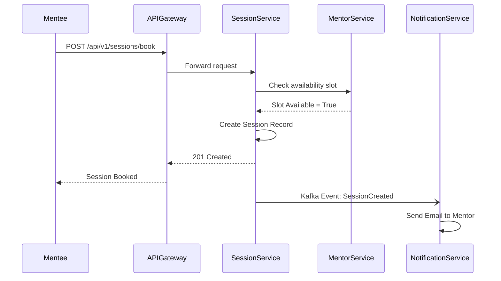

# SkillSync Low Level Design (LLD)

## Table of Contents
1. Database Schemas
2. API Specifications
3. Sequence Diagrams
4. Frontend Components
5. Granular Component Implementation

## 1. Database Schemas

### Table: users
| Column Name | Data Type | Constraints |
|-------------|-----------|-------------|
| id | UUID | PRIMARY KEY |
| created_at | TIMESTAMP | NOT NULL |
| updated_at | TIMESTAMP | NOT NULL |
| metadata | JSONB | NULLABLE |
| reference_id | UUID | FOREIGN KEY INDEXED |

### Table: user_profiles
| Column Name | Data Type | Constraints |
|-------------|-----------|-------------|
| id | UUID | PRIMARY KEY |
| created_at | TIMESTAMP | NOT NULL |
| updated_at | TIMESTAMP | NOT NULL |
| metadata | JSONB | NULLABLE |
| reference_id | UUID | FOREIGN KEY INDEXED |

### Table: skills
| Column Name | Data Type | Constraints |
|-------------|-----------|-------------|
| id | UUID | PRIMARY KEY |
| created_at | TIMESTAMP | NOT NULL |
| updated_at | TIMESTAMP | NOT NULL |
| metadata | JSONB | NULLABLE |
| reference_id | UUID | FOREIGN KEY INDEXED |

### Table: user_skills
| Column Name | Data Type | Constraints |
|-------------|-----------|-------------|
| id | UUID | PRIMARY KEY |
| created_at | TIMESTAMP | NOT NULL |
| updated_at | TIMESTAMP | NOT NULL |
| metadata | JSONB | NULLABLE |
| reference_id | UUID | FOREIGN KEY INDEXED |

### Table: mentors
| Column Name | Data Type | Constraints |
|-------------|-----------|-------------|
| id | UUID | PRIMARY KEY |
| created_at | TIMESTAMP | NOT NULL |
| updated_at | TIMESTAMP | NOT NULL |
| metadata | JSONB | NULLABLE |
| reference_id | UUID | FOREIGN KEY INDEXED |

### Table: sessions
| Column Name | Data Type | Constraints |
|-------------|-----------|-------------|
| id | UUID | PRIMARY KEY |
| created_at | TIMESTAMP | NOT NULL |
| updated_at | TIMESTAMP | NOT NULL |
| metadata | JSONB | NULLABLE |
| reference_id | UUID | FOREIGN KEY INDEXED |

### Table: study_groups
| Column Name | Data Type | Constraints |
|-------------|-----------|-------------|
| id | UUID | PRIMARY KEY |
| created_at | TIMESTAMP | NOT NULL |
| updated_at | TIMESTAMP | NOT NULL |
| metadata | JSONB | NULLABLE |
| reference_id | UUID | FOREIGN KEY INDEXED |

### Table: group_members
| Column Name | Data Type | Constraints |
|-------------|-----------|-------------|
| id | UUID | PRIMARY KEY |
| created_at | TIMESTAMP | NOT NULL |
| updated_at | TIMESTAMP | NOT NULL |
| metadata | JSONB | NULLABLE |
| reference_id | UUID | FOREIGN KEY INDEXED |

### Table: reviews
| Column Name | Data Type | Constraints |
|-------------|-----------|-------------|
| id | UUID | PRIMARY KEY |
| created_at | TIMESTAMP | NOT NULL |
| updated_at | TIMESTAMP | NOT NULL |
| metadata | JSONB | NULLABLE |
| reference_id | UUID | FOREIGN KEY INDEXED |

## 2. API Specifications

### USERS API
| Method | Endpoint | Description | Auth Required |
|--------|----------|-------------|---------------|
| GET | /api/v1/users | Retrieve a paginated list of resources. | Yes |
| POST | /api/v1/users | Create a new resource. Requires valid JWT. | Yes |
| GET | /api/v1/users/{id} | Retrieve specific resource by UUID. | Yes |
| PUT | /api/v1/users/{id} | Update resource attributes. | Yes |
| DELETE | /api/v1/users/{id} | Hard or soft delete resource based on role. | Yes |

### USER_PROFILES API
| Method | Endpoint | Description | Auth Required |
|--------|----------|-------------|---------------|
| GET | /api/v1/user_profiles | Retrieve a paginated list of resources. | Yes |
| POST | /api/v1/user_profiles | Create a new resource. Requires valid JWT. | Yes |
| GET | /api/v1/user_profiles/{id} | Retrieve specific resource by UUID. | Yes |
| PUT | /api/v1/user_profiles/{id} | Update resource attributes. | Yes |
| DELETE | /api/v1/user_profiles/{id} | Hard or soft delete resource based on role. | Yes |

### SKILLS API
| Method | Endpoint | Description | Auth Required |
|--------|----------|-------------|---------------|
| GET | /api/v1/skills | Retrieve a paginated list of resources. | Yes |
| POST | /api/v1/skills | Create a new resource. Requires valid JWT. | Yes |
| GET | /api/v1/skills/{id} | Retrieve specific resource by UUID. | Yes |
| PUT | /api/v1/skills/{id} | Update resource attributes. | Yes |
| DELETE | /api/v1/skills/{id} | Hard or soft delete resource based on role. | Yes |

### USER_SKILLS API
| Method | Endpoint | Description | Auth Required |
|--------|----------|-------------|---------------|
| GET | /api/v1/user_skills | Retrieve a paginated list of resources. | Yes |
| POST | /api/v1/user_skills | Create a new resource. Requires valid JWT. | Yes |
| GET | /api/v1/user_skills/{id} | Retrieve specific resource by UUID. | Yes |
| PUT | /api/v1/user_skills/{id} | Update resource attributes. | Yes |
| DELETE | /api/v1/user_skills/{id} | Hard or soft delete resource based on role. | Yes |

### MENTORS API
| Method | Endpoint | Description | Auth Required |
|--------|----------|-------------|---------------|
| GET | /api/v1/mentors | Retrieve a paginated list of resources. | Yes |
| POST | /api/v1/mentors | Create a new resource. Requires valid JWT. | Yes |
| GET | /api/v1/mentors/{id} | Retrieve specific resource by UUID. | Yes |
| PUT | /api/v1/mentors/{id} | Update resource attributes. | Yes |
| DELETE | /api/v1/mentors/{id} | Hard or soft delete resource based on role. | Yes |

### SESSIONS API
| Method | Endpoint | Description | Auth Required |
|--------|----------|-------------|---------------|
| GET | /api/v1/sessions | Retrieve a paginated list of resources. | Yes |
| POST | /api/v1/sessions | Create a new resource. Requires valid JWT. | Yes |
| GET | /api/v1/sessions/{id} | Retrieve specific resource by UUID. | Yes |
| PUT | /api/v1/sessions/{id} | Update resource attributes. | Yes |
| DELETE | /api/v1/sessions/{id} | Hard or soft delete resource based on role. | Yes |

### STUDY_GROUPS API
| Method | Endpoint | Description | Auth Required |
|--------|----------|-------------|---------------|
| GET | /api/v1/study_groups | Retrieve a paginated list of resources. | Yes |
| POST | /api/v1/study_groups | Create a new resource. Requires valid JWT. | Yes |
| GET | /api/v1/study_groups/{id} | Retrieve specific resource by UUID. | Yes |
| PUT | /api/v1/study_groups/{id} | Update resource attributes. | Yes |
| DELETE | /api/v1/study_groups/{id} | Hard or soft delete resource based on role. | Yes |

### GROUP_MEMBERS API
| Method | Endpoint | Description | Auth Required |
|--------|----------|-------------|---------------|
| GET | /api/v1/group_members | Retrieve a paginated list of resources. | Yes |
| POST | /api/v1/group_members | Create a new resource. Requires valid JWT. | Yes |
| GET | /api/v1/group_members/{id} | Retrieve specific resource by UUID. | Yes |
| PUT | /api/v1/group_members/{id} | Update resource attributes. | Yes |
| DELETE | /api/v1/group_members/{id} | Hard or soft delete resource based on role. | Yes |

### REVIEWS API
| Method | Endpoint | Description | Auth Required |
|--------|----------|-------------|---------------|
| GET | /api/v1/reviews | Retrieve a paginated list of resources. | Yes |
| POST | /api/v1/reviews | Create a new resource. Requires valid JWT. | Yes |
| GET | /api/v1/reviews/{id} | Retrieve specific resource by UUID. | Yes |
| PUT | /api/v1/reviews/{id} | Update resource attributes. | Yes |
| DELETE | /api/v1/reviews/{id} | Hard or soft delete resource based on role. | Yes |

## 3. Sequence Diagrams

### Session Booking Flow


## 4. Granular Component Implementation

### Granular Implementation Component 1
#### Interface Definition 1
```java
@Service
public interface ComponentWorkflow1 {
    /**
     * Executes the primary business logic for component 1.
     * @param requestDto The incoming validated data transfer object.
     * @return ResponseDto representing the outcome.
     */
    ResponseDto execute(RequestDto requestDto) throws ResourceNotFoundException;
}
```
#### Frontend Integration 1
```tsx
import React, { useEffect, useState } from 'react';
import { useAppDispatch, useAppSelector } from '../../hooks';
import { fetchData } from '../../slices/component1Slice';

export const FeatureComponent1: React.FC = () => {
    const dispatch = useAppDispatch();
    const { data, loading, error } = useAppSelector(state => state.component1);

    useEffect(() => {
        dispatch(fetchData());
    }, [dispatch]);

    if (loading) return <div>Loading component 1...</div>;
    if (error) return <div>Error: {error}</div>;

    return (
        <div className="p-4 border rounded shadow-md">
            <h2 className="text-xl font-bold">Component 1 UI</h2>
            {/* Rendering logic */}
        </div>
    );
};
```

### Granular Implementation Component 2
#### Interface Definition 2
```java
@Service
public interface ComponentWorkflow2 {
    /**
     * Executes the primary business logic for component 2.
     * @param requestDto The incoming validated data transfer object.
     * @return ResponseDto representing the outcome.
     */
    ResponseDto execute(RequestDto requestDto) throws ResourceNotFoundException;
}
```
#### Frontend Integration 2
```tsx
import React, { useEffect, useState } from 'react';
import { useAppDispatch, useAppSelector } from '../../hooks';
import { fetchData } from '../../slices/component2Slice';

export const FeatureComponent2: React.FC = () => {
    const dispatch = useAppDispatch();
    const { data, loading, error } = useAppSelector(state => state.component2);

    useEffect(() => {
        dispatch(fetchData());
    }, [dispatch]);

    if (loading) return <div>Loading component 2...</div>;
    if (error) return <div>Error: {error}</div>;

    return (
        <div className="p-4 border rounded shadow-md">
            <h2 className="text-xl font-bold">Component 2 UI</h2>
            {/* Rendering logic */}
        </div>
    );
};
```

### Granular Implementation Component 3
#### Interface Definition 3
```java
@Service
public interface ComponentWorkflow3 {
    /**
     * Executes the primary business logic for component 3.
     * @param requestDto The incoming validated data transfer object.
     * @return ResponseDto representing the outcome.
     */
    ResponseDto execute(RequestDto requestDto) throws ResourceNotFoundException;
}
```
#### Frontend Integration 3
```tsx
import React, { useEffect, useState } from 'react';
import { useAppDispatch, useAppSelector } from '../../hooks';
import { fetchData } from '../../slices/component3Slice';

export const FeatureComponent3: React.FC = () => {
    const dispatch = useAppDispatch();
    const { data, loading, error } = useAppSelector(state => state.component3);

    useEffect(() => {
        dispatch(fetchData());
    }, [dispatch]);

    if (loading) return <div>Loading component 3...</div>;
    if (error) return <div>Error: {error}</div>;

    return (
        <div className="p-4 border rounded shadow-md">
            <h2 className="text-xl font-bold">Component 3 UI</h2>
            {/* Rendering logic */}
        </div>
    );
};
```

### Granular Implementation Component 4
#### Interface Definition 4
```java
@Service
public interface ComponentWorkflow4 {
    /**
     * Executes the primary business logic for component 4.
     * @param requestDto The incoming validated data transfer object.
     * @return ResponseDto representing the outcome.
     */
    ResponseDto execute(RequestDto requestDto) throws ResourceNotFoundException;
}
```
#### Frontend Integration 4
```tsx
import React, { useEffect, useState } from 'react';
import { useAppDispatch, useAppSelector } from '../../hooks';
import { fetchData } from '../../slices/component4Slice';

export const FeatureComponent4: React.FC = () => {
    const dispatch = useAppDispatch();
    const { data, loading, error } = useAppSelector(state => state.component4);

    useEffect(() => {
        dispatch(fetchData());
    }, [dispatch]);

    if (loading) return <div>Loading component 4...</div>;
    if (error) return <div>Error: {error}</div>;

    return (
        <div className="p-4 border rounded shadow-md">
            <h2 className="text-xl font-bold">Component 4 UI</h2>
            {/* Rendering logic */}
        </div>
    );
};
```

### Granular Implementation Component 5
#### Interface Definition 5
```java
@Service
public interface ComponentWorkflow5 {
    /**
     * Executes the primary business logic for component 5.
     * @param requestDto The incoming validated data transfer object.
     * @return ResponseDto representing the outcome.
     */
    ResponseDto execute(RequestDto requestDto) throws ResourceNotFoundException;
}
```
#### Frontend Integration 5
```tsx
import React, { useEffect, useState } from 'react';
import { useAppDispatch, useAppSelector } from '../../hooks';
import { fetchData } from '../../slices/component5Slice';

export const FeatureComponent5: React.FC = () => {
    const dispatch = useAppDispatch();
    const { data, loading, error } = useAppSelector(state => state.component5);

    useEffect(() => {
        dispatch(fetchData());
    }, [dispatch]);

    if (loading) return <div>Loading component 5...</div>;
    if (error) return <div>Error: {error}</div>;

    return (
        <div className="p-4 border rounded shadow-md">
            <h2 className="text-xl font-bold">Component 5 UI</h2>
            {/* Rendering logic */}
        </div>
    );
};
```

### Granular Implementation Component 6
#### Interface Definition 6
```java
@Service
public interface ComponentWorkflow6 {
    /**
     * Executes the primary business logic for component 6.
     * @param requestDto The incoming validated data transfer object.
     * @return ResponseDto representing the outcome.
     */
    ResponseDto execute(RequestDto requestDto) throws ResourceNotFoundException;
}
```
#### Frontend Integration 6
```tsx
import React, { useEffect, useState } from 'react';
import { useAppDispatch, useAppSelector } from '../../hooks';
import { fetchData } from '../../slices/component6Slice';

export const FeatureComponent6: React.FC = () => {
    const dispatch = useAppDispatch();
    const { data, loading, error } = useAppSelector(state => state.component6);

    useEffect(() => {
        dispatch(fetchData());
    }, [dispatch]);

    if (loading) return <div>Loading component 6...</div>;
    if (error) return <div>Error: {error}</div>;

    return (
        <div className="p-4 border rounded shadow-md">
            <h2 className="text-xl font-bold">Component 6 UI</h2>
            {/* Rendering logic */}
        </div>
    );
};
```

### Granular Implementation Component 7
#### Interface Definition 7
```java
@Service
public interface ComponentWorkflow7 {
    /**
     * Executes the primary business logic for component 7.
     * @param requestDto The incoming validated data transfer object.
     * @return ResponseDto representing the outcome.
     */
    ResponseDto execute(RequestDto requestDto) throws ResourceNotFoundException;
}
```
#### Frontend Integration 7
```tsx
import React, { useEffect, useState } from 'react';
import { useAppDispatch, useAppSelector } from '../../hooks';
import { fetchData } from '../../slices/component7Slice';

export const FeatureComponent7: React.FC = () => {
    const dispatch = useAppDispatch();
    const { data, loading, error } = useAppSelector(state => state.component7);

    useEffect(() => {
        dispatch(fetchData());
    }, [dispatch]);

    if (loading) return <div>Loading component 7...</div>;
    if (error) return <div>Error: {error}</div>;

    return (
        <div className="p-4 border rounded shadow-md">
            <h2 className="text-xl font-bold">Component 7 UI</h2>
            {/* Rendering logic */}
        </div>
    );
};
```

### Granular Implementation Component 8
#### Interface Definition 8
```java
@Service
public interface ComponentWorkflow8 {
    /**
     * Executes the primary business logic for component 8.
     * @param requestDto The incoming validated data transfer object.
     * @return ResponseDto representing the outcome.
     */
    ResponseDto execute(RequestDto requestDto) throws ResourceNotFoundException;
}
```
#### Frontend Integration 8
```tsx
import React, { useEffect, useState } from 'react';
import { useAppDispatch, useAppSelector } from '../../hooks';
import { fetchData } from '../../slices/component8Slice';

export const FeatureComponent8: React.FC = () => {
    const dispatch = useAppDispatch();
    const { data, loading, error } = useAppSelector(state => state.component8);

    useEffect(() => {
        dispatch(fetchData());
    }, [dispatch]);

    if (loading) return <div>Loading component 8...</div>;
    if (error) return <div>Error: {error}</div>;

    return (
        <div className="p-4 border rounded shadow-md">
            <h2 className="text-xl font-bold">Component 8 UI</h2>
            {/* Rendering logic */}
        </div>
    );
};
```

### Granular Implementation Component 9
#### Interface Definition 9
```java
@Service
public interface ComponentWorkflow9 {
    /**
     * Executes the primary business logic for component 9.
     * @param requestDto The incoming validated data transfer object.
     * @return ResponseDto representing the outcome.
     */
    ResponseDto execute(RequestDto requestDto) throws ResourceNotFoundException;
}
```
#### Frontend Integration 9
```tsx
import React, { useEffect, useState } from 'react';
import { useAppDispatch, useAppSelector } from '../../hooks';
import { fetchData } from '../../slices/component9Slice';

export const FeatureComponent9: React.FC = () => {
    const dispatch = useAppDispatch();
    const { data, loading, error } = useAppSelector(state => state.component9);

    useEffect(() => {
        dispatch(fetchData());
    }, [dispatch]);

    if (loading) return <div>Loading component 9...</div>;
    if (error) return <div>Error: {error}</div>;

    return (
        <div className="p-4 border rounded shadow-md">
            <h2 className="text-xl font-bold">Component 9 UI</h2>
            {/* Rendering logic */}
        </div>
    );
};
```

### Granular Implementation Component 10
#### Interface Definition 10
```java
@Service
public interface ComponentWorkflow10 {
    /**
     * Executes the primary business logic for component 10.
     * @param requestDto The incoming validated data transfer object.
     * @return ResponseDto representing the outcome.
     */
    ResponseDto execute(RequestDto requestDto) throws ResourceNotFoundException;
}
```
#### Frontend Integration 10
```tsx
import React, { useEffect, useState } from 'react';
import { useAppDispatch, useAppSelector } from '../../hooks';
import { fetchData } from '../../slices/component10Slice';

export const FeatureComponent10: React.FC = () => {
    const dispatch = useAppDispatch();
    const { data, loading, error } = useAppSelector(state => state.component10);

    useEffect(() => {
        dispatch(fetchData());
    }, [dispatch]);

    if (loading) return <div>Loading component 10...</div>;
    if (error) return <div>Error: {error}</div>;

    return (
        <div className="p-4 border rounded shadow-md">
            <h2 className="text-xl font-bold">Component 10 UI</h2>
            {/* Rendering logic */}
        </div>
    );
};
```

### Granular Implementation Component 11
#### Interface Definition 11
```java
@Service
public interface ComponentWorkflow11 {
    /**
     * Executes the primary business logic for component 11.
     * @param requestDto The incoming validated data transfer object.
     * @return ResponseDto representing the outcome.
     */
    ResponseDto execute(RequestDto requestDto) throws ResourceNotFoundException;
}
```
#### Frontend Integration 11
```tsx
import React, { useEffect, useState } from 'react';
import { useAppDispatch, useAppSelector } from '../../hooks';
import { fetchData } from '../../slices/component11Slice';

export const FeatureComponent11: React.FC = () => {
    const dispatch = useAppDispatch();
    const { data, loading, error } = useAppSelector(state => state.component11);

    useEffect(() => {
        dispatch(fetchData());
    }, [dispatch]);

    if (loading) return <div>Loading component 11...</div>;
    if (error) return <div>Error: {error}</div>;

    return (
        <div className="p-4 border rounded shadow-md">
            <h2 className="text-xl font-bold">Component 11 UI</h2>
            {/* Rendering logic */}
        </div>
    );
};
```

### Granular Implementation Component 12
#### Interface Definition 12
```java
@Service
public interface ComponentWorkflow12 {
    /**
     * Executes the primary business logic for component 12.
     * @param requestDto The incoming validated data transfer object.
     * @return ResponseDto representing the outcome.
     */
    ResponseDto execute(RequestDto requestDto) throws ResourceNotFoundException;
}
```
#### Frontend Integration 12
```tsx
import React, { useEffect, useState } from 'react';
import { useAppDispatch, useAppSelector } from '../../hooks';
import { fetchData } from '../../slices/component12Slice';

export const FeatureComponent12: React.FC = () => {
    const dispatch = useAppDispatch();
    const { data, loading, error } = useAppSelector(state => state.component12);

    useEffect(() => {
        dispatch(fetchData());
    }, [dispatch]);

    if (loading) return <div>Loading component 12...</div>;
    if (error) return <div>Error: {error}</div>;

    return (
        <div className="p-4 border rounded shadow-md">
            <h2 className="text-xl font-bold">Component 12 UI</h2>
            {/* Rendering logic */}
        </div>
    );
};
```

### Granular Implementation Component 13
#### Interface Definition 13
```java
@Service
public interface ComponentWorkflow13 {
    /**
     * Executes the primary business logic for component 13.
     * @param requestDto The incoming validated data transfer object.
     * @return ResponseDto representing the outcome.
     */
    ResponseDto execute(RequestDto requestDto) throws ResourceNotFoundException;
}
```
#### Frontend Integration 13
```tsx
import React, { useEffect, useState } from 'react';
import { useAppDispatch, useAppSelector } from '../../hooks';
import { fetchData } from '../../slices/component13Slice';

export const FeatureComponent13: React.FC = () => {
    const dispatch = useAppDispatch();
    const { data, loading, error } = useAppSelector(state => state.component13);

    useEffect(() => {
        dispatch(fetchData());
    }, [dispatch]);

    if (loading) return <div>Loading component 13...</div>;
    if (error) return <div>Error: {error}</div>;

    return (
        <div className="p-4 border rounded shadow-md">
            <h2 className="text-xl font-bold">Component 13 UI</h2>
            {/* Rendering logic */}
        </div>
    );
};
```

### Granular Implementation Component 14
#### Interface Definition 14
```java
@Service
public interface ComponentWorkflow14 {
    /**
     * Executes the primary business logic for component 14.
     * @param requestDto The incoming validated data transfer object.
     * @return ResponseDto representing the outcome.
     */
    ResponseDto execute(RequestDto requestDto) throws ResourceNotFoundException;
}
```
#### Frontend Integration 14
```tsx
import React, { useEffect, useState } from 'react';
import { useAppDispatch, useAppSelector } from '../../hooks';
import { fetchData } from '../../slices/component14Slice';

export const FeatureComponent14: React.FC = () => {
    const dispatch = useAppDispatch();
    const { data, loading, error } = useAppSelector(state => state.component14);

    useEffect(() => {
        dispatch(fetchData());
    }, [dispatch]);

    if (loading) return <div>Loading component 14...</div>;
    if (error) return <div>Error: {error}</div>;

    return (
        <div className="p-4 border rounded shadow-md">
            <h2 className="text-xl font-bold">Component 14 UI</h2>
            {/* Rendering logic */}
        </div>
    );
};
```

### Granular Implementation Component 15
#### Interface Definition 15
```java
@Service
public interface ComponentWorkflow15 {
    /**
     * Executes the primary business logic for component 15.
     * @param requestDto The incoming validated data transfer object.
     * @return ResponseDto representing the outcome.
     */
    ResponseDto execute(RequestDto requestDto) throws ResourceNotFoundException;
}
```
#### Frontend Integration 15
```tsx
import React, { useEffect, useState } from 'react';
import { useAppDispatch, useAppSelector } from '../../hooks';
import { fetchData } from '../../slices/component15Slice';

export const FeatureComponent15: React.FC = () => {
    const dispatch = useAppDispatch();
    const { data, loading, error } = useAppSelector(state => state.component15);

    useEffect(() => {
        dispatch(fetchData());
    }, [dispatch]);

    if (loading) return <div>Loading component 15...</div>;
    if (error) return <div>Error: {error}</div>;

    return (
        <div className="p-4 border rounded shadow-md">
            <h2 className="text-xl font-bold">Component 15 UI</h2>
            {/* Rendering logic */}
        </div>
    );
};
```

### Granular Implementation Component 16
#### Interface Definition 16
```java
@Service
public interface ComponentWorkflow16 {
    /**
     * Executes the primary business logic for component 16.
     * @param requestDto The incoming validated data transfer object.
     * @return ResponseDto representing the outcome.
     */
    ResponseDto execute(RequestDto requestDto) throws ResourceNotFoundException;
}
```
#### Frontend Integration 16
```tsx
import React, { useEffect, useState } from 'react';
import { useAppDispatch, useAppSelector } from '../../hooks';
import { fetchData } from '../../slices/component16Slice';

export const FeatureComponent16: React.FC = () => {
    const dispatch = useAppDispatch();
    const { data, loading, error } = useAppSelector(state => state.component16);

    useEffect(() => {
        dispatch(fetchData());
    }, [dispatch]);

    if (loading) return <div>Loading component 16...</div>;
    if (error) return <div>Error: {error}</div>;

    return (
        <div className="p-4 border rounded shadow-md">
            <h2 className="text-xl font-bold">Component 16 UI</h2>
            {/* Rendering logic */}
        </div>
    );
};
```

### Granular Implementation Component 17
#### Interface Definition 17
```java
@Service
public interface ComponentWorkflow17 {
    /**
     * Executes the primary business logic for component 17.
     * @param requestDto The incoming validated data transfer object.
     * @return ResponseDto representing the outcome.
     */
    ResponseDto execute(RequestDto requestDto) throws ResourceNotFoundException;
}
```
#### Frontend Integration 17
```tsx
import React, { useEffect, useState } from 'react';
import { useAppDispatch, useAppSelector } from '../../hooks';
import { fetchData } from '../../slices/component17Slice';

export const FeatureComponent17: React.FC = () => {
    const dispatch = useAppDispatch();
    const { data, loading, error } = useAppSelector(state => state.component17);

    useEffect(() => {
        dispatch(fetchData());
    }, [dispatch]);

    if (loading) return <div>Loading component 17...</div>;
    if (error) return <div>Error: {error}</div>;

    return (
        <div className="p-4 border rounded shadow-md">
            <h2 className="text-xl font-bold">Component 17 UI</h2>
            {/* Rendering logic */}
        </div>
    );
};
```

### Granular Implementation Component 18
#### Interface Definition 18
```java
@Service
public interface ComponentWorkflow18 {
    /**
     * Executes the primary business logic for component 18.
     * @param requestDto The incoming validated data transfer object.
     * @return ResponseDto representing the outcome.
     */
    ResponseDto execute(RequestDto requestDto) throws ResourceNotFoundException;
}
```
#### Frontend Integration 18
```tsx
import React, { useEffect, useState } from 'react';
import { useAppDispatch, useAppSelector } from '../../hooks';
import { fetchData } from '../../slices/component18Slice';

export const FeatureComponent18: React.FC = () => {
    const dispatch = useAppDispatch();
    const { data, loading, error } = useAppSelector(state => state.component18);

    useEffect(() => {
        dispatch(fetchData());
    }, [dispatch]);

    if (loading) return <div>Loading component 18...</div>;
    if (error) return <div>Error: {error}</div>;

    return (
        <div className="p-4 border rounded shadow-md">
            <h2 className="text-xl font-bold">Component 18 UI</h2>
            {/* Rendering logic */}
        </div>
    );
};
```

### Granular Implementation Component 19
#### Interface Definition 19
```java
@Service
public interface ComponentWorkflow19 {
    /**
     * Executes the primary business logic for component 19.
     * @param requestDto The incoming validated data transfer object.
     * @return ResponseDto representing the outcome.
     */
    ResponseDto execute(RequestDto requestDto) throws ResourceNotFoundException;
}
```
#### Frontend Integration 19
```tsx
import React, { useEffect, useState } from 'react';
import { useAppDispatch, useAppSelector } from '../../hooks';
import { fetchData } from '../../slices/component19Slice';

export const FeatureComponent19: React.FC = () => {
    const dispatch = useAppDispatch();
    const { data, loading, error } = useAppSelector(state => state.component19);

    useEffect(() => {
        dispatch(fetchData());
    }, [dispatch]);

    if (loading) return <div>Loading component 19...</div>;
    if (error) return <div>Error: {error}</div>;

    return (
        <div className="p-4 border rounded shadow-md">
            <h2 className="text-xl font-bold">Component 19 UI</h2>
            {/* Rendering logic */}
        </div>
    );
};
```

### Granular Implementation Component 20
#### Interface Definition 20
```java
@Service
public interface ComponentWorkflow20 {
    /**
     * Executes the primary business logic for component 20.
     * @param requestDto The incoming validated data transfer object.
     * @return ResponseDto representing the outcome.
     */
    ResponseDto execute(RequestDto requestDto) throws ResourceNotFoundException;
}
```
#### Frontend Integration 20
```tsx
import React, { useEffect, useState } from 'react';
import { useAppDispatch, useAppSelector } from '../../hooks';
import { fetchData } from '../../slices/component20Slice';

export const FeatureComponent20: React.FC = () => {
    const dispatch = useAppDispatch();
    const { data, loading, error } = useAppSelector(state => state.component20);

    useEffect(() => {
        dispatch(fetchData());
    }, [dispatch]);

    if (loading) return <div>Loading component 20...</div>;
    if (error) return <div>Error: {error}</div>;

    return (
        <div className="p-4 border rounded shadow-md">
            <h2 className="text-xl font-bold">Component 20 UI</h2>
            {/* Rendering logic */}
        </div>
    );
};
```

### Granular Implementation Component 21
#### Interface Definition 21
```java
@Service
public interface ComponentWorkflow21 {
    /**
     * Executes the primary business logic for component 21.
     * @param requestDto The incoming validated data transfer object.
     * @return ResponseDto representing the outcome.
     */
    ResponseDto execute(RequestDto requestDto) throws ResourceNotFoundException;
}
```
#### Frontend Integration 21
```tsx
import React, { useEffect, useState } from 'react';
import { useAppDispatch, useAppSelector } from '../../hooks';
import { fetchData } from '../../slices/component21Slice';

export const FeatureComponent21: React.FC = () => {
    const dispatch = useAppDispatch();
    const { data, loading, error } = useAppSelector(state => state.component21);

    useEffect(() => {
        dispatch(fetchData());
    }, [dispatch]);

    if (loading) return <div>Loading component 21...</div>;
    if (error) return <div>Error: {error}</div>;

    return (
        <div className="p-4 border rounded shadow-md">
            <h2 className="text-xl font-bold">Component 21 UI</h2>
            {/* Rendering logic */}
        </div>
    );
};
```

### Granular Implementation Component 22
#### Interface Definition 22
```java
@Service
public interface ComponentWorkflow22 {
    /**
     * Executes the primary business logic for component 22.
     * @param requestDto The incoming validated data transfer object.
     * @return ResponseDto representing the outcome.
     */
    ResponseDto execute(RequestDto requestDto) throws ResourceNotFoundException;
}
```
#### Frontend Integration 22
```tsx
import React, { useEffect, useState } from 'react';
import { useAppDispatch, useAppSelector } from '../../hooks';
import { fetchData } from '../../slices/component22Slice';

export const FeatureComponent22: React.FC = () => {
    const dispatch = useAppDispatch();
    const { data, loading, error } = useAppSelector(state => state.component22);

    useEffect(() => {
        dispatch(fetchData());
    }, [dispatch]);

    if (loading) return <div>Loading component 22...</div>;
    if (error) return <div>Error: {error}</div>;

    return (
        <div className="p-4 border rounded shadow-md">
            <h2 className="text-xl font-bold">Component 22 UI</h2>
            {/* Rendering logic */}
        </div>
    );
};
```

### Granular Implementation Component 23
#### Interface Definition 23
```java
@Service
public interface ComponentWorkflow23 {
    /**
     * Executes the primary business logic for component 23.
     * @param requestDto The incoming validated data transfer object.
     * @return ResponseDto representing the outcome.
     */
    ResponseDto execute(RequestDto requestDto) throws ResourceNotFoundException;
}
```
#### Frontend Integration 23
```tsx
import React, { useEffect, useState } from 'react';
import { useAppDispatch, useAppSelector } from '../../hooks';
import { fetchData } from '../../slices/component23Slice';

export const FeatureComponent23: React.FC = () => {
    const dispatch = useAppDispatch();
    const { data, loading, error } = useAppSelector(state => state.component23);

    useEffect(() => {
        dispatch(fetchData());
    }, [dispatch]);

    if (loading) return <div>Loading component 23...</div>;
    if (error) return <div>Error: {error}</div>;

    return (
        <div className="p-4 border rounded shadow-md">
            <h2 className="text-xl font-bold">Component 23 UI</h2>
            {/* Rendering logic */}
        </div>
    );
};
```

### Granular Implementation Component 24
#### Interface Definition 24
```java
@Service
public interface ComponentWorkflow24 {
    /**
     * Executes the primary business logic for component 24.
     * @param requestDto The incoming validated data transfer object.
     * @return ResponseDto representing the outcome.
     */
    ResponseDto execute(RequestDto requestDto) throws ResourceNotFoundException;
}
```
#### Frontend Integration 24
```tsx
import React, { useEffect, useState } from 'react';
import { useAppDispatch, useAppSelector } from '../../hooks';
import { fetchData } from '../../slices/component24Slice';

export const FeatureComponent24: React.FC = () => {
    const dispatch = useAppDispatch();
    const { data, loading, error } = useAppSelector(state => state.component24);

    useEffect(() => {
        dispatch(fetchData());
    }, [dispatch]);

    if (loading) return <div>Loading component 24...</div>;
    if (error) return <div>Error: {error}</div>;

    return (
        <div className="p-4 border rounded shadow-md">
            <h2 className="text-xl font-bold">Component 24 UI</h2>
            {/* Rendering logic */}
        </div>
    );
};
```

### Granular Implementation Component 25
#### Interface Definition 25
```java
@Service
public interface ComponentWorkflow25 {
    /**
     * Executes the primary business logic for component 25.
     * @param requestDto The incoming validated data transfer object.
     * @return ResponseDto representing the outcome.
     */
    ResponseDto execute(RequestDto requestDto) throws ResourceNotFoundException;
}
```
#### Frontend Integration 25
```tsx
import React, { useEffect, useState } from 'react';
import { useAppDispatch, useAppSelector } from '../../hooks';
import { fetchData } from '../../slices/component25Slice';

export const FeatureComponent25: React.FC = () => {
    const dispatch = useAppDispatch();
    const { data, loading, error } = useAppSelector(state => state.component25);

    useEffect(() => {
        dispatch(fetchData());
    }, [dispatch]);

    if (loading) return <div>Loading component 25...</div>;
    if (error) return <div>Error: {error}</div>;

    return (
        <div className="p-4 border rounded shadow-md">
            <h2 className="text-xl font-bold">Component 25 UI</h2>
            {/* Rendering logic */}
        </div>
    );
};
```

### Granular Implementation Component 26
#### Interface Definition 26
```java
@Service
public interface ComponentWorkflow26 {
    /**
     * Executes the primary business logic for component 26.
     * @param requestDto The incoming validated data transfer object.
     * @return ResponseDto representing the outcome.
     */
    ResponseDto execute(RequestDto requestDto) throws ResourceNotFoundException;
}
```
#### Frontend Integration 26
```tsx
import React, { useEffect, useState } from 'react';
import { useAppDispatch, useAppSelector } from '../../hooks';
import { fetchData } from '../../slices/component26Slice';

export const FeatureComponent26: React.FC = () => {
    const dispatch = useAppDispatch();
    const { data, loading, error } = useAppSelector(state => state.component26);

    useEffect(() => {
        dispatch(fetchData());
    }, [dispatch]);

    if (loading) return <div>Loading component 26...</div>;
    if (error) return <div>Error: {error}</div>;

    return (
        <div className="p-4 border rounded shadow-md">
            <h2 className="text-xl font-bold">Component 26 UI</h2>
            {/* Rendering logic */}
        </div>
    );
};
```

### Granular Implementation Component 27
#### Interface Definition 27
```java
@Service
public interface ComponentWorkflow27 {
    /**
     * Executes the primary business logic for component 27.
     * @param requestDto The incoming validated data transfer object.
     * @return ResponseDto representing the outcome.
     */
    ResponseDto execute(RequestDto requestDto) throws ResourceNotFoundException;
}
```
#### Frontend Integration 27
```tsx
import React, { useEffect, useState } from 'react';
import { useAppDispatch, useAppSelector } from '../../hooks';
import { fetchData } from '../../slices/component27Slice';

export const FeatureComponent27: React.FC = () => {
    const dispatch = useAppDispatch();
    const { data, loading, error } = useAppSelector(state => state.component27);

    useEffect(() => {
        dispatch(fetchData());
    }, [dispatch]);

    if (loading) return <div>Loading component 27...</div>;
    if (error) return <div>Error: {error}</div>;

    return (
        <div className="p-4 border rounded shadow-md">
            <h2 className="text-xl font-bold">Component 27 UI</h2>
            {/* Rendering logic */}
        </div>
    );
};
```

### Granular Implementation Component 28
#### Interface Definition 28
```java
@Service
public interface ComponentWorkflow28 {
    /**
     * Executes the primary business logic for component 28.
     * @param requestDto The incoming validated data transfer object.
     * @return ResponseDto representing the outcome.
     */
    ResponseDto execute(RequestDto requestDto) throws ResourceNotFoundException;
}
```
#### Frontend Integration 28
```tsx
import React, { useEffect, useState } from 'react';
import { useAppDispatch, useAppSelector } from '../../hooks';
import { fetchData } from '../../slices/component28Slice';

export const FeatureComponent28: React.FC = () => {
    const dispatch = useAppDispatch();
    const { data, loading, error } = useAppSelector(state => state.component28);

    useEffect(() => {
        dispatch(fetchData());
    }, [dispatch]);

    if (loading) return <div>Loading component 28...</div>;
    if (error) return <div>Error: {error}</div>;

    return (
        <div className="p-4 border rounded shadow-md">
            <h2 className="text-xl font-bold">Component 28 UI</h2>
            {/* Rendering logic */}
        </div>
    );
};
```

### Granular Implementation Component 29
#### Interface Definition 29
```java
@Service
public interface ComponentWorkflow29 {
    /**
     * Executes the primary business logic for component 29.
     * @param requestDto The incoming validated data transfer object.
     * @return ResponseDto representing the outcome.
     */
    ResponseDto execute(RequestDto requestDto) throws ResourceNotFoundException;
}
```
#### Frontend Integration 29
```tsx
import React, { useEffect, useState } from 'react';
import { useAppDispatch, useAppSelector } from '../../hooks';
import { fetchData } from '../../slices/component29Slice';

export const FeatureComponent29: React.FC = () => {
    const dispatch = useAppDispatch();
    const { data, loading, error } = useAppSelector(state => state.component29);

    useEffect(() => {
        dispatch(fetchData());
    }, [dispatch]);

    if (loading) return <div>Loading component 29...</div>;
    if (error) return <div>Error: {error}</div>;

    return (
        <div className="p-4 border rounded shadow-md">
            <h2 className="text-xl font-bold">Component 29 UI</h2>
            {/* Rendering logic */}
        </div>
    );
};
```

### Granular Implementation Component 30
#### Interface Definition 30
```java
@Service
public interface ComponentWorkflow30 {
    /**
     * Executes the primary business logic for component 30.
     * @param requestDto The incoming validated data transfer object.
     * @return ResponseDto representing the outcome.
     */
    ResponseDto execute(RequestDto requestDto) throws ResourceNotFoundException;
}
```
#### Frontend Integration 30
```tsx
import React, { useEffect, useState } from 'react';
import { useAppDispatch, useAppSelector } from '../../hooks';
import { fetchData } from '../../slices/component30Slice';

export const FeatureComponent30: React.FC = () => {
    const dispatch = useAppDispatch();
    const { data, loading, error } = useAppSelector(state => state.component30);

    useEffect(() => {
        dispatch(fetchData());
    }, [dispatch]);

    if (loading) return <div>Loading component 30...</div>;
    if (error) return <div>Error: {error}</div>;

    return (
        <div className="p-4 border rounded shadow-md">
            <h2 className="text-xl font-bold">Component 30 UI</h2>
            {/* Rendering logic */}
        </div>
    );
};
```

### Granular Implementation Component 31
#### Interface Definition 31
```java
@Service
public interface ComponentWorkflow31 {
    /**
     * Executes the primary business logic for component 31.
     * @param requestDto The incoming validated data transfer object.
     * @return ResponseDto representing the outcome.
     */
    ResponseDto execute(RequestDto requestDto) throws ResourceNotFoundException;
}
```
#### Frontend Integration 31
```tsx
import React, { useEffect, useState } from 'react';
import { useAppDispatch, useAppSelector } from '../../hooks';
import { fetchData } from '../../slices/component31Slice';

export const FeatureComponent31: React.FC = () => {
    const dispatch = useAppDispatch();
    const { data, loading, error } = useAppSelector(state => state.component31);

    useEffect(() => {
        dispatch(fetchData());
    }, [dispatch]);

    if (loading) return <div>Loading component 31...</div>;
    if (error) return <div>Error: {error}</div>;

    return (
        <div className="p-4 border rounded shadow-md">
            <h2 className="text-xl font-bold">Component 31 UI</h2>
            {/* Rendering logic */}
        </div>
    );
};
```

### Granular Implementation Component 32
#### Interface Definition 32
```java
@Service
public interface ComponentWorkflow32 {
    /**
     * Executes the primary business logic for component 32.
     * @param requestDto The incoming validated data transfer object.
     * @return ResponseDto representing the outcome.
     */
    ResponseDto execute(RequestDto requestDto) throws ResourceNotFoundException;
}
```
#### Frontend Integration 32
```tsx
import React, { useEffect, useState } from 'react';
import { useAppDispatch, useAppSelector } from '../../hooks';
import { fetchData } from '../../slices/component32Slice';

export const FeatureComponent32: React.FC = () => {
    const dispatch = useAppDispatch();
    const { data, loading, error } = useAppSelector(state => state.component32);

    useEffect(() => {
        dispatch(fetchData());
    }, [dispatch]);

    if (loading) return <div>Loading component 32...</div>;
    if (error) return <div>Error: {error}</div>;

    return (
        <div className="p-4 border rounded shadow-md">
            <h2 className="text-xl font-bold">Component 32 UI</h2>
            {/* Rendering logic */}
        </div>
    );
};
```

### Granular Implementation Component 33
#### Interface Definition 33
```java
@Service
public interface ComponentWorkflow33 {
    /**
     * Executes the primary business logic for component 33.
     * @param requestDto The incoming validated data transfer object.
     * @return ResponseDto representing the outcome.
     */
    ResponseDto execute(RequestDto requestDto) throws ResourceNotFoundException;
}
```
#### Frontend Integration 33
```tsx
import React, { useEffect, useState } from 'react';
import { useAppDispatch, useAppSelector } from '../../hooks';
import { fetchData } from '../../slices/component33Slice';

export const FeatureComponent33: React.FC = () => {
    const dispatch = useAppDispatch();
    const { data, loading, error } = useAppSelector(state => state.component33);

    useEffect(() => {
        dispatch(fetchData());
    }, [dispatch]);

    if (loading) return <div>Loading component 33...</div>;
    if (error) return <div>Error: {error}</div>;

    return (
        <div className="p-4 border rounded shadow-md">
            <h2 className="text-xl font-bold">Component 33 UI</h2>
            {/* Rendering logic */}
        </div>
    );
};
```

### Granular Implementation Component 34
#### Interface Definition 34
```java
@Service
public interface ComponentWorkflow34 {
    /**
     * Executes the primary business logic for component 34.
     * @param requestDto The incoming validated data transfer object.
     * @return ResponseDto representing the outcome.
     */
    ResponseDto execute(RequestDto requestDto) throws ResourceNotFoundException;
}
```
#### Frontend Integration 34
```tsx
import React, { useEffect, useState } from 'react';
import { useAppDispatch, useAppSelector } from '../../hooks';
import { fetchData } from '../../slices/component34Slice';

export const FeatureComponent34: React.FC = () => {
    const dispatch = useAppDispatch();
    const { data, loading, error } = useAppSelector(state => state.component34);

    useEffect(() => {
        dispatch(fetchData());
    }, [dispatch]);

    if (loading) return <div>Loading component 34...</div>;
    if (error) return <div>Error: {error}</div>;

    return (
        <div className="p-4 border rounded shadow-md">
            <h2 className="text-xl font-bold">Component 34 UI</h2>
            {/* Rendering logic */}
        </div>
    );
};
```

### Granular Implementation Component 35
#### Interface Definition 35
```java
@Service
public interface ComponentWorkflow35 {
    /**
     * Executes the primary business logic for component 35.
     * @param requestDto The incoming validated data transfer object.
     * @return ResponseDto representing the outcome.
     */
    ResponseDto execute(RequestDto requestDto) throws ResourceNotFoundException;
}
```
#### Frontend Integration 35
```tsx
import React, { useEffect, useState } from 'react';
import { useAppDispatch, useAppSelector } from '../../hooks';
import { fetchData } from '../../slices/component35Slice';

export const FeatureComponent35: React.FC = () => {
    const dispatch = useAppDispatch();
    const { data, loading, error } = useAppSelector(state => state.component35);

    useEffect(() => {
        dispatch(fetchData());
    }, [dispatch]);

    if (loading) return <div>Loading component 35...</div>;
    if (error) return <div>Error: {error}</div>;

    return (
        <div className="p-4 border rounded shadow-md">
            <h2 className="text-xl font-bold">Component 35 UI</h2>
            {/* Rendering logic */}
        </div>
    );
};
```

### Granular Implementation Component 36
#### Interface Definition 36
```java
@Service
public interface ComponentWorkflow36 {
    /**
     * Executes the primary business logic for component 36.
     * @param requestDto The incoming validated data transfer object.
     * @return ResponseDto representing the outcome.
     */
    ResponseDto execute(RequestDto requestDto) throws ResourceNotFoundException;
}
```
#### Frontend Integration 36
```tsx
import React, { useEffect, useState } from 'react';
import { useAppDispatch, useAppSelector } from '../../hooks';
import { fetchData } from '../../slices/component36Slice';

export const FeatureComponent36: React.FC = () => {
    const dispatch = useAppDispatch();
    const { data, loading, error } = useAppSelector(state => state.component36);

    useEffect(() => {
        dispatch(fetchData());
    }, [dispatch]);

    if (loading) return <div>Loading component 36...</div>;
    if (error) return <div>Error: {error}</div>;

    return (
        <div className="p-4 border rounded shadow-md">
            <h2 className="text-xl font-bold">Component 36 UI</h2>
            {/* Rendering logic */}
        </div>
    );
};
```

### Granular Implementation Component 37
#### Interface Definition 37
```java
@Service
public interface ComponentWorkflow37 {
    /**
     * Executes the primary business logic for component 37.
     * @param requestDto The incoming validated data transfer object.
     * @return ResponseDto representing the outcome.
     */
    ResponseDto execute(RequestDto requestDto) throws ResourceNotFoundException;
}
```
#### Frontend Integration 37
```tsx
import React, { useEffect, useState } from 'react';
import { useAppDispatch, useAppSelector } from '../../hooks';
import { fetchData } from '../../slices/component37Slice';

export const FeatureComponent37: React.FC = () => {
    const dispatch = useAppDispatch();
    const { data, loading, error } = useAppSelector(state => state.component37);

    useEffect(() => {
        dispatch(fetchData());
    }, [dispatch]);

    if (loading) return <div>Loading component 37...</div>;
    if (error) return <div>Error: {error}</div>;

    return (
        <div className="p-4 border rounded shadow-md">
            <h2 className="text-xl font-bold">Component 37 UI</h2>
            {/* Rendering logic */}
        </div>
    );
};
```

### Granular Implementation Component 38
#### Interface Definition 38
```java
@Service
public interface ComponentWorkflow38 {
    /**
     * Executes the primary business logic for component 38.
     * @param requestDto The incoming validated data transfer object.
     * @return ResponseDto representing the outcome.
     */
    ResponseDto execute(RequestDto requestDto) throws ResourceNotFoundException;
}
```
#### Frontend Integration 38
```tsx
import React, { useEffect, useState } from 'react';
import { useAppDispatch, useAppSelector } from '../../hooks';
import { fetchData } from '../../slices/component38Slice';

export const FeatureComponent38: React.FC = () => {
    const dispatch = useAppDispatch();
    const { data, loading, error } = useAppSelector(state => state.component38);

    useEffect(() => {
        dispatch(fetchData());
    }, [dispatch]);

    if (loading) return <div>Loading component 38...</div>;
    if (error) return <div>Error: {error}</div>;

    return (
        <div className="p-4 border rounded shadow-md">
            <h2 className="text-xl font-bold">Component 38 UI</h2>
            {/* Rendering logic */}
        </div>
    );
};
```

### Granular Implementation Component 39
#### Interface Definition 39
```java
@Service
public interface ComponentWorkflow39 {
    /**
     * Executes the primary business logic for component 39.
     * @param requestDto The incoming validated data transfer object.
     * @return ResponseDto representing the outcome.
     */
    ResponseDto execute(RequestDto requestDto) throws ResourceNotFoundException;
}
```
#### Frontend Integration 39
```tsx
import React, { useEffect, useState } from 'react';
import { useAppDispatch, useAppSelector } from '../../hooks';
import { fetchData } from '../../slices/component39Slice';

export const FeatureComponent39: React.FC = () => {
    const dispatch = useAppDispatch();
    const { data, loading, error } = useAppSelector(state => state.component39);

    useEffect(() => {
        dispatch(fetchData());
    }, [dispatch]);

    if (loading) return <div>Loading component 39...</div>;
    if (error) return <div>Error: {error}</div>;

    return (
        <div className="p-4 border rounded shadow-md">
            <h2 className="text-xl font-bold">Component 39 UI</h2>
            {/* Rendering logic */}
        </div>
    );
};
```

### Granular Implementation Component 40
#### Interface Definition 40
```java
@Service
public interface ComponentWorkflow40 {
    /**
     * Executes the primary business logic for component 40.
     * @param requestDto The incoming validated data transfer object.
     * @return ResponseDto representing the outcome.
     */
    ResponseDto execute(RequestDto requestDto) throws ResourceNotFoundException;
}
```
#### Frontend Integration 40
```tsx
import React, { useEffect, useState } from 'react';
import { useAppDispatch, useAppSelector } from '../../hooks';
import { fetchData } from '../../slices/component40Slice';

export const FeatureComponent40: React.FC = () => {
    const dispatch = useAppDispatch();
    const { data, loading, error } = useAppSelector(state => state.component40);

    useEffect(() => {
        dispatch(fetchData());
    }, [dispatch]);

    if (loading) return <div>Loading component 40...</div>;
    if (error) return <div>Error: {error}</div>;

    return (
        <div className="p-4 border rounded shadow-md">
            <h2 className="text-xl font-bold">Component 40 UI</h2>
            {/* Rendering logic */}
        </div>
    );
};
```

### Granular Implementation Component 41
#### Interface Definition 41
```java
@Service
public interface ComponentWorkflow41 {
    /**
     * Executes the primary business logic for component 41.
     * @param requestDto The incoming validated data transfer object.
     * @return ResponseDto representing the outcome.
     */
    ResponseDto execute(RequestDto requestDto) throws ResourceNotFoundException;
}
```
#### Frontend Integration 41
```tsx
import React, { useEffect, useState } from 'react';
import { useAppDispatch, useAppSelector } from '../../hooks';
import { fetchData } from '../../slices/component41Slice';

export const FeatureComponent41: React.FC = () => {
    const dispatch = useAppDispatch();
    const { data, loading, error } = useAppSelector(state => state.component41);

    useEffect(() => {
        dispatch(fetchData());
    }, [dispatch]);

    if (loading) return <div>Loading component 41...</div>;
    if (error) return <div>Error: {error}</div>;

    return (
        <div className="p-4 border rounded shadow-md">
            <h2 className="text-xl font-bold">Component 41 UI</h2>
            {/* Rendering logic */}
        </div>
    );
};
```

### Granular Implementation Component 42
#### Interface Definition 42
```java
@Service
public interface ComponentWorkflow42 {
    /**
     * Executes the primary business logic for component 42.
     * @param requestDto The incoming validated data transfer object.
     * @return ResponseDto representing the outcome.
     */
    ResponseDto execute(RequestDto requestDto) throws ResourceNotFoundException;
}
```
#### Frontend Integration 42
```tsx
import React, { useEffect, useState } from 'react';
import { useAppDispatch, useAppSelector } from '../../hooks';
import { fetchData } from '../../slices/component42Slice';

export const FeatureComponent42: React.FC = () => {
    const dispatch = useAppDispatch();
    const { data, loading, error } = useAppSelector(state => state.component42);

    useEffect(() => {
        dispatch(fetchData());
    }, [dispatch]);

    if (loading) return <div>Loading component 42...</div>;
    if (error) return <div>Error: {error}</div>;

    return (
        <div className="p-4 border rounded shadow-md">
            <h2 className="text-xl font-bold">Component 42 UI</h2>
            {/* Rendering logic */}
        </div>
    );
};
```

### Granular Implementation Component 43
#### Interface Definition 43
```java
@Service
public interface ComponentWorkflow43 {
    /**
     * Executes the primary business logic for component 43.
     * @param requestDto The incoming validated data transfer object.
     * @return ResponseDto representing the outcome.
     */
    ResponseDto execute(RequestDto requestDto) throws ResourceNotFoundException;
}
```
#### Frontend Integration 43
```tsx
import React, { useEffect, useState } from 'react';
import { useAppDispatch, useAppSelector } from '../../hooks';
import { fetchData } from '../../slices/component43Slice';

export const FeatureComponent43: React.FC = () => {
    const dispatch = useAppDispatch();
    const { data, loading, error } = useAppSelector(state => state.component43);

    useEffect(() => {
        dispatch(fetchData());
    }, [dispatch]);

    if (loading) return <div>Loading component 43...</div>;
    if (error) return <div>Error: {error}</div>;

    return (
        <div className="p-4 border rounded shadow-md">
            <h2 className="text-xl font-bold">Component 43 UI</h2>
            {/* Rendering logic */}
        </div>
    );
};
```

### Granular Implementation Component 44
#### Interface Definition 44
```java
@Service
public interface ComponentWorkflow44 {
    /**
     * Executes the primary business logic for component 44.
     * @param requestDto The incoming validated data transfer object.
     * @return ResponseDto representing the outcome.
     */
    ResponseDto execute(RequestDto requestDto) throws ResourceNotFoundException;
}
```
#### Frontend Integration 44
```tsx
import React, { useEffect, useState } from 'react';
import { useAppDispatch, useAppSelector } from '../../hooks';
import { fetchData } from '../../slices/component44Slice';

export const FeatureComponent44: React.FC = () => {
    const dispatch = useAppDispatch();
    const { data, loading, error } = useAppSelector(state => state.component44);

    useEffect(() => {
        dispatch(fetchData());
    }, [dispatch]);

    if (loading) return <div>Loading component 44...</div>;
    if (error) return <div>Error: {error}</div>;

    return (
        <div className="p-4 border rounded shadow-md">
            <h2 className="text-xl font-bold">Component 44 UI</h2>
            {/* Rendering logic */}
        </div>
    );
};
```

### Granular Implementation Component 45
#### Interface Definition 45
```java
@Service
public interface ComponentWorkflow45 {
    /**
     * Executes the primary business logic for component 45.
     * @param requestDto The incoming validated data transfer object.
     * @return ResponseDto representing the outcome.
     */
    ResponseDto execute(RequestDto requestDto) throws ResourceNotFoundException;
}
```
#### Frontend Integration 45
```tsx
import React, { useEffect, useState } from 'react';
import { useAppDispatch, useAppSelector } from '../../hooks';
import { fetchData } from '../../slices/component45Slice';

export const FeatureComponent45: React.FC = () => {
    const dispatch = useAppDispatch();
    const { data, loading, error } = useAppSelector(state => state.component45);

    useEffect(() => {
        dispatch(fetchData());
    }, [dispatch]);

    if (loading) return <div>Loading component 45...</div>;
    if (error) return <div>Error: {error}</div>;

    return (
        <div className="p-4 border rounded shadow-md">
            <h2 className="text-xl font-bold">Component 45 UI</h2>
            {/* Rendering logic */}
        </div>
    );
};
```

### Granular Implementation Component 46
#### Interface Definition 46
```java
@Service
public interface ComponentWorkflow46 {
    /**
     * Executes the primary business logic for component 46.
     * @param requestDto The incoming validated data transfer object.
     * @return ResponseDto representing the outcome.
     */
    ResponseDto execute(RequestDto requestDto) throws ResourceNotFoundException;
}
```
#### Frontend Integration 46
```tsx
import React, { useEffect, useState } from 'react';
import { useAppDispatch, useAppSelector } from '../../hooks';
import { fetchData } from '../../slices/component46Slice';

export const FeatureComponent46: React.FC = () => {
    const dispatch = useAppDispatch();
    const { data, loading, error } = useAppSelector(state => state.component46);

    useEffect(() => {
        dispatch(fetchData());
    }, [dispatch]);

    if (loading) return <div>Loading component 46...</div>;
    if (error) return <div>Error: {error}</div>;

    return (
        <div className="p-4 border rounded shadow-md">
            <h2 className="text-xl font-bold">Component 46 UI</h2>
            {/* Rendering logic */}
        </div>
    );
};
```

### Granular Implementation Component 47
#### Interface Definition 47
```java
@Service
public interface ComponentWorkflow47 {
    /**
     * Executes the primary business logic for component 47.
     * @param requestDto The incoming validated data transfer object.
     * @return ResponseDto representing the outcome.
     */
    ResponseDto execute(RequestDto requestDto) throws ResourceNotFoundException;
}
```
#### Frontend Integration 47
```tsx
import React, { useEffect, useState } from 'react';
import { useAppDispatch, useAppSelector } from '../../hooks';
import { fetchData } from '../../slices/component47Slice';

export const FeatureComponent47: React.FC = () => {
    const dispatch = useAppDispatch();
    const { data, loading, error } = useAppSelector(state => state.component47);

    useEffect(() => {
        dispatch(fetchData());
    }, [dispatch]);

    if (loading) return <div>Loading component 47...</div>;
    if (error) return <div>Error: {error}</div>;

    return (
        <div className="p-4 border rounded shadow-md">
            <h2 className="text-xl font-bold">Component 47 UI</h2>
            {/* Rendering logic */}
        </div>
    );
};
```

### Granular Implementation Component 48
#### Interface Definition 48
```java
@Service
public interface ComponentWorkflow48 {
    /**
     * Executes the primary business logic for component 48.
     * @param requestDto The incoming validated data transfer object.
     * @return ResponseDto representing the outcome.
     */
    ResponseDto execute(RequestDto requestDto) throws ResourceNotFoundException;
}
```
#### Frontend Integration 48
```tsx
import React, { useEffect, useState } from 'react';
import { useAppDispatch, useAppSelector } from '../../hooks';
import { fetchData } from '../../slices/component48Slice';

export const FeatureComponent48: React.FC = () => {
    const dispatch = useAppDispatch();
    const { data, loading, error } = useAppSelector(state => state.component48);

    useEffect(() => {
        dispatch(fetchData());
    }, [dispatch]);

    if (loading) return <div>Loading component 48...</div>;
    if (error) return <div>Error: {error}</div>;

    return (
        <div className="p-4 border rounded shadow-md">
            <h2 className="text-xl font-bold">Component 48 UI</h2>
            {/* Rendering logic */}
        </div>
    );
};
```

### Granular Implementation Component 49
#### Interface Definition 49
```java
@Service
public interface ComponentWorkflow49 {
    /**
     * Executes the primary business logic for component 49.
     * @param requestDto The incoming validated data transfer object.
     * @return ResponseDto representing the outcome.
     */
    ResponseDto execute(RequestDto requestDto) throws ResourceNotFoundException;
}
```
#### Frontend Integration 49
```tsx
import React, { useEffect, useState } from 'react';
import { useAppDispatch, useAppSelector } from '../../hooks';
import { fetchData } from '../../slices/component49Slice';

export const FeatureComponent49: React.FC = () => {
    const dispatch = useAppDispatch();
    const { data, loading, error } = useAppSelector(state => state.component49);

    useEffect(() => {
        dispatch(fetchData());
    }, [dispatch]);

    if (loading) return <div>Loading component 49...</div>;
    if (error) return <div>Error: {error}</div>;

    return (
        <div className="p-4 border rounded shadow-md">
            <h2 className="text-xl font-bold">Component 49 UI</h2>
            {/* Rendering logic */}
        </div>
    );
};
```

### Granular Implementation Component 50
#### Interface Definition 50
```java
@Service
public interface ComponentWorkflow50 {
    /**
     * Executes the primary business logic for component 50.
     * @param requestDto The incoming validated data transfer object.
     * @return ResponseDto representing the outcome.
     */
    ResponseDto execute(RequestDto requestDto) throws ResourceNotFoundException;
}
```
#### Frontend Integration 50
```tsx
import React, { useEffect, useState } from 'react';
import { useAppDispatch, useAppSelector } from '../../hooks';
import { fetchData } from '../../slices/component50Slice';

export const FeatureComponent50: React.FC = () => {
    const dispatch = useAppDispatch();
    const { data, loading, error } = useAppSelector(state => state.component50);

    useEffect(() => {
        dispatch(fetchData());
    }, [dispatch]);

    if (loading) return <div>Loading component 50...</div>;
    if (error) return <div>Error: {error}</div>;

    return (
        <div className="p-4 border rounded shadow-md">
            <h2 className="text-xl font-bold">Component 50 UI</h2>
            {/* Rendering logic */}
        </div>
    );
};
```

### Granular Implementation Component 51
#### Interface Definition 51
```java
@Service
public interface ComponentWorkflow51 {
    /**
     * Executes the primary business logic for component 51.
     * @param requestDto The incoming validated data transfer object.
     * @return ResponseDto representing the outcome.
     */
    ResponseDto execute(RequestDto requestDto) throws ResourceNotFoundException;
}
```
#### Frontend Integration 51
```tsx
import React, { useEffect, useState } from 'react';
import { useAppDispatch, useAppSelector } from '../../hooks';
import { fetchData } from '../../slices/component51Slice';

export const FeatureComponent51: React.FC = () => {
    const dispatch = useAppDispatch();
    const { data, loading, error } = useAppSelector(state => state.component51);

    useEffect(() => {
        dispatch(fetchData());
    }, [dispatch]);

    if (loading) return <div>Loading component 51...</div>;
    if (error) return <div>Error: {error}</div>;

    return (
        <div className="p-4 border rounded shadow-md">
            <h2 className="text-xl font-bold">Component 51 UI</h2>
            {/* Rendering logic */}
        </div>
    );
};
```

### Granular Implementation Component 52
#### Interface Definition 52
```java
@Service
public interface ComponentWorkflow52 {
    /**
     * Executes the primary business logic for component 52.
     * @param requestDto The incoming validated data transfer object.
     * @return ResponseDto representing the outcome.
     */
    ResponseDto execute(RequestDto requestDto) throws ResourceNotFoundException;
}
```
#### Frontend Integration 52
```tsx
import React, { useEffect, useState } from 'react';
import { useAppDispatch, useAppSelector } from '../../hooks';
import { fetchData } from '../../slices/component52Slice';

export const FeatureComponent52: React.FC = () => {
    const dispatch = useAppDispatch();
    const { data, loading, error } = useAppSelector(state => state.component52);

    useEffect(() => {
        dispatch(fetchData());
    }, [dispatch]);

    if (loading) return <div>Loading component 52...</div>;
    if (error) return <div>Error: {error}</div>;

    return (
        <div className="p-4 border rounded shadow-md">
            <h2 className="text-xl font-bold">Component 52 UI</h2>
            {/* Rendering logic */}
        </div>
    );
};
```

### Granular Implementation Component 53
#### Interface Definition 53
```java
@Service
public interface ComponentWorkflow53 {
    /**
     * Executes the primary business logic for component 53.
     * @param requestDto The incoming validated data transfer object.
     * @return ResponseDto representing the outcome.
     */
    ResponseDto execute(RequestDto requestDto) throws ResourceNotFoundException;
}
```
#### Frontend Integration 53
```tsx
import React, { useEffect, useState } from 'react';
import { useAppDispatch, useAppSelector } from '../../hooks';
import { fetchData } from '../../slices/component53Slice';

export const FeatureComponent53: React.FC = () => {
    const dispatch = useAppDispatch();
    const { data, loading, error } = useAppSelector(state => state.component53);

    useEffect(() => {
        dispatch(fetchData());
    }, [dispatch]);

    if (loading) return <div>Loading component 53...</div>;
    if (error) return <div>Error: {error}</div>;

    return (
        <div className="p-4 border rounded shadow-md">
            <h2 className="text-xl font-bold">Component 53 UI</h2>
            {/* Rendering logic */}
        </div>
    );
};
```

### Granular Implementation Component 54
#### Interface Definition 54
```java
@Service
public interface ComponentWorkflow54 {
    /**
     * Executes the primary business logic for component 54.
     * @param requestDto The incoming validated data transfer object.
     * @return ResponseDto representing the outcome.
     */
    ResponseDto execute(RequestDto requestDto) throws ResourceNotFoundException;
}
```
#### Frontend Integration 54
```tsx
import React, { useEffect, useState } from 'react';
import { useAppDispatch, useAppSelector } from '../../hooks';
import { fetchData } from '../../slices/component54Slice';

export const FeatureComponent54: React.FC = () => {
    const dispatch = useAppDispatch();
    const { data, loading, error } = useAppSelector(state => state.component54);

    useEffect(() => {
        dispatch(fetchData());
    }, [dispatch]);

    if (loading) return <div>Loading component 54...</div>;
    if (error) return <div>Error: {error}</div>;

    return (
        <div className="p-4 border rounded shadow-md">
            <h2 className="text-xl font-bold">Component 54 UI</h2>
            {/* Rendering logic */}
        </div>
    );
};
```

### Granular Implementation Component 55
#### Interface Definition 55
```java
@Service
public interface ComponentWorkflow55 {
    /**
     * Executes the primary business logic for component 55.
     * @param requestDto The incoming validated data transfer object.
     * @return ResponseDto representing the outcome.
     */
    ResponseDto execute(RequestDto requestDto) throws ResourceNotFoundException;
}
```
#### Frontend Integration 55
```tsx
import React, { useEffect, useState } from 'react';
import { useAppDispatch, useAppSelector } from '../../hooks';
import { fetchData } from '../../slices/component55Slice';

export const FeatureComponent55: React.FC = () => {
    const dispatch = useAppDispatch();
    const { data, loading, error } = useAppSelector(state => state.component55);

    useEffect(() => {
        dispatch(fetchData());
    }, [dispatch]);

    if (loading) return <div>Loading component 55...</div>;
    if (error) return <div>Error: {error}</div>;

    return (
        <div className="p-4 border rounded shadow-md">
            <h2 className="text-xl font-bold">Component 55 UI</h2>
            {/* Rendering logic */}
        </div>
    );
};
```

### Granular Implementation Component 56
#### Interface Definition 56
```java
@Service
public interface ComponentWorkflow56 {
    /**
     * Executes the primary business logic for component 56.
     * @param requestDto The incoming validated data transfer object.
     * @return ResponseDto representing the outcome.
     */
    ResponseDto execute(RequestDto requestDto) throws ResourceNotFoundException;
}
```
#### Frontend Integration 56
```tsx
import React, { useEffect, useState } from 'react';
import { useAppDispatch, useAppSelector } from '../../hooks';
import { fetchData } from '../../slices/component56Slice';

export const FeatureComponent56: React.FC = () => {
    const dispatch = useAppDispatch();
    const { data, loading, error } = useAppSelector(state => state.component56);

    useEffect(() => {
        dispatch(fetchData());
    }, [dispatch]);

    if (loading) return <div>Loading component 56...</div>;
    if (error) return <div>Error: {error}</div>;

    return (
        <div className="p-4 border rounded shadow-md">
            <h2 className="text-xl font-bold">Component 56 UI</h2>
            {/* Rendering logic */}
        </div>
    );
};
```

### Granular Implementation Component 57
#### Interface Definition 57
```java
@Service
public interface ComponentWorkflow57 {
    /**
     * Executes the primary business logic for component 57.
     * @param requestDto The incoming validated data transfer object.
     * @return ResponseDto representing the outcome.
     */
    ResponseDto execute(RequestDto requestDto) throws ResourceNotFoundException;
}
```
#### Frontend Integration 57
```tsx
import React, { useEffect, useState } from 'react';
import { useAppDispatch, useAppSelector } from '../../hooks';
import { fetchData } from '../../slices/component57Slice';

export const FeatureComponent57: React.FC = () => {
    const dispatch = useAppDispatch();
    const { data, loading, error } = useAppSelector(state => state.component57);

    useEffect(() => {
        dispatch(fetchData());
    }, [dispatch]);

    if (loading) return <div>Loading component 57...</div>;
    if (error) return <div>Error: {error}</div>;

    return (
        <div className="p-4 border rounded shadow-md">
            <h2 className="text-xl font-bold">Component 57 UI</h2>
            {/* Rendering logic */}
        </div>
    );
};
```

### Granular Implementation Component 58
#### Interface Definition 58
```java
@Service
public interface ComponentWorkflow58 {
    /**
     * Executes the primary business logic for component 58.
     * @param requestDto The incoming validated data transfer object.
     * @return ResponseDto representing the outcome.
     */
    ResponseDto execute(RequestDto requestDto) throws ResourceNotFoundException;
}
```
#### Frontend Integration 58
```tsx
import React, { useEffect, useState } from 'react';
import { useAppDispatch, useAppSelector } from '../../hooks';
import { fetchData } from '../../slices/component58Slice';

export const FeatureComponent58: React.FC = () => {
    const dispatch = useAppDispatch();
    const { data, loading, error } = useAppSelector(state => state.component58);

    useEffect(() => {
        dispatch(fetchData());
    }, [dispatch]);

    if (loading) return <div>Loading component 58...</div>;
    if (error) return <div>Error: {error}</div>;

    return (
        <div className="p-4 border rounded shadow-md">
            <h2 className="text-xl font-bold">Component 58 UI</h2>
            {/* Rendering logic */}
        </div>
    );
};
```

### Granular Implementation Component 59
#### Interface Definition 59
```java
@Service
public interface ComponentWorkflow59 {
    /**
     * Executes the primary business logic for component 59.
     * @param requestDto The incoming validated data transfer object.
     * @return ResponseDto representing the outcome.
     */
    ResponseDto execute(RequestDto requestDto) throws ResourceNotFoundException;
}
```
#### Frontend Integration 59
```tsx
import React, { useEffect, useState } from 'react';
import { useAppDispatch, useAppSelector } from '../../hooks';
import { fetchData } from '../../slices/component59Slice';

export const FeatureComponent59: React.FC = () => {
    const dispatch = useAppDispatch();
    const { data, loading, error } = useAppSelector(state => state.component59);

    useEffect(() => {
        dispatch(fetchData());
    }, [dispatch]);

    if (loading) return <div>Loading component 59...</div>;
    if (error) return <div>Error: {error}</div>;

    return (
        <div className="p-4 border rounded shadow-md">
            <h2 className="text-xl font-bold">Component 59 UI</h2>
            {/* Rendering logic */}
        </div>
    );
};
```

### Granular Implementation Component 60
#### Interface Definition 60
```java
@Service
public interface ComponentWorkflow60 {
    /**
     * Executes the primary business logic for component 60.
     * @param requestDto The incoming validated data transfer object.
     * @return ResponseDto representing the outcome.
     */
    ResponseDto execute(RequestDto requestDto) throws ResourceNotFoundException;
}
```
#### Frontend Integration 60
```tsx
import React, { useEffect, useState } from 'react';
import { useAppDispatch, useAppSelector } from '../../hooks';
import { fetchData } from '../../slices/component60Slice';

export const FeatureComponent60: React.FC = () => {
    const dispatch = useAppDispatch();
    const { data, loading, error } = useAppSelector(state => state.component60);

    useEffect(() => {
        dispatch(fetchData());
    }, [dispatch]);

    if (loading) return <div>Loading component 60...</div>;
    if (error) return <div>Error: {error}</div>;

    return (
        <div className="p-4 border rounded shadow-md">
            <h2 className="text-xl font-bold">Component 60 UI</h2>
            {/* Rendering logic */}
        </div>
    );
};
```

### Granular Implementation Component 61
#### Interface Definition 61
```java
@Service
public interface ComponentWorkflow61 {
    /**
     * Executes the primary business logic for component 61.
     * @param requestDto The incoming validated data transfer object.
     * @return ResponseDto representing the outcome.
     */
    ResponseDto execute(RequestDto requestDto) throws ResourceNotFoundException;
}
```
#### Frontend Integration 61
```tsx
import React, { useEffect, useState } from 'react';
import { useAppDispatch, useAppSelector } from '../../hooks';
import { fetchData } from '../../slices/component61Slice';

export const FeatureComponent61: React.FC = () => {
    const dispatch = useAppDispatch();
    const { data, loading, error } = useAppSelector(state => state.component61);

    useEffect(() => {
        dispatch(fetchData());
    }, [dispatch]);

    if (loading) return <div>Loading component 61...</div>;
    if (error) return <div>Error: {error}</div>;

    return (
        <div className="p-4 border rounded shadow-md">
            <h2 className="text-xl font-bold">Component 61 UI</h2>
            {/* Rendering logic */}
        </div>
    );
};
```

### Granular Implementation Component 62
#### Interface Definition 62
```java
@Service
public interface ComponentWorkflow62 {
    /**
     * Executes the primary business logic for component 62.
     * @param requestDto The incoming validated data transfer object.
     * @return ResponseDto representing the outcome.
     */
    ResponseDto execute(RequestDto requestDto) throws ResourceNotFoundException;
}
```
#### Frontend Integration 62
```tsx
import React, { useEffect, useState } from 'react';
import { useAppDispatch, useAppSelector } from '../../hooks';
import { fetchData } from '../../slices/component62Slice';

export const FeatureComponent62: React.FC = () => {
    const dispatch = useAppDispatch();
    const { data, loading, error } = useAppSelector(state => state.component62);

    useEffect(() => {
        dispatch(fetchData());
    }, [dispatch]);

    if (loading) return <div>Loading component 62...</div>;
    if (error) return <div>Error: {error}</div>;

    return (
        <div className="p-4 border rounded shadow-md">
            <h2 className="text-xl font-bold">Component 62 UI</h2>
            {/* Rendering logic */}
        </div>
    );
};
```

### Granular Implementation Component 63
#### Interface Definition 63
```java
@Service
public interface ComponentWorkflow63 {
    /**
     * Executes the primary business logic for component 63.
     * @param requestDto The incoming validated data transfer object.
     * @return ResponseDto representing the outcome.
     */
    ResponseDto execute(RequestDto requestDto) throws ResourceNotFoundException;
}
```
#### Frontend Integration 63
```tsx
import React, { useEffect, useState } from 'react';
import { useAppDispatch, useAppSelector } from '../../hooks';
import { fetchData } from '../../slices/component63Slice';

export const FeatureComponent63: React.FC = () => {
    const dispatch = useAppDispatch();
    const { data, loading, error } = useAppSelector(state => state.component63);

    useEffect(() => {
        dispatch(fetchData());
    }, [dispatch]);

    if (loading) return <div>Loading component 63...</div>;
    if (error) return <div>Error: {error}</div>;

    return (
        <div className="p-4 border rounded shadow-md">
            <h2 className="text-xl font-bold">Component 63 UI</h2>
            {/* Rendering logic */}
        </div>
    );
};
```

### Granular Implementation Component 64
#### Interface Definition 64
```java
@Service
public interface ComponentWorkflow64 {
    /**
     * Executes the primary business logic for component 64.
     * @param requestDto The incoming validated data transfer object.
     * @return ResponseDto representing the outcome.
     */
    ResponseDto execute(RequestDto requestDto) throws ResourceNotFoundException;
}
```
#### Frontend Integration 64
```tsx
import React, { useEffect, useState } from 'react';
import { useAppDispatch, useAppSelector } from '../../hooks';
import { fetchData } from '../../slices/component64Slice';

export const FeatureComponent64: React.FC = () => {
    const dispatch = useAppDispatch();
    const { data, loading, error } = useAppSelector(state => state.component64);

    useEffect(() => {
        dispatch(fetchData());
    }, [dispatch]);

    if (loading) return <div>Loading component 64...</div>;
    if (error) return <div>Error: {error}</div>;

    return (
        <div className="p-4 border rounded shadow-md">
            <h2 className="text-xl font-bold">Component 64 UI</h2>
            {/* Rendering logic */}
        </div>
    );
};
```

### Granular Implementation Component 65
#### Interface Definition 65
```java
@Service
public interface ComponentWorkflow65 {
    /**
     * Executes the primary business logic for component 65.
     * @param requestDto The incoming validated data transfer object.
     * @return ResponseDto representing the outcome.
     */
    ResponseDto execute(RequestDto requestDto) throws ResourceNotFoundException;
}
```
#### Frontend Integration 65
```tsx
import React, { useEffect, useState } from 'react';
import { useAppDispatch, useAppSelector } from '../../hooks';
import { fetchData } from '../../slices/component65Slice';

export const FeatureComponent65: React.FC = () => {
    const dispatch = useAppDispatch();
    const { data, loading, error } = useAppSelector(state => state.component65);

    useEffect(() => {
        dispatch(fetchData());
    }, [dispatch]);

    if (loading) return <div>Loading component 65...</div>;
    if (error) return <div>Error: {error}</div>;

    return (
        <div className="p-4 border rounded shadow-md">
            <h2 className="text-xl font-bold">Component 65 UI</h2>
            {/* Rendering logic */}
        </div>
    );
};
```

### Granular Implementation Component 66
#### Interface Definition 66
```java
@Service
public interface ComponentWorkflow66 {
    /**
     * Executes the primary business logic for component 66.
     * @param requestDto The incoming validated data transfer object.
     * @return ResponseDto representing the outcome.
     */
    ResponseDto execute(RequestDto requestDto) throws ResourceNotFoundException;
}
```
#### Frontend Integration 66
```tsx
import React, { useEffect, useState } from 'react';
import { useAppDispatch, useAppSelector } from '../../hooks';
import { fetchData } from '../../slices/component66Slice';

export const FeatureComponent66: React.FC = () => {
    const dispatch = useAppDispatch();
    const { data, loading, error } = useAppSelector(state => state.component66);

    useEffect(() => {
        dispatch(fetchData());
    }, [dispatch]);

    if (loading) return <div>Loading component 66...</div>;
    if (error) return <div>Error: {error}</div>;

    return (
        <div className="p-4 border rounded shadow-md">
            <h2 className="text-xl font-bold">Component 66 UI</h2>
            {/* Rendering logic */}
        </div>
    );
};
```

### Granular Implementation Component 67
#### Interface Definition 67
```java
@Service
public interface ComponentWorkflow67 {
    /**
     * Executes the primary business logic for component 67.
     * @param requestDto The incoming validated data transfer object.
     * @return ResponseDto representing the outcome.
     */
    ResponseDto execute(RequestDto requestDto) throws ResourceNotFoundException;
}
```
#### Frontend Integration 67
```tsx
import React, { useEffect, useState } from 'react';
import { useAppDispatch, useAppSelector } from '../../hooks';
import { fetchData } from '../../slices/component67Slice';

export const FeatureComponent67: React.FC = () => {
    const dispatch = useAppDispatch();
    const { data, loading, error } = useAppSelector(state => state.component67);

    useEffect(() => {
        dispatch(fetchData());
    }, [dispatch]);

    if (loading) return <div>Loading component 67...</div>;
    if (error) return <div>Error: {error}</div>;

    return (
        <div className="p-4 border rounded shadow-md">
            <h2 className="text-xl font-bold">Component 67 UI</h2>
            {/* Rendering logic */}
        </div>
    );
};
```

### Granular Implementation Component 68
#### Interface Definition 68
```java
@Service
public interface ComponentWorkflow68 {
    /**
     * Executes the primary business logic for component 68.
     * @param requestDto The incoming validated data transfer object.
     * @return ResponseDto representing the outcome.
     */
    ResponseDto execute(RequestDto requestDto) throws ResourceNotFoundException;
}
```
#### Frontend Integration 68
```tsx
import React, { useEffect, useState } from 'react';
import { useAppDispatch, useAppSelector } from '../../hooks';
import { fetchData } from '../../slices/component68Slice';

export const FeatureComponent68: React.FC = () => {
    const dispatch = useAppDispatch();
    const { data, loading, error } = useAppSelector(state => state.component68);

    useEffect(() => {
        dispatch(fetchData());
    }, [dispatch]);

    if (loading) return <div>Loading component 68...</div>;
    if (error) return <div>Error: {error}</div>;

    return (
        <div className="p-4 border rounded shadow-md">
            <h2 className="text-xl font-bold">Component 68 UI</h2>
            {/* Rendering logic */}
        </div>
    );
};
```

### Granular Implementation Component 69
#### Interface Definition 69
```java
@Service
public interface ComponentWorkflow69 {
    /**
     * Executes the primary business logic for component 69.
     * @param requestDto The incoming validated data transfer object.
     * @return ResponseDto representing the outcome.
     */
    ResponseDto execute(RequestDto requestDto) throws ResourceNotFoundException;
}
```
#### Frontend Integration 69
```tsx
import React, { useEffect, useState } from 'react';
import { useAppDispatch, useAppSelector } from '../../hooks';
import { fetchData } from '../../slices/component69Slice';

export const FeatureComponent69: React.FC = () => {
    const dispatch = useAppDispatch();
    const { data, loading, error } = useAppSelector(state => state.component69);

    useEffect(() => {
        dispatch(fetchData());
    }, [dispatch]);

    if (loading) return <div>Loading component 69...</div>;
    if (error) return <div>Error: {error}</div>;

    return (
        <div className="p-4 border rounded shadow-md">
            <h2 className="text-xl font-bold">Component 69 UI</h2>
            {/* Rendering logic */}
        </div>
    );
};
```

### Granular Implementation Component 70
#### Interface Definition 70
```java
@Service
public interface ComponentWorkflow70 {
    /**
     * Executes the primary business logic for component 70.
     * @param requestDto The incoming validated data transfer object.
     * @return ResponseDto representing the outcome.
     */
    ResponseDto execute(RequestDto requestDto) throws ResourceNotFoundException;
}
```
#### Frontend Integration 70
```tsx
import React, { useEffect, useState } from 'react';
import { useAppDispatch, useAppSelector } from '../../hooks';
import { fetchData } from '../../slices/component70Slice';

export const FeatureComponent70: React.FC = () => {
    const dispatch = useAppDispatch();
    const { data, loading, error } = useAppSelector(state => state.component70);

    useEffect(() => {
        dispatch(fetchData());
    }, [dispatch]);

    if (loading) return <div>Loading component 70...</div>;
    if (error) return <div>Error: {error}</div>;

    return (
        <div className="p-4 border rounded shadow-md">
            <h2 className="text-xl font-bold">Component 70 UI</h2>
            {/* Rendering logic */}
        </div>
    );
};
```

### Granular Implementation Component 71
#### Interface Definition 71
```java
@Service
public interface ComponentWorkflow71 {
    /**
     * Executes the primary business logic for component 71.
     * @param requestDto The incoming validated data transfer object.
     * @return ResponseDto representing the outcome.
     */
    ResponseDto execute(RequestDto requestDto) throws ResourceNotFoundException;
}
```
#### Frontend Integration 71
```tsx
import React, { useEffect, useState } from 'react';
import { useAppDispatch, useAppSelector } from '../../hooks';
import { fetchData } from '../../slices/component71Slice';

export const FeatureComponent71: React.FC = () => {
    const dispatch = useAppDispatch();
    const { data, loading, error } = useAppSelector(state => state.component71);

    useEffect(() => {
        dispatch(fetchData());
    }, [dispatch]);

    if (loading) return <div>Loading component 71...</div>;
    if (error) return <div>Error: {error}</div>;

    return (
        <div className="p-4 border rounded shadow-md">
            <h2 className="text-xl font-bold">Component 71 UI</h2>
            {/* Rendering logic */}
        </div>
    );
};
```

### Granular Implementation Component 72
#### Interface Definition 72
```java
@Service
public interface ComponentWorkflow72 {
    /**
     * Executes the primary business logic for component 72.
     * @param requestDto The incoming validated data transfer object.
     * @return ResponseDto representing the outcome.
     */
    ResponseDto execute(RequestDto requestDto) throws ResourceNotFoundException;
}
```
#### Frontend Integration 72
```tsx
import React, { useEffect, useState } from 'react';
import { useAppDispatch, useAppSelector } from '../../hooks';
import { fetchData } from '../../slices/component72Slice';

export const FeatureComponent72: React.FC = () => {
    const dispatch = useAppDispatch();
    const { data, loading, error } = useAppSelector(state => state.component72);

    useEffect(() => {
        dispatch(fetchData());
    }, [dispatch]);

    if (loading) return <div>Loading component 72...</div>;
    if (error) return <div>Error: {error}</div>;

    return (
        <div className="p-4 border rounded shadow-md">
            <h2 className="text-xl font-bold">Component 72 UI</h2>
            {/* Rendering logic */}
        </div>
    );
};
```

### Granular Implementation Component 73
#### Interface Definition 73
```java
@Service
public interface ComponentWorkflow73 {
    /**
     * Executes the primary business logic for component 73.
     * @param requestDto The incoming validated data transfer object.
     * @return ResponseDto representing the outcome.
     */
    ResponseDto execute(RequestDto requestDto) throws ResourceNotFoundException;
}
```
#### Frontend Integration 73
```tsx
import React, { useEffect, useState } from 'react';
import { useAppDispatch, useAppSelector } from '../../hooks';
import { fetchData } from '../../slices/component73Slice';

export const FeatureComponent73: React.FC = () => {
    const dispatch = useAppDispatch();
    const { data, loading, error } = useAppSelector(state => state.component73);

    useEffect(() => {
        dispatch(fetchData());
    }, [dispatch]);

    if (loading) return <div>Loading component 73...</div>;
    if (error) return <div>Error: {error}</div>;

    return (
        <div className="p-4 border rounded shadow-md">
            <h2 className="text-xl font-bold">Component 73 UI</h2>
            {/* Rendering logic */}
        </div>
    );
};
```

### Granular Implementation Component 74
#### Interface Definition 74
```java
@Service
public interface ComponentWorkflow74 {
    /**
     * Executes the primary business logic for component 74.
     * @param requestDto The incoming validated data transfer object.
     * @return ResponseDto representing the outcome.
     */
    ResponseDto execute(RequestDto requestDto) throws ResourceNotFoundException;
}
```
#### Frontend Integration 74
```tsx
import React, { useEffect, useState } from 'react';
import { useAppDispatch, useAppSelector } from '../../hooks';
import { fetchData } from '../../slices/component74Slice';

export const FeatureComponent74: React.FC = () => {
    const dispatch = useAppDispatch();
    const { data, loading, error } = useAppSelector(state => state.component74);

    useEffect(() => {
        dispatch(fetchData());
    }, [dispatch]);

    if (loading) return <div>Loading component 74...</div>;
    if (error) return <div>Error: {error}</div>;

    return (
        <div className="p-4 border rounded shadow-md">
            <h2 className="text-xl font-bold">Component 74 UI</h2>
            {/* Rendering logic */}
        </div>
    );
};
```

### Granular Implementation Component 75
#### Interface Definition 75
```java
@Service
public interface ComponentWorkflow75 {
    /**
     * Executes the primary business logic for component 75.
     * @param requestDto The incoming validated data transfer object.
     * @return ResponseDto representing the outcome.
     */
    ResponseDto execute(RequestDto requestDto) throws ResourceNotFoundException;
}
```
#### Frontend Integration 75
```tsx
import React, { useEffect, useState } from 'react';
import { useAppDispatch, useAppSelector } from '../../hooks';
import { fetchData } from '../../slices/component75Slice';

export const FeatureComponent75: React.FC = () => {
    const dispatch = useAppDispatch();
    const { data, loading, error } = useAppSelector(state => state.component75);

    useEffect(() => {
        dispatch(fetchData());
    }, [dispatch]);

    if (loading) return <div>Loading component 75...</div>;
    if (error) return <div>Error: {error}</div>;

    return (
        <div className="p-4 border rounded shadow-md">
            <h2 className="text-xl font-bold">Component 75 UI</h2>
            {/* Rendering logic */}
        </div>
    );
};
```

### Granular Implementation Component 76
#### Interface Definition 76
```java
@Service
public interface ComponentWorkflow76 {
    /**
     * Executes the primary business logic for component 76.
     * @param requestDto The incoming validated data transfer object.
     * @return ResponseDto representing the outcome.
     */
    ResponseDto execute(RequestDto requestDto) throws ResourceNotFoundException;
}
```
#### Frontend Integration 76
```tsx
import React, { useEffect, useState } from 'react';
import { useAppDispatch, useAppSelector } from '../../hooks';
import { fetchData } from '../../slices/component76Slice';

export const FeatureComponent76: React.FC = () => {
    const dispatch = useAppDispatch();
    const { data, loading, error } = useAppSelector(state => state.component76);

    useEffect(() => {
        dispatch(fetchData());
    }, [dispatch]);

    if (loading) return <div>Loading component 76...</div>;
    if (error) return <div>Error: {error}</div>;

    return (
        <div className="p-4 border rounded shadow-md">
            <h2 className="text-xl font-bold">Component 76 UI</h2>
            {/* Rendering logic */}
        </div>
    );
};
```

### Granular Implementation Component 77
#### Interface Definition 77
```java
@Service
public interface ComponentWorkflow77 {
    /**
     * Executes the primary business logic for component 77.
     * @param requestDto The incoming validated data transfer object.
     * @return ResponseDto representing the outcome.
     */
    ResponseDto execute(RequestDto requestDto) throws ResourceNotFoundException;
}
```
#### Frontend Integration 77
```tsx
import React, { useEffect, useState } from 'react';
import { useAppDispatch, useAppSelector } from '../../hooks';
import { fetchData } from '../../slices/component77Slice';

export const FeatureComponent77: React.FC = () => {
    const dispatch = useAppDispatch();
    const { data, loading, error } = useAppSelector(state => state.component77);

    useEffect(() => {
        dispatch(fetchData());
    }, [dispatch]);

    if (loading) return <div>Loading component 77...</div>;
    if (error) return <div>Error: {error}</div>;

    return (
        <div className="p-4 border rounded shadow-md">
            <h2 className="text-xl font-bold">Component 77 UI</h2>
            {/* Rendering logic */}
        </div>
    );
};
```

### Granular Implementation Component 78
#### Interface Definition 78
```java
@Service
public interface ComponentWorkflow78 {
    /**
     * Executes the primary business logic for component 78.
     * @param requestDto The incoming validated data transfer object.
     * @return ResponseDto representing the outcome.
     */
    ResponseDto execute(RequestDto requestDto) throws ResourceNotFoundException;
}
```
#### Frontend Integration 78
```tsx
import React, { useEffect, useState } from 'react';
import { useAppDispatch, useAppSelector } from '../../hooks';
import { fetchData } from '../../slices/component78Slice';

export const FeatureComponent78: React.FC = () => {
    const dispatch = useAppDispatch();
    const { data, loading, error } = useAppSelector(state => state.component78);

    useEffect(() => {
        dispatch(fetchData());
    }, [dispatch]);

    if (loading) return <div>Loading component 78...</div>;
    if (error) return <div>Error: {error}</div>;

    return (
        <div className="p-4 border rounded shadow-md">
            <h2 className="text-xl font-bold">Component 78 UI</h2>
            {/* Rendering logic */}
        </div>
    );
};
```

### Granular Implementation Component 79
#### Interface Definition 79
```java
@Service
public interface ComponentWorkflow79 {
    /**
     * Executes the primary business logic for component 79.
     * @param requestDto The incoming validated data transfer object.
     * @return ResponseDto representing the outcome.
     */
    ResponseDto execute(RequestDto requestDto) throws ResourceNotFoundException;
}
```
#### Frontend Integration 79
```tsx
import React, { useEffect, useState } from 'react';
import { useAppDispatch, useAppSelector } from '../../hooks';
import { fetchData } from '../../slices/component79Slice';

export const FeatureComponent79: React.FC = () => {
    const dispatch = useAppDispatch();
    const { data, loading, error } = useAppSelector(state => state.component79);

    useEffect(() => {
        dispatch(fetchData());
    }, [dispatch]);

    if (loading) return <div>Loading component 79...</div>;
    if (error) return <div>Error: {error}</div>;

    return (
        <div className="p-4 border rounded shadow-md">
            <h2 className="text-xl font-bold">Component 79 UI</h2>
            {/* Rendering logic */}
        </div>
    );
};
```

### Granular Implementation Component 80
#### Interface Definition 80
```java
@Service
public interface ComponentWorkflow80 {
    /**
     * Executes the primary business logic for component 80.
     * @param requestDto The incoming validated data transfer object.
     * @return ResponseDto representing the outcome.
     */
    ResponseDto execute(RequestDto requestDto) throws ResourceNotFoundException;
}
```
#### Frontend Integration 80
```tsx
import React, { useEffect, useState } from 'react';
import { useAppDispatch, useAppSelector } from '../../hooks';
import { fetchData } from '../../slices/component80Slice';

export const FeatureComponent80: React.FC = () => {
    const dispatch = useAppDispatch();
    const { data, loading, error } = useAppSelector(state => state.component80);

    useEffect(() => {
        dispatch(fetchData());
    }, [dispatch]);

    if (loading) return <div>Loading component 80...</div>;
    if (error) return <div>Error: {error}</div>;

    return (
        <div className="p-4 border rounded shadow-md">
            <h2 className="text-xl font-bold">Component 80 UI</h2>
            {/* Rendering logic */}
        </div>
    );
};
```

### Granular Implementation Component 81
#### Interface Definition 81
```java
@Service
public interface ComponentWorkflow81 {
    /**
     * Executes the primary business logic for component 81.
     * @param requestDto The incoming validated data transfer object.
     * @return ResponseDto representing the outcome.
     */
    ResponseDto execute(RequestDto requestDto) throws ResourceNotFoundException;
}
```
#### Frontend Integration 81
```tsx
import React, { useEffect, useState } from 'react';
import { useAppDispatch, useAppSelector } from '../../hooks';
import { fetchData } from '../../slices/component81Slice';

export const FeatureComponent81: React.FC = () => {
    const dispatch = useAppDispatch();
    const { data, loading, error } = useAppSelector(state => state.component81);

    useEffect(() => {
        dispatch(fetchData());
    }, [dispatch]);

    if (loading) return <div>Loading component 81...</div>;
    if (error) return <div>Error: {error}</div>;

    return (
        <div className="p-4 border rounded shadow-md">
            <h2 className="text-xl font-bold">Component 81 UI</h2>
            {/* Rendering logic */}
        </div>
    );
};
```

### Granular Implementation Component 82
#### Interface Definition 82
```java
@Service
public interface ComponentWorkflow82 {
    /**
     * Executes the primary business logic for component 82.
     * @param requestDto The incoming validated data transfer object.
     * @return ResponseDto representing the outcome.
     */
    ResponseDto execute(RequestDto requestDto) throws ResourceNotFoundException;
}
```
#### Frontend Integration 82
```tsx
import React, { useEffect, useState } from 'react';
import { useAppDispatch, useAppSelector } from '../../hooks';
import { fetchData } from '../../slices/component82Slice';

export const FeatureComponent82: React.FC = () => {
    const dispatch = useAppDispatch();
    const { data, loading, error } = useAppSelector(state => state.component82);

    useEffect(() => {
        dispatch(fetchData());
    }, [dispatch]);

    if (loading) return <div>Loading component 82...</div>;
    if (error) return <div>Error: {error}</div>;

    return (
        <div className="p-4 border rounded shadow-md">
            <h2 className="text-xl font-bold">Component 82 UI</h2>
            {/* Rendering logic */}
        </div>
    );
};
```

### Granular Implementation Component 83
#### Interface Definition 83
```java
@Service
public interface ComponentWorkflow83 {
    /**
     * Executes the primary business logic for component 83.
     * @param requestDto The incoming validated data transfer object.
     * @return ResponseDto representing the outcome.
     */
    ResponseDto execute(RequestDto requestDto) throws ResourceNotFoundException;
}
```
#### Frontend Integration 83
```tsx
import React, { useEffect, useState } from 'react';
import { useAppDispatch, useAppSelector } from '../../hooks';
import { fetchData } from '../../slices/component83Slice';

export const FeatureComponent83: React.FC = () => {
    const dispatch = useAppDispatch();
    const { data, loading, error } = useAppSelector(state => state.component83);

    useEffect(() => {
        dispatch(fetchData());
    }, [dispatch]);

    if (loading) return <div>Loading component 83...</div>;
    if (error) return <div>Error: {error}</div>;

    return (
        <div className="p-4 border rounded shadow-md">
            <h2 className="text-xl font-bold">Component 83 UI</h2>
            {/* Rendering logic */}
        </div>
    );
};
```

### Granular Implementation Component 84
#### Interface Definition 84
```java
@Service
public interface ComponentWorkflow84 {
    /**
     * Executes the primary business logic for component 84.
     * @param requestDto The incoming validated data transfer object.
     * @return ResponseDto representing the outcome.
     */
    ResponseDto execute(RequestDto requestDto) throws ResourceNotFoundException;
}
```
#### Frontend Integration 84
```tsx
import React, { useEffect, useState } from 'react';
import { useAppDispatch, useAppSelector } from '../../hooks';
import { fetchData } from '../../slices/component84Slice';

export const FeatureComponent84: React.FC = () => {
    const dispatch = useAppDispatch();
    const { data, loading, error } = useAppSelector(state => state.component84);

    useEffect(() => {
        dispatch(fetchData());
    }, [dispatch]);

    if (loading) return <div>Loading component 84...</div>;
    if (error) return <div>Error: {error}</div>;

    return (
        <div className="p-4 border rounded shadow-md">
            <h2 className="text-xl font-bold">Component 84 UI</h2>
            {/* Rendering logic */}
        </div>
    );
};
```

### Granular Implementation Component 85
#### Interface Definition 85
```java
@Service
public interface ComponentWorkflow85 {
    /**
     * Executes the primary business logic for component 85.
     * @param requestDto The incoming validated data transfer object.
     * @return ResponseDto representing the outcome.
     */
    ResponseDto execute(RequestDto requestDto) throws ResourceNotFoundException;
}
```
#### Frontend Integration 85
```tsx
import React, { useEffect, useState } from 'react';
import { useAppDispatch, useAppSelector } from '../../hooks';
import { fetchData } from '../../slices/component85Slice';

export const FeatureComponent85: React.FC = () => {
    const dispatch = useAppDispatch();
    const { data, loading, error } = useAppSelector(state => state.component85);

    useEffect(() => {
        dispatch(fetchData());
    }, [dispatch]);

    if (loading) return <div>Loading component 85...</div>;
    if (error) return <div>Error: {error}</div>;

    return (
        <div className="p-4 border rounded shadow-md">
            <h2 className="text-xl font-bold">Component 85 UI</h2>
            {/* Rendering logic */}
        </div>
    );
};
```

### Granular Implementation Component 86
#### Interface Definition 86
```java
@Service
public interface ComponentWorkflow86 {
    /**
     * Executes the primary business logic for component 86.
     * @param requestDto The incoming validated data transfer object.
     * @return ResponseDto representing the outcome.
     */
    ResponseDto execute(RequestDto requestDto) throws ResourceNotFoundException;
}
```
#### Frontend Integration 86
```tsx
import React, { useEffect, useState } from 'react';
import { useAppDispatch, useAppSelector } from '../../hooks';
import { fetchData } from '../../slices/component86Slice';

export const FeatureComponent86: React.FC = () => {
    const dispatch = useAppDispatch();
    const { data, loading, error } = useAppSelector(state => state.component86);

    useEffect(() => {
        dispatch(fetchData());
    }, [dispatch]);

    if (loading) return <div>Loading component 86...</div>;
    if (error) return <div>Error: {error}</div>;

    return (
        <div className="p-4 border rounded shadow-md">
            <h2 className="text-xl font-bold">Component 86 UI</h2>
            {/* Rendering logic */}
        </div>
    );
};
```

### Granular Implementation Component 87
#### Interface Definition 87
```java
@Service
public interface ComponentWorkflow87 {
    /**
     * Executes the primary business logic for component 87.
     * @param requestDto The incoming validated data transfer object.
     * @return ResponseDto representing the outcome.
     */
    ResponseDto execute(RequestDto requestDto) throws ResourceNotFoundException;
}
```
#### Frontend Integration 87
```tsx
import React, { useEffect, useState } from 'react';
import { useAppDispatch, useAppSelector } from '../../hooks';
import { fetchData } from '../../slices/component87Slice';

export const FeatureComponent87: React.FC = () => {
    const dispatch = useAppDispatch();
    const { data, loading, error } = useAppSelector(state => state.component87);

    useEffect(() => {
        dispatch(fetchData());
    }, [dispatch]);

    if (loading) return <div>Loading component 87...</div>;
    if (error) return <div>Error: {error}</div>;

    return (
        <div className="p-4 border rounded shadow-md">
            <h2 className="text-xl font-bold">Component 87 UI</h2>
            {/* Rendering logic */}
        </div>
    );
};
```

### Granular Implementation Component 88
#### Interface Definition 88
```java
@Service
public interface ComponentWorkflow88 {
    /**
     * Executes the primary business logic for component 88.
     * @param requestDto The incoming validated data transfer object.
     * @return ResponseDto representing the outcome.
     */
    ResponseDto execute(RequestDto requestDto) throws ResourceNotFoundException;
}
```
#### Frontend Integration 88
```tsx
import React, { useEffect, useState } from 'react';
import { useAppDispatch, useAppSelector } from '../../hooks';
import { fetchData } from '../../slices/component88Slice';

export const FeatureComponent88: React.FC = () => {
    const dispatch = useAppDispatch();
    const { data, loading, error } = useAppSelector(state => state.component88);

    useEffect(() => {
        dispatch(fetchData());
    }, [dispatch]);

    if (loading) return <div>Loading component 88...</div>;
    if (error) return <div>Error: {error}</div>;

    return (
        <div className="p-4 border rounded shadow-md">
            <h2 className="text-xl font-bold">Component 88 UI</h2>
            {/* Rendering logic */}
        </div>
    );
};
```

### Granular Implementation Component 89
#### Interface Definition 89
```java
@Service
public interface ComponentWorkflow89 {
    /**
     * Executes the primary business logic for component 89.
     * @param requestDto The incoming validated data transfer object.
     * @return ResponseDto representing the outcome.
     */
    ResponseDto execute(RequestDto requestDto) throws ResourceNotFoundException;
}
```
#### Frontend Integration 89
```tsx
import React, { useEffect, useState } from 'react';
import { useAppDispatch, useAppSelector } from '../../hooks';
import { fetchData } from '../../slices/component89Slice';

export const FeatureComponent89: React.FC = () => {
    const dispatch = useAppDispatch();
    const { data, loading, error } = useAppSelector(state => state.component89);

    useEffect(() => {
        dispatch(fetchData());
    }, [dispatch]);

    if (loading) return <div>Loading component 89...</div>;
    if (error) return <div>Error: {error}</div>;

    return (
        <div className="p-4 border rounded shadow-md">
            <h2 className="text-xl font-bold">Component 89 UI</h2>
            {/* Rendering logic */}
        </div>
    );
};
```

### Granular Implementation Component 90
#### Interface Definition 90
```java
@Service
public interface ComponentWorkflow90 {
    /**
     * Executes the primary business logic for component 90.
     * @param requestDto The incoming validated data transfer object.
     * @return ResponseDto representing the outcome.
     */
    ResponseDto execute(RequestDto requestDto) throws ResourceNotFoundException;
}
```
#### Frontend Integration 90
```tsx
import React, { useEffect, useState } from 'react';
import { useAppDispatch, useAppSelector } from '../../hooks';
import { fetchData } from '../../slices/component90Slice';

export const FeatureComponent90: React.FC = () => {
    const dispatch = useAppDispatch();
    const { data, loading, error } = useAppSelector(state => state.component90);

    useEffect(() => {
        dispatch(fetchData());
    }, [dispatch]);

    if (loading) return <div>Loading component 90...</div>;
    if (error) return <div>Error: {error}</div>;

    return (
        <div className="p-4 border rounded shadow-md">
            <h2 className="text-xl font-bold">Component 90 UI</h2>
            {/* Rendering logic */}
        </div>
    );
};
```

### Granular Implementation Component 91
#### Interface Definition 91
```java
@Service
public interface ComponentWorkflow91 {
    /**
     * Executes the primary business logic for component 91.
     * @param requestDto The incoming validated data transfer object.
     * @return ResponseDto representing the outcome.
     */
    ResponseDto execute(RequestDto requestDto) throws ResourceNotFoundException;
}
```
#### Frontend Integration 91
```tsx
import React, { useEffect, useState } from 'react';
import { useAppDispatch, useAppSelector } from '../../hooks';
import { fetchData } from '../../slices/component91Slice';

export const FeatureComponent91: React.FC = () => {
    const dispatch = useAppDispatch();
    const { data, loading, error } = useAppSelector(state => state.component91);

    useEffect(() => {
        dispatch(fetchData());
    }, [dispatch]);

    if (loading) return <div>Loading component 91...</div>;
    if (error) return <div>Error: {error}</div>;

    return (
        <div className="p-4 border rounded shadow-md">
            <h2 className="text-xl font-bold">Component 91 UI</h2>
            {/* Rendering logic */}
        </div>
    );
};
```

### Granular Implementation Component 92
#### Interface Definition 92
```java
@Service
public interface ComponentWorkflow92 {
    /**
     * Executes the primary business logic for component 92.
     * @param requestDto The incoming validated data transfer object.
     * @return ResponseDto representing the outcome.
     */
    ResponseDto execute(RequestDto requestDto) throws ResourceNotFoundException;
}
```
#### Frontend Integration 92
```tsx
import React, { useEffect, useState } from 'react';
import { useAppDispatch, useAppSelector } from '../../hooks';
import { fetchData } from '../../slices/component92Slice';

export const FeatureComponent92: React.FC = () => {
    const dispatch = useAppDispatch();
    const { data, loading, error } = useAppSelector(state => state.component92);

    useEffect(() => {
        dispatch(fetchData());
    }, [dispatch]);

    if (loading) return <div>Loading component 92...</div>;
    if (error) return <div>Error: {error}</div>;

    return (
        <div className="p-4 border rounded shadow-md">
            <h2 className="text-xl font-bold">Component 92 UI</h2>
            {/* Rendering logic */}
        </div>
    );
};
```

### Granular Implementation Component 93
#### Interface Definition 93
```java
@Service
public interface ComponentWorkflow93 {
    /**
     * Executes the primary business logic for component 93.
     * @param requestDto The incoming validated data transfer object.
     * @return ResponseDto representing the outcome.
     */
    ResponseDto execute(RequestDto requestDto) throws ResourceNotFoundException;
}
```
#### Frontend Integration 93
```tsx
import React, { useEffect, useState } from 'react';
import { useAppDispatch, useAppSelector } from '../../hooks';
import { fetchData } from '../../slices/component93Slice';

export const FeatureComponent93: React.FC = () => {
    const dispatch = useAppDispatch();
    const { data, loading, error } = useAppSelector(state => state.component93);

    useEffect(() => {
        dispatch(fetchData());
    }, [dispatch]);

    if (loading) return <div>Loading component 93...</div>;
    if (error) return <div>Error: {error}</div>;

    return (
        <div className="p-4 border rounded shadow-md">
            <h2 className="text-xl font-bold">Component 93 UI</h2>
            {/* Rendering logic */}
        </div>
    );
};
```

### Granular Implementation Component 94
#### Interface Definition 94
```java
@Service
public interface ComponentWorkflow94 {
    /**
     * Executes the primary business logic for component 94.
     * @param requestDto The incoming validated data transfer object.
     * @return ResponseDto representing the outcome.
     */
    ResponseDto execute(RequestDto requestDto) throws ResourceNotFoundException;
}
```
#### Frontend Integration 94
```tsx
import React, { useEffect, useState } from 'react';
import { useAppDispatch, useAppSelector } from '../../hooks';
import { fetchData } from '../../slices/component94Slice';

export const FeatureComponent94: React.FC = () => {
    const dispatch = useAppDispatch();
    const { data, loading, error } = useAppSelector(state => state.component94);

    useEffect(() => {
        dispatch(fetchData());
    }, [dispatch]);

    if (loading) return <div>Loading component 94...</div>;
    if (error) return <div>Error: {error}</div>;

    return (
        <div className="p-4 border rounded shadow-md">
            <h2 className="text-xl font-bold">Component 94 UI</h2>
            {/* Rendering logic */}
        </div>
    );
};
```

### Granular Implementation Component 95
#### Interface Definition 95
```java
@Service
public interface ComponentWorkflow95 {
    /**
     * Executes the primary business logic for component 95.
     * @param requestDto The incoming validated data transfer object.
     * @return ResponseDto representing the outcome.
     */
    ResponseDto execute(RequestDto requestDto) throws ResourceNotFoundException;
}
```
#### Frontend Integration 95
```tsx
import React, { useEffect, useState } from 'react';
import { useAppDispatch, useAppSelector } from '../../hooks';
import { fetchData } from '../../slices/component95Slice';

export const FeatureComponent95: React.FC = () => {
    const dispatch = useAppDispatch();
    const { data, loading, error } = useAppSelector(state => state.component95);

    useEffect(() => {
        dispatch(fetchData());
    }, [dispatch]);

    if (loading) return <div>Loading component 95...</div>;
    if (error) return <div>Error: {error}</div>;

    return (
        <div className="p-4 border rounded shadow-md">
            <h2 className="text-xl font-bold">Component 95 UI</h2>
            {/* Rendering logic */}
        </div>
    );
};
```

### Granular Implementation Component 96
#### Interface Definition 96
```java
@Service
public interface ComponentWorkflow96 {
    /**
     * Executes the primary business logic for component 96.
     * @param requestDto The incoming validated data transfer object.
     * @return ResponseDto representing the outcome.
     */
    ResponseDto execute(RequestDto requestDto) throws ResourceNotFoundException;
}
```
#### Frontend Integration 96
```tsx
import React, { useEffect, useState } from 'react';
import { useAppDispatch, useAppSelector } from '../../hooks';
import { fetchData } from '../../slices/component96Slice';

export const FeatureComponent96: React.FC = () => {
    const dispatch = useAppDispatch();
    const { data, loading, error } = useAppSelector(state => state.component96);

    useEffect(() => {
        dispatch(fetchData());
    }, [dispatch]);

    if (loading) return <div>Loading component 96...</div>;
    if (error) return <div>Error: {error}</div>;

    return (
        <div className="p-4 border rounded shadow-md">
            <h2 className="text-xl font-bold">Component 96 UI</h2>
            {/* Rendering logic */}
        </div>
    );
};
```

### Granular Implementation Component 97
#### Interface Definition 97
```java
@Service
public interface ComponentWorkflow97 {
    /**
     * Executes the primary business logic for component 97.
     * @param requestDto The incoming validated data transfer object.
     * @return ResponseDto representing the outcome.
     */
    ResponseDto execute(RequestDto requestDto) throws ResourceNotFoundException;
}
```
#### Frontend Integration 97
```tsx
import React, { useEffect, useState } from 'react';
import { useAppDispatch, useAppSelector } from '../../hooks';
import { fetchData } from '../../slices/component97Slice';

export const FeatureComponent97: React.FC = () => {
    const dispatch = useAppDispatch();
    const { data, loading, error } = useAppSelector(state => state.component97);

    useEffect(() => {
        dispatch(fetchData());
    }, [dispatch]);

    if (loading) return <div>Loading component 97...</div>;
    if (error) return <div>Error: {error}</div>;

    return (
        <div className="p-4 border rounded shadow-md">
            <h2 className="text-xl font-bold">Component 97 UI</h2>
            {/* Rendering logic */}
        </div>
    );
};
```

### Granular Implementation Component 98
#### Interface Definition 98
```java
@Service
public interface ComponentWorkflow98 {
    /**
     * Executes the primary business logic for component 98.
     * @param requestDto The incoming validated data transfer object.
     * @return ResponseDto representing the outcome.
     */
    ResponseDto execute(RequestDto requestDto) throws ResourceNotFoundException;
}
```
#### Frontend Integration 98
```tsx
import React, { useEffect, useState } from 'react';
import { useAppDispatch, useAppSelector } from '../../hooks';
import { fetchData } from '../../slices/component98Slice';

export const FeatureComponent98: React.FC = () => {
    const dispatch = useAppDispatch();
    const { data, loading, error } = useAppSelector(state => state.component98);

    useEffect(() => {
        dispatch(fetchData());
    }, [dispatch]);

    if (loading) return <div>Loading component 98...</div>;
    if (error) return <div>Error: {error}</div>;

    return (
        <div className="p-4 border rounded shadow-md">
            <h2 className="text-xl font-bold">Component 98 UI</h2>
            {/* Rendering logic */}
        </div>
    );
};
```

### Granular Implementation Component 99
#### Interface Definition 99
```java
@Service
public interface ComponentWorkflow99 {
    /**
     * Executes the primary business logic for component 99.
     * @param requestDto The incoming validated data transfer object.
     * @return ResponseDto representing the outcome.
     */
    ResponseDto execute(RequestDto requestDto) throws ResourceNotFoundException;
}
```
#### Frontend Integration 99
```tsx
import React, { useEffect, useState } from 'react';
import { useAppDispatch, useAppSelector } from '../../hooks';
import { fetchData } from '../../slices/component99Slice';

export const FeatureComponent99: React.FC = () => {
    const dispatch = useAppDispatch();
    const { data, loading, error } = useAppSelector(state => state.component99);

    useEffect(() => {
        dispatch(fetchData());
    }, [dispatch]);

    if (loading) return <div>Loading component 99...</div>;
    if (error) return <div>Error: {error}</div>;

    return (
        <div className="p-4 border rounded shadow-md">
            <h2 className="text-xl font-bold">Component 99 UI</h2>
            {/* Rendering logic */}
        </div>
    );
};
```

### Granular Implementation Component 100
#### Interface Definition 100
```java
@Service
public interface ComponentWorkflow100 {
    /**
     * Executes the primary business logic for component 100.
     * @param requestDto The incoming validated data transfer object.
     * @return ResponseDto representing the outcome.
     */
    ResponseDto execute(RequestDto requestDto) throws ResourceNotFoundException;
}
```
#### Frontend Integration 100
```tsx
import React, { useEffect, useState } from 'react';
import { useAppDispatch, useAppSelector } from '../../hooks';
import { fetchData } from '../../slices/component100Slice';

export const FeatureComponent100: React.FC = () => {
    const dispatch = useAppDispatch();
    const { data, loading, error } = useAppSelector(state => state.component100);

    useEffect(() => {
        dispatch(fetchData());
    }, [dispatch]);

    if (loading) return <div>Loading component 100...</div>;
    if (error) return <div>Error: {error}</div>;

    return (
        <div className="p-4 border rounded shadow-md">
            <h2 className="text-xl font-bold">Component 100 UI</h2>
            {/* Rendering logic */}
        </div>
    );
};
```

### Granular Implementation Component 101
#### Interface Definition 101
```java
@Service
public interface ComponentWorkflow101 {
    /**
     * Executes the primary business logic for component 101.
     * @param requestDto The incoming validated data transfer object.
     * @return ResponseDto representing the outcome.
     */
    ResponseDto execute(RequestDto requestDto) throws ResourceNotFoundException;
}
```
#### Frontend Integration 101
```tsx
import React, { useEffect, useState } from 'react';
import { useAppDispatch, useAppSelector } from '../../hooks';
import { fetchData } from '../../slices/component101Slice';

export const FeatureComponent101: React.FC = () => {
    const dispatch = useAppDispatch();
    const { data, loading, error } = useAppSelector(state => state.component101);

    useEffect(() => {
        dispatch(fetchData());
    }, [dispatch]);

    if (loading) return <div>Loading component 101...</div>;
    if (error) return <div>Error: {error}</div>;

    return (
        <div className="p-4 border rounded shadow-md">
            <h2 className="text-xl font-bold">Component 101 UI</h2>
            {/* Rendering logic */}
        </div>
    );
};
```

### Granular Implementation Component 102
#### Interface Definition 102
```java
@Service
public interface ComponentWorkflow102 {
    /**
     * Executes the primary business logic for component 102.
     * @param requestDto The incoming validated data transfer object.
     * @return ResponseDto representing the outcome.
     */
    ResponseDto execute(RequestDto requestDto) throws ResourceNotFoundException;
}
```
#### Frontend Integration 102
```tsx
import React, { useEffect, useState } from 'react';
import { useAppDispatch, useAppSelector } from '../../hooks';
import { fetchData } from '../../slices/component102Slice';

export const FeatureComponent102: React.FC = () => {
    const dispatch = useAppDispatch();
    const { data, loading, error } = useAppSelector(state => state.component102);

    useEffect(() => {
        dispatch(fetchData());
    }, [dispatch]);

    if (loading) return <div>Loading component 102...</div>;
    if (error) return <div>Error: {error}</div>;

    return (
        <div className="p-4 border rounded shadow-md">
            <h2 className="text-xl font-bold">Component 102 UI</h2>
            {/* Rendering logic */}
        </div>
    );
};
```

### Granular Implementation Component 103
#### Interface Definition 103
```java
@Service
public interface ComponentWorkflow103 {
    /**
     * Executes the primary business logic for component 103.
     * @param requestDto The incoming validated data transfer object.
     * @return ResponseDto representing the outcome.
     */
    ResponseDto execute(RequestDto requestDto) throws ResourceNotFoundException;
}
```
#### Frontend Integration 103
```tsx
import React, { useEffect, useState } from 'react';
import { useAppDispatch, useAppSelector } from '../../hooks';
import { fetchData } from '../../slices/component103Slice';

export const FeatureComponent103: React.FC = () => {
    const dispatch = useAppDispatch();
    const { data, loading, error } = useAppSelector(state => state.component103);

    useEffect(() => {
        dispatch(fetchData());
    }, [dispatch]);

    if (loading) return <div>Loading component 103...</div>;
    if (error) return <div>Error: {error}</div>;

    return (
        <div className="p-4 border rounded shadow-md">
            <h2 className="text-xl font-bold">Component 103 UI</h2>
            {/* Rendering logic */}
        </div>
    );
};
```

### Granular Implementation Component 104
#### Interface Definition 104
```java
@Service
public interface ComponentWorkflow104 {
    /**
     * Executes the primary business logic for component 104.
     * @param requestDto The incoming validated data transfer object.
     * @return ResponseDto representing the outcome.
     */
    ResponseDto execute(RequestDto requestDto) throws ResourceNotFoundException;
}
```
#### Frontend Integration 104
```tsx
import React, { useEffect, useState } from 'react';
import { useAppDispatch, useAppSelector } from '../../hooks';
import { fetchData } from '../../slices/component104Slice';

export const FeatureComponent104: React.FC = () => {
    const dispatch = useAppDispatch();
    const { data, loading, error } = useAppSelector(state => state.component104);

    useEffect(() => {
        dispatch(fetchData());
    }, [dispatch]);

    if (loading) return <div>Loading component 104...</div>;
    if (error) return <div>Error: {error}</div>;

    return (
        <div className="p-4 border rounded shadow-md">
            <h2 className="text-xl font-bold">Component 104 UI</h2>
            {/* Rendering logic */}
        </div>
    );
};
```

### Granular Implementation Component 105
#### Interface Definition 105
```java
@Service
public interface ComponentWorkflow105 {
    /**
     * Executes the primary business logic for component 105.
     * @param requestDto The incoming validated data transfer object.
     * @return ResponseDto representing the outcome.
     */
    ResponseDto execute(RequestDto requestDto) throws ResourceNotFoundException;
}
```
#### Frontend Integration 105
```tsx
import React, { useEffect, useState } from 'react';
import { useAppDispatch, useAppSelector } from '../../hooks';
import { fetchData } from '../../slices/component105Slice';

export const FeatureComponent105: React.FC = () => {
    const dispatch = useAppDispatch();
    const { data, loading, error } = useAppSelector(state => state.component105);

    useEffect(() => {
        dispatch(fetchData());
    }, [dispatch]);

    if (loading) return <div>Loading component 105...</div>;
    if (error) return <div>Error: {error}</div>;

    return (
        <div className="p-4 border rounded shadow-md">
            <h2 className="text-xl font-bold">Component 105 UI</h2>
            {/* Rendering logic */}
        </div>
    );
};
```

### Granular Implementation Component 106
#### Interface Definition 106
```java
@Service
public interface ComponentWorkflow106 {
    /**
     * Executes the primary business logic for component 106.
     * @param requestDto The incoming validated data transfer object.
     * @return ResponseDto representing the outcome.
     */
    ResponseDto execute(RequestDto requestDto) throws ResourceNotFoundException;
}
```
#### Frontend Integration 106
```tsx
import React, { useEffect, useState } from 'react';
import { useAppDispatch, useAppSelector } from '../../hooks';
import { fetchData } from '../../slices/component106Slice';

export const FeatureComponent106: React.FC = () => {
    const dispatch = useAppDispatch();
    const { data, loading, error } = useAppSelector(state => state.component106);

    useEffect(() => {
        dispatch(fetchData());
    }, [dispatch]);

    if (loading) return <div>Loading component 106...</div>;
    if (error) return <div>Error: {error}</div>;

    return (
        <div className="p-4 border rounded shadow-md">
            <h2 className="text-xl font-bold">Component 106 UI</h2>
            {/* Rendering logic */}
        </div>
    );
};
```

### Granular Implementation Component 107
#### Interface Definition 107
```java
@Service
public interface ComponentWorkflow107 {
    /**
     * Executes the primary business logic for component 107.
     * @param requestDto The incoming validated data transfer object.
     * @return ResponseDto representing the outcome.
     */
    ResponseDto execute(RequestDto requestDto) throws ResourceNotFoundException;
}
```
#### Frontend Integration 107
```tsx
import React, { useEffect, useState } from 'react';
import { useAppDispatch, useAppSelector } from '../../hooks';
import { fetchData } from '../../slices/component107Slice';

export const FeatureComponent107: React.FC = () => {
    const dispatch = useAppDispatch();
    const { data, loading, error } = useAppSelector(state => state.component107);

    useEffect(() => {
        dispatch(fetchData());
    }, [dispatch]);

    if (loading) return <div>Loading component 107...</div>;
    if (error) return <div>Error: {error}</div>;

    return (
        <div className="p-4 border rounded shadow-md">
            <h2 className="text-xl font-bold">Component 107 UI</h2>
            {/* Rendering logic */}
        </div>
    );
};
```

### Granular Implementation Component 108
#### Interface Definition 108
```java
@Service
public interface ComponentWorkflow108 {
    /**
     * Executes the primary business logic for component 108.
     * @param requestDto The incoming validated data transfer object.
     * @return ResponseDto representing the outcome.
     */
    ResponseDto execute(RequestDto requestDto) throws ResourceNotFoundException;
}
```
#### Frontend Integration 108
```tsx
import React, { useEffect, useState } from 'react';
import { useAppDispatch, useAppSelector } from '../../hooks';
import { fetchData } from '../../slices/component108Slice';

export const FeatureComponent108: React.FC = () => {
    const dispatch = useAppDispatch();
    const { data, loading, error } = useAppSelector(state => state.component108);

    useEffect(() => {
        dispatch(fetchData());
    }, [dispatch]);

    if (loading) return <div>Loading component 108...</div>;
    if (error) return <div>Error: {error}</div>;

    return (
        <div className="p-4 border rounded shadow-md">
            <h2 className="text-xl font-bold">Component 108 UI</h2>
            {/* Rendering logic */}
        </div>
    );
};
```

### Granular Implementation Component 109
#### Interface Definition 109
```java
@Service
public interface ComponentWorkflow109 {
    /**
     * Executes the primary business logic for component 109.
     * @param requestDto The incoming validated data transfer object.
     * @return ResponseDto representing the outcome.
     */
    ResponseDto execute(RequestDto requestDto) throws ResourceNotFoundException;
}
```
#### Frontend Integration 109
```tsx
import React, { useEffect, useState } from 'react';
import { useAppDispatch, useAppSelector } from '../../hooks';
import { fetchData } from '../../slices/component109Slice';

export const FeatureComponent109: React.FC = () => {
    const dispatch = useAppDispatch();
    const { data, loading, error } = useAppSelector(state => state.component109);

    useEffect(() => {
        dispatch(fetchData());
    }, [dispatch]);

    if (loading) return <div>Loading component 109...</div>;
    if (error) return <div>Error: {error}</div>;

    return (
        <div className="p-4 border rounded shadow-md">
            <h2 className="text-xl font-bold">Component 109 UI</h2>
            {/* Rendering logic */}
        </div>
    );
};
```

### Granular Implementation Component 110
#### Interface Definition 110
```java
@Service
public interface ComponentWorkflow110 {
    /**
     * Executes the primary business logic for component 110.
     * @param requestDto The incoming validated data transfer object.
     * @return ResponseDto representing the outcome.
     */
    ResponseDto execute(RequestDto requestDto) throws ResourceNotFoundException;
}
```
#### Frontend Integration 110
```tsx
import React, { useEffect, useState } from 'react';
import { useAppDispatch, useAppSelector } from '../../hooks';
import { fetchData } from '../../slices/component110Slice';

export const FeatureComponent110: React.FC = () => {
    const dispatch = useAppDispatch();
    const { data, loading, error } = useAppSelector(state => state.component110);

    useEffect(() => {
        dispatch(fetchData());
    }, [dispatch]);

    if (loading) return <div>Loading component 110...</div>;
    if (error) return <div>Error: {error}</div>;

    return (
        <div className="p-4 border rounded shadow-md">
            <h2 className="text-xl font-bold">Component 110 UI</h2>
            {/* Rendering logic */}
        </div>
    );
};
```

### Granular Implementation Component 111
#### Interface Definition 111
```java
@Service
public interface ComponentWorkflow111 {
    /**
     * Executes the primary business logic for component 111.
     * @param requestDto The incoming validated data transfer object.
     * @return ResponseDto representing the outcome.
     */
    ResponseDto execute(RequestDto requestDto) throws ResourceNotFoundException;
}
```
#### Frontend Integration 111
```tsx
import React, { useEffect, useState } from 'react';
import { useAppDispatch, useAppSelector } from '../../hooks';
import { fetchData } from '../../slices/component111Slice';

export const FeatureComponent111: React.FC = () => {
    const dispatch = useAppDispatch();
    const { data, loading, error } = useAppSelector(state => state.component111);

    useEffect(() => {
        dispatch(fetchData());
    }, [dispatch]);

    if (loading) return <div>Loading component 111...</div>;
    if (error) return <div>Error: {error}</div>;

    return (
        <div className="p-4 border rounded shadow-md">
            <h2 className="text-xl font-bold">Component 111 UI</h2>
            {/* Rendering logic */}
        </div>
    );
};
```

### Granular Implementation Component 112
#### Interface Definition 112
```java
@Service
public interface ComponentWorkflow112 {
    /**
     * Executes the primary business logic for component 112.
     * @param requestDto The incoming validated data transfer object.
     * @return ResponseDto representing the outcome.
     */
    ResponseDto execute(RequestDto requestDto) throws ResourceNotFoundException;
}
```
#### Frontend Integration 112
```tsx
import React, { useEffect, useState } from 'react';
import { useAppDispatch, useAppSelector } from '../../hooks';
import { fetchData } from '../../slices/component112Slice';

export const FeatureComponent112: React.FC = () => {
    const dispatch = useAppDispatch();
    const { data, loading, error } = useAppSelector(state => state.component112);

    useEffect(() => {
        dispatch(fetchData());
    }, [dispatch]);

    if (loading) return <div>Loading component 112...</div>;
    if (error) return <div>Error: {error}</div>;

    return (
        <div className="p-4 border rounded shadow-md">
            <h2 className="text-xl font-bold">Component 112 UI</h2>
            {/* Rendering logic */}
        </div>
    );
};
```

### Granular Implementation Component 113
#### Interface Definition 113
```java
@Service
public interface ComponentWorkflow113 {
    /**
     * Executes the primary business logic for component 113.
     * @param requestDto The incoming validated data transfer object.
     * @return ResponseDto representing the outcome.
     */
    ResponseDto execute(RequestDto requestDto) throws ResourceNotFoundException;
}
```
#### Frontend Integration 113
```tsx
import React, { useEffect, useState } from 'react';
import { useAppDispatch, useAppSelector } from '../../hooks';
import { fetchData } from '../../slices/component113Slice';

export const FeatureComponent113: React.FC = () => {
    const dispatch = useAppDispatch();
    const { data, loading, error } = useAppSelector(state => state.component113);

    useEffect(() => {
        dispatch(fetchData());
    }, [dispatch]);

    if (loading) return <div>Loading component 113...</div>;
    if (error) return <div>Error: {error}</div>;

    return (
        <div className="p-4 border rounded shadow-md">
            <h2 className="text-xl font-bold">Component 113 UI</h2>
            {/* Rendering logic */}
        </div>
    );
};
```

### Granular Implementation Component 114
#### Interface Definition 114
```java
@Service
public interface ComponentWorkflow114 {
    /**
     * Executes the primary business logic for component 114.
     * @param requestDto The incoming validated data transfer object.
     * @return ResponseDto representing the outcome.
     */
    ResponseDto execute(RequestDto requestDto) throws ResourceNotFoundException;
}
```
#### Frontend Integration 114
```tsx
import React, { useEffect, useState } from 'react';
import { useAppDispatch, useAppSelector } from '../../hooks';
import { fetchData } from '../../slices/component114Slice';

export const FeatureComponent114: React.FC = () => {
    const dispatch = useAppDispatch();
    const { data, loading, error } = useAppSelector(state => state.component114);

    useEffect(() => {
        dispatch(fetchData());
    }, [dispatch]);

    if (loading) return <div>Loading component 114...</div>;
    if (error) return <div>Error: {error}</div>;

    return (
        <div className="p-4 border rounded shadow-md">
            <h2 className="text-xl font-bold">Component 114 UI</h2>
            {/* Rendering logic */}
        </div>
    );
};
```

### Granular Implementation Component 115
#### Interface Definition 115
```java
@Service
public interface ComponentWorkflow115 {
    /**
     * Executes the primary business logic for component 115.
     * @param requestDto The incoming validated data transfer object.
     * @return ResponseDto representing the outcome.
     */
    ResponseDto execute(RequestDto requestDto) throws ResourceNotFoundException;
}
```
#### Frontend Integration 115
```tsx
import React, { useEffect, useState } from 'react';
import { useAppDispatch, useAppSelector } from '../../hooks';
import { fetchData } from '../../slices/component115Slice';

export const FeatureComponent115: React.FC = () => {
    const dispatch = useAppDispatch();
    const { data, loading, error } = useAppSelector(state => state.component115);

    useEffect(() => {
        dispatch(fetchData());
    }, [dispatch]);

    if (loading) return <div>Loading component 115...</div>;
    if (error) return <div>Error: {error}</div>;

    return (
        <div className="p-4 border rounded shadow-md">
            <h2 className="text-xl font-bold">Component 115 UI</h2>
            {/* Rendering logic */}
        </div>
    );
};
```

### Granular Implementation Component 116
#### Interface Definition 116
```java
@Service
public interface ComponentWorkflow116 {
    /**
     * Executes the primary business logic for component 116.
     * @param requestDto The incoming validated data transfer object.
     * @return ResponseDto representing the outcome.
     */
    ResponseDto execute(RequestDto requestDto) throws ResourceNotFoundException;
}
```
#### Frontend Integration 116
```tsx
import React, { useEffect, useState } from 'react';
import { useAppDispatch, useAppSelector } from '../../hooks';
import { fetchData } from '../../slices/component116Slice';

export const FeatureComponent116: React.FC = () => {
    const dispatch = useAppDispatch();
    const { data, loading, error } = useAppSelector(state => state.component116);

    useEffect(() => {
        dispatch(fetchData());
    }, [dispatch]);

    if (loading) return <div>Loading component 116...</div>;
    if (error) return <div>Error: {error}</div>;

    return (
        <div className="p-4 border rounded shadow-md">
            <h2 className="text-xl font-bold">Component 116 UI</h2>
            {/* Rendering logic */}
        </div>
    );
};
```

### Granular Implementation Component 117
#### Interface Definition 117
```java
@Service
public interface ComponentWorkflow117 {
    /**
     * Executes the primary business logic for component 117.
     * @param requestDto The incoming validated data transfer object.
     * @return ResponseDto representing the outcome.
     */
    ResponseDto execute(RequestDto requestDto) throws ResourceNotFoundException;
}
```
#### Frontend Integration 117
```tsx
import React, { useEffect, useState } from 'react';
import { useAppDispatch, useAppSelector } from '../../hooks';
import { fetchData } from '../../slices/component117Slice';

export const FeatureComponent117: React.FC = () => {
    const dispatch = useAppDispatch();
    const { data, loading, error } = useAppSelector(state => state.component117);

    useEffect(() => {
        dispatch(fetchData());
    }, [dispatch]);

    if (loading) return <div>Loading component 117...</div>;
    if (error) return <div>Error: {error}</div>;

    return (
        <div className="p-4 border rounded shadow-md">
            <h2 className="text-xl font-bold">Component 117 UI</h2>
            {/* Rendering logic */}
        </div>
    );
};
```

### Granular Implementation Component 118
#### Interface Definition 118
```java
@Service
public interface ComponentWorkflow118 {
    /**
     * Executes the primary business logic for component 118.
     * @param requestDto The incoming validated data transfer object.
     * @return ResponseDto representing the outcome.
     */
    ResponseDto execute(RequestDto requestDto) throws ResourceNotFoundException;
}
```
#### Frontend Integration 118
```tsx
import React, { useEffect, useState } from 'react';
import { useAppDispatch, useAppSelector } from '../../hooks';
import { fetchData } from '../../slices/component118Slice';

export const FeatureComponent118: React.FC = () => {
    const dispatch = useAppDispatch();
    const { data, loading, error } = useAppSelector(state => state.component118);

    useEffect(() => {
        dispatch(fetchData());
    }, [dispatch]);

    if (loading) return <div>Loading component 118...</div>;
    if (error) return <div>Error: {error}</div>;

    return (
        <div className="p-4 border rounded shadow-md">
            <h2 className="text-xl font-bold">Component 118 UI</h2>
            {/* Rendering logic */}
        </div>
    );
};
```

### Granular Implementation Component 119
#### Interface Definition 119
```java
@Service
public interface ComponentWorkflow119 {
    /**
     * Executes the primary business logic for component 119.
     * @param requestDto The incoming validated data transfer object.
     * @return ResponseDto representing the outcome.
     */
    ResponseDto execute(RequestDto requestDto) throws ResourceNotFoundException;
}
```
#### Frontend Integration 119
```tsx
import React, { useEffect, useState } from 'react';
import { useAppDispatch, useAppSelector } from '../../hooks';
import { fetchData } from '../../slices/component119Slice';

export const FeatureComponent119: React.FC = () => {
    const dispatch = useAppDispatch();
    const { data, loading, error } = useAppSelector(state => state.component119);

    useEffect(() => {
        dispatch(fetchData());
    }, [dispatch]);

    if (loading) return <div>Loading component 119...</div>;
    if (error) return <div>Error: {error}</div>;

    return (
        <div className="p-4 border rounded shadow-md">
            <h2 className="text-xl font-bold">Component 119 UI</h2>
            {/* Rendering logic */}
        </div>
    );
};
```

### Granular Implementation Component 120
#### Interface Definition 120
```java
@Service
public interface ComponentWorkflow120 {
    /**
     * Executes the primary business logic for component 120.
     * @param requestDto The incoming validated data transfer object.
     * @return ResponseDto representing the outcome.
     */
    ResponseDto execute(RequestDto requestDto) throws ResourceNotFoundException;
}
```
#### Frontend Integration 120
```tsx
import React, { useEffect, useState } from 'react';
import { useAppDispatch, useAppSelector } from '../../hooks';
import { fetchData } from '../../slices/component120Slice';

export const FeatureComponent120: React.FC = () => {
    const dispatch = useAppDispatch();
    const { data, loading, error } = useAppSelector(state => state.component120);

    useEffect(() => {
        dispatch(fetchData());
    }, [dispatch]);

    if (loading) return <div>Loading component 120...</div>;
    if (error) return <div>Error: {error}</div>;

    return (
        <div className="p-4 border rounded shadow-md">
            <h2 className="text-xl font-bold">Component 120 UI</h2>
            {/* Rendering logic */}
        </div>
    );
};
```

### Granular Implementation Component 121
#### Interface Definition 121
```java
@Service
public interface ComponentWorkflow121 {
    /**
     * Executes the primary business logic for component 121.
     * @param requestDto The incoming validated data transfer object.
     * @return ResponseDto representing the outcome.
     */
    ResponseDto execute(RequestDto requestDto) throws ResourceNotFoundException;
}
```
#### Frontend Integration 121
```tsx
import React, { useEffect, useState } from 'react';
import { useAppDispatch, useAppSelector } from '../../hooks';
import { fetchData } from '../../slices/component121Slice';

export const FeatureComponent121: React.FC = () => {
    const dispatch = useAppDispatch();
    const { data, loading, error } = useAppSelector(state => state.component121);

    useEffect(() => {
        dispatch(fetchData());
    }, [dispatch]);

    if (loading) return <div>Loading component 121...</div>;
    if (error) return <div>Error: {error}</div>;

    return (
        <div className="p-4 border rounded shadow-md">
            <h2 className="text-xl font-bold">Component 121 UI</h2>
            {/* Rendering logic */}
        </div>
    );
};
```

### Granular Implementation Component 122
#### Interface Definition 122
```java
@Service
public interface ComponentWorkflow122 {
    /**
     * Executes the primary business logic for component 122.
     * @param requestDto The incoming validated data transfer object.
     * @return ResponseDto representing the outcome.
     */
    ResponseDto execute(RequestDto requestDto) throws ResourceNotFoundException;
}
```
#### Frontend Integration 122
```tsx
import React, { useEffect, useState } from 'react';
import { useAppDispatch, useAppSelector } from '../../hooks';
import { fetchData } from '../../slices/component122Slice';

export const FeatureComponent122: React.FC = () => {
    const dispatch = useAppDispatch();
    const { data, loading, error } = useAppSelector(state => state.component122);

    useEffect(() => {
        dispatch(fetchData());
    }, [dispatch]);

    if (loading) return <div>Loading component 122...</div>;
    if (error) return <div>Error: {error}</div>;

    return (
        <div className="p-4 border rounded shadow-md">
            <h2 className="text-xl font-bold">Component 122 UI</h2>
            {/* Rendering logic */}
        </div>
    );
};
```

### Granular Implementation Component 123
#### Interface Definition 123
```java
@Service
public interface ComponentWorkflow123 {
    /**
     * Executes the primary business logic for component 123.
     * @param requestDto The incoming validated data transfer object.
     * @return ResponseDto representing the outcome.
     */
    ResponseDto execute(RequestDto requestDto) throws ResourceNotFoundException;
}
```
#### Frontend Integration 123
```tsx
import React, { useEffect, useState } from 'react';
import { useAppDispatch, useAppSelector } from '../../hooks';
import { fetchData } from '../../slices/component123Slice';

export const FeatureComponent123: React.FC = () => {
    const dispatch = useAppDispatch();
    const { data, loading, error } = useAppSelector(state => state.component123);

    useEffect(() => {
        dispatch(fetchData());
    }, [dispatch]);

    if (loading) return <div>Loading component 123...</div>;
    if (error) return <div>Error: {error}</div>;

    return (
        <div className="p-4 border rounded shadow-md">
            <h2 className="text-xl font-bold">Component 123 UI</h2>
            {/* Rendering logic */}
        </div>
    );
};
```

### Granular Implementation Component 124
#### Interface Definition 124
```java
@Service
public interface ComponentWorkflow124 {
    /**
     * Executes the primary business logic for component 124.
     * @param requestDto The incoming validated data transfer object.
     * @return ResponseDto representing the outcome.
     */
    ResponseDto execute(RequestDto requestDto) throws ResourceNotFoundException;
}
```
#### Frontend Integration 124
```tsx
import React, { useEffect, useState } from 'react';
import { useAppDispatch, useAppSelector } from '../../hooks';
import { fetchData } from '../../slices/component124Slice';

export const FeatureComponent124: React.FC = () => {
    const dispatch = useAppDispatch();
    const { data, loading, error } = useAppSelector(state => state.component124);

    useEffect(() => {
        dispatch(fetchData());
    }, [dispatch]);

    if (loading) return <div>Loading component 124...</div>;
    if (error) return <div>Error: {error}</div>;

    return (
        <div className="p-4 border rounded shadow-md">
            <h2 className="text-xl font-bold">Component 124 UI</h2>
            {/* Rendering logic */}
        </div>
    );
};
```

### Granular Implementation Component 125
#### Interface Definition 125
```java
@Service
public interface ComponentWorkflow125 {
    /**
     * Executes the primary business logic for component 125.
     * @param requestDto The incoming validated data transfer object.
     * @return ResponseDto representing the outcome.
     */
    ResponseDto execute(RequestDto requestDto) throws ResourceNotFoundException;
}
```
#### Frontend Integration 125
```tsx
import React, { useEffect, useState } from 'react';
import { useAppDispatch, useAppSelector } from '../../hooks';
import { fetchData } from '../../slices/component125Slice';

export const FeatureComponent125: React.FC = () => {
    const dispatch = useAppDispatch();
    const { data, loading, error } = useAppSelector(state => state.component125);

    useEffect(() => {
        dispatch(fetchData());
    }, [dispatch]);

    if (loading) return <div>Loading component 125...</div>;
    if (error) return <div>Error: {error}</div>;

    return (
        <div className="p-4 border rounded shadow-md">
            <h2 className="text-xl font-bold">Component 125 UI</h2>
            {/* Rendering logic */}
        </div>
    );
};
```

### Granular Implementation Component 126
#### Interface Definition 126
```java
@Service
public interface ComponentWorkflow126 {
    /**
     * Executes the primary business logic for component 126.
     * @param requestDto The incoming validated data transfer object.
     * @return ResponseDto representing the outcome.
     */
    ResponseDto execute(RequestDto requestDto) throws ResourceNotFoundException;
}
```
#### Frontend Integration 126
```tsx
import React, { useEffect, useState } from 'react';
import { useAppDispatch, useAppSelector } from '../../hooks';
import { fetchData } from '../../slices/component126Slice';

export const FeatureComponent126: React.FC = () => {
    const dispatch = useAppDispatch();
    const { data, loading, error } = useAppSelector(state => state.component126);

    useEffect(() => {
        dispatch(fetchData());
    }, [dispatch]);

    if (loading) return <div>Loading component 126...</div>;
    if (error) return <div>Error: {error}</div>;

    return (
        <div className="p-4 border rounded shadow-md">
            <h2 className="text-xl font-bold">Component 126 UI</h2>
            {/* Rendering logic */}
        </div>
    );
};
```

### Granular Implementation Component 127
#### Interface Definition 127
```java
@Service
public interface ComponentWorkflow127 {
    /**
     * Executes the primary business logic for component 127.
     * @param requestDto The incoming validated data transfer object.
     * @return ResponseDto representing the outcome.
     */
    ResponseDto execute(RequestDto requestDto) throws ResourceNotFoundException;
}
```
#### Frontend Integration 127
```tsx
import React, { useEffect, useState } from 'react';
import { useAppDispatch, useAppSelector } from '../../hooks';
import { fetchData } from '../../slices/component127Slice';

export const FeatureComponent127: React.FC = () => {
    const dispatch = useAppDispatch();
    const { data, loading, error } = useAppSelector(state => state.component127);

    useEffect(() => {
        dispatch(fetchData());
    }, [dispatch]);

    if (loading) return <div>Loading component 127...</div>;
    if (error) return <div>Error: {error}</div>;

    return (
        <div className="p-4 border rounded shadow-md">
            <h2 className="text-xl font-bold">Component 127 UI</h2>
            {/* Rendering logic */}
        </div>
    );
};
```

### Granular Implementation Component 128
#### Interface Definition 128
```java
@Service
public interface ComponentWorkflow128 {
    /**
     * Executes the primary business logic for component 128.
     * @param requestDto The incoming validated data transfer object.
     * @return ResponseDto representing the outcome.
     */
    ResponseDto execute(RequestDto requestDto) throws ResourceNotFoundException;
}
```
#### Frontend Integration 128
```tsx
import React, { useEffect, useState } from 'react';
import { useAppDispatch, useAppSelector } from '../../hooks';
import { fetchData } from '../../slices/component128Slice';

export const FeatureComponent128: React.FC = () => {
    const dispatch = useAppDispatch();
    const { data, loading, error } = useAppSelector(state => state.component128);

    useEffect(() => {
        dispatch(fetchData());
    }, [dispatch]);

    if (loading) return <div>Loading component 128...</div>;
    if (error) return <div>Error: {error}</div>;

    return (
        <div className="p-4 border rounded shadow-md">
            <h2 className="text-xl font-bold">Component 128 UI</h2>
            {/* Rendering logic */}
        </div>
    );
};
```

### Granular Implementation Component 129
#### Interface Definition 129
```java
@Service
public interface ComponentWorkflow129 {
    /**
     * Executes the primary business logic for component 129.
     * @param requestDto The incoming validated data transfer object.
     * @return ResponseDto representing the outcome.
     */
    ResponseDto execute(RequestDto requestDto) throws ResourceNotFoundException;
}
```
#### Frontend Integration 129
```tsx
import React, { useEffect, useState } from 'react';
import { useAppDispatch, useAppSelector } from '../../hooks';
import { fetchData } from '../../slices/component129Slice';

export const FeatureComponent129: React.FC = () => {
    const dispatch = useAppDispatch();
    const { data, loading, error } = useAppSelector(state => state.component129);

    useEffect(() => {
        dispatch(fetchData());
    }, [dispatch]);

    if (loading) return <div>Loading component 129...</div>;
    if (error) return <div>Error: {error}</div>;

    return (
        <div className="p-4 border rounded shadow-md">
            <h2 className="text-xl font-bold">Component 129 UI</h2>
            {/* Rendering logic */}
        </div>
    );
};
```

### Granular Implementation Component 130
#### Interface Definition 130
```java
@Service
public interface ComponentWorkflow130 {
    /**
     * Executes the primary business logic for component 130.
     * @param requestDto The incoming validated data transfer object.
     * @return ResponseDto representing the outcome.
     */
    ResponseDto execute(RequestDto requestDto) throws ResourceNotFoundException;
}
```
#### Frontend Integration 130
```tsx
import React, { useEffect, useState } from 'react';
import { useAppDispatch, useAppSelector } from '../../hooks';
import { fetchData } from '../../slices/component130Slice';

export const FeatureComponent130: React.FC = () => {
    const dispatch = useAppDispatch();
    const { data, loading, error } = useAppSelector(state => state.component130);

    useEffect(() => {
        dispatch(fetchData());
    }, [dispatch]);

    if (loading) return <div>Loading component 130...</div>;
    if (error) return <div>Error: {error}</div>;

    return (
        <div className="p-4 border rounded shadow-md">
            <h2 className="text-xl font-bold">Component 130 UI</h2>
            {/* Rendering logic */}
        </div>
    );
};
```

### Granular Implementation Component 131
#### Interface Definition 131
```java
@Service
public interface ComponentWorkflow131 {
    /**
     * Executes the primary business logic for component 131.
     * @param requestDto The incoming validated data transfer object.
     * @return ResponseDto representing the outcome.
     */
    ResponseDto execute(RequestDto requestDto) throws ResourceNotFoundException;
}
```
#### Frontend Integration 131
```tsx
import React, { useEffect, useState } from 'react';
import { useAppDispatch, useAppSelector } from '../../hooks';
import { fetchData } from '../../slices/component131Slice';

export const FeatureComponent131: React.FC = () => {
    const dispatch = useAppDispatch();
    const { data, loading, error } = useAppSelector(state => state.component131);

    useEffect(() => {
        dispatch(fetchData());
    }, [dispatch]);

    if (loading) return <div>Loading component 131...</div>;
    if (error) return <div>Error: {error}</div>;

    return (
        <div className="p-4 border rounded shadow-md">
            <h2 className="text-xl font-bold">Component 131 UI</h2>
            {/* Rendering logic */}
        </div>
    );
};
```

### Granular Implementation Component 132
#### Interface Definition 132
```java
@Service
public interface ComponentWorkflow132 {
    /**
     * Executes the primary business logic for component 132.
     * @param requestDto The incoming validated data transfer object.
     * @return ResponseDto representing the outcome.
     */
    ResponseDto execute(RequestDto requestDto) throws ResourceNotFoundException;
}
```
#### Frontend Integration 132
```tsx
import React, { useEffect, useState } from 'react';
import { useAppDispatch, useAppSelector } from '../../hooks';
import { fetchData } from '../../slices/component132Slice';

export const FeatureComponent132: React.FC = () => {
    const dispatch = useAppDispatch();
    const { data, loading, error } = useAppSelector(state => state.component132);

    useEffect(() => {
        dispatch(fetchData());
    }, [dispatch]);

    if (loading) return <div>Loading component 132...</div>;
    if (error) return <div>Error: {error}</div>;

    return (
        <div className="p-4 border rounded shadow-md">
            <h2 className="text-xl font-bold">Component 132 UI</h2>
            {/* Rendering logic */}
        </div>
    );
};
```

### Granular Implementation Component 133
#### Interface Definition 133
```java
@Service
public interface ComponentWorkflow133 {
    /**
     * Executes the primary business logic for component 133.
     * @param requestDto The incoming validated data transfer object.
     * @return ResponseDto representing the outcome.
     */
    ResponseDto execute(RequestDto requestDto) throws ResourceNotFoundException;
}
```
#### Frontend Integration 133
```tsx
import React, { useEffect, useState } from 'react';
import { useAppDispatch, useAppSelector } from '../../hooks';
import { fetchData } from '../../slices/component133Slice';

export const FeatureComponent133: React.FC = () => {
    const dispatch = useAppDispatch();
    const { data, loading, error } = useAppSelector(state => state.component133);

    useEffect(() => {
        dispatch(fetchData());
    }, [dispatch]);

    if (loading) return <div>Loading component 133...</div>;
    if (error) return <div>Error: {error}</div>;

    return (
        <div className="p-4 border rounded shadow-md">
            <h2 className="text-xl font-bold">Component 133 UI</h2>
            {/* Rendering logic */}
        </div>
    );
};
```

### Granular Implementation Component 134
#### Interface Definition 134
```java
@Service
public interface ComponentWorkflow134 {
    /**
     * Executes the primary business logic for component 134.
     * @param requestDto The incoming validated data transfer object.
     * @return ResponseDto representing the outcome.
     */
    ResponseDto execute(RequestDto requestDto) throws ResourceNotFoundException;
}
```
#### Frontend Integration 134
```tsx
import React, { useEffect, useState } from 'react';
import { useAppDispatch, useAppSelector } from '../../hooks';
import { fetchData } from '../../slices/component134Slice';

export const FeatureComponent134: React.FC = () => {
    const dispatch = useAppDispatch();
    const { data, loading, error } = useAppSelector(state => state.component134);

    useEffect(() => {
        dispatch(fetchData());
    }, [dispatch]);

    if (loading) return <div>Loading component 134...</div>;
    if (error) return <div>Error: {error}</div>;

    return (
        <div className="p-4 border rounded shadow-md">
            <h2 className="text-xl font-bold">Component 134 UI</h2>
            {/* Rendering logic */}
        </div>
    );
};
```

### Granular Implementation Component 135
#### Interface Definition 135
```java
@Service
public interface ComponentWorkflow135 {
    /**
     * Executes the primary business logic for component 135.
     * @param requestDto The incoming validated data transfer object.
     * @return ResponseDto representing the outcome.
     */
    ResponseDto execute(RequestDto requestDto) throws ResourceNotFoundException;
}
```
#### Frontend Integration 135
```tsx
import React, { useEffect, useState } from 'react';
import { useAppDispatch, useAppSelector } from '../../hooks';
import { fetchData } from '../../slices/component135Slice';

export const FeatureComponent135: React.FC = () => {
    const dispatch = useAppDispatch();
    const { data, loading, error } = useAppSelector(state => state.component135);

    useEffect(() => {
        dispatch(fetchData());
    }, [dispatch]);

    if (loading) return <div>Loading component 135...</div>;
    if (error) return <div>Error: {error}</div>;

    return (
        <div className="p-4 border rounded shadow-md">
            <h2 className="text-xl font-bold">Component 135 UI</h2>
            {/* Rendering logic */}
        </div>
    );
};
```

### Granular Implementation Component 136
#### Interface Definition 136
```java
@Service
public interface ComponentWorkflow136 {
    /**
     * Executes the primary business logic for component 136.
     * @param requestDto The incoming validated data transfer object.
     * @return ResponseDto representing the outcome.
     */
    ResponseDto execute(RequestDto requestDto) throws ResourceNotFoundException;
}
```
#### Frontend Integration 136
```tsx
import React, { useEffect, useState } from 'react';
import { useAppDispatch, useAppSelector } from '../../hooks';
import { fetchData } from '../../slices/component136Slice';

export const FeatureComponent136: React.FC = () => {
    const dispatch = useAppDispatch();
    const { data, loading, error } = useAppSelector(state => state.component136);

    useEffect(() => {
        dispatch(fetchData());
    }, [dispatch]);

    if (loading) return <div>Loading component 136...</div>;
    if (error) return <div>Error: {error}</div>;

    return (
        <div className="p-4 border rounded shadow-md">
            <h2 className="text-xl font-bold">Component 136 UI</h2>
            {/* Rendering logic */}
        </div>
    );
};
```

### Granular Implementation Component 137
#### Interface Definition 137
```java
@Service
public interface ComponentWorkflow137 {
    /**
     * Executes the primary business logic for component 137.
     * @param requestDto The incoming validated data transfer object.
     * @return ResponseDto representing the outcome.
     */
    ResponseDto execute(RequestDto requestDto) throws ResourceNotFoundException;
}
```
#### Frontend Integration 137
```tsx
import React, { useEffect, useState } from 'react';
import { useAppDispatch, useAppSelector } from '../../hooks';
import { fetchData } from '../../slices/component137Slice';

export const FeatureComponent137: React.FC = () => {
    const dispatch = useAppDispatch();
    const { data, loading, error } = useAppSelector(state => state.component137);

    useEffect(() => {
        dispatch(fetchData());
    }, [dispatch]);

    if (loading) return <div>Loading component 137...</div>;
    if (error) return <div>Error: {error}</div>;

    return (
        <div className="p-4 border rounded shadow-md">
            <h2 className="text-xl font-bold">Component 137 UI</h2>
            {/* Rendering logic */}
        </div>
    );
};
```

### Granular Implementation Component 138
#### Interface Definition 138
```java
@Service
public interface ComponentWorkflow138 {
    /**
     * Executes the primary business logic for component 138.
     * @param requestDto The incoming validated data transfer object.
     * @return ResponseDto representing the outcome.
     */
    ResponseDto execute(RequestDto requestDto) throws ResourceNotFoundException;
}
```
#### Frontend Integration 138
```tsx
import React, { useEffect, useState } from 'react';
import { useAppDispatch, useAppSelector } from '../../hooks';
import { fetchData } from '../../slices/component138Slice';

export const FeatureComponent138: React.FC = () => {
    const dispatch = useAppDispatch();
    const { data, loading, error } = useAppSelector(state => state.component138);

    useEffect(() => {
        dispatch(fetchData());
    }, [dispatch]);

    if (loading) return <div>Loading component 138...</div>;
    if (error) return <div>Error: {error}</div>;

    return (
        <div className="p-4 border rounded shadow-md">
            <h2 className="text-xl font-bold">Component 138 UI</h2>
            {/* Rendering logic */}
        </div>
    );
};
```

### Granular Implementation Component 139
#### Interface Definition 139
```java
@Service
public interface ComponentWorkflow139 {
    /**
     * Executes the primary business logic for component 139.
     * @param requestDto The incoming validated data transfer object.
     * @return ResponseDto representing the outcome.
     */
    ResponseDto execute(RequestDto requestDto) throws ResourceNotFoundException;
}
```
#### Frontend Integration 139
```tsx
import React, { useEffect, useState } from 'react';
import { useAppDispatch, useAppSelector } from '../../hooks';
import { fetchData } from '../../slices/component139Slice';

export const FeatureComponent139: React.FC = () => {
    const dispatch = useAppDispatch();
    const { data, loading, error } = useAppSelector(state => state.component139);

    useEffect(() => {
        dispatch(fetchData());
    }, [dispatch]);

    if (loading) return <div>Loading component 139...</div>;
    if (error) return <div>Error: {error}</div>;

    return (
        <div className="p-4 border rounded shadow-md">
            <h2 className="text-xl font-bold">Component 139 UI</h2>
            {/* Rendering logic */}
        </div>
    );
};
```

### Granular Implementation Component 140
#### Interface Definition 140
```java
@Service
public interface ComponentWorkflow140 {
    /**
     * Executes the primary business logic for component 140.
     * @param requestDto The incoming validated data transfer object.
     * @return ResponseDto representing the outcome.
     */
    ResponseDto execute(RequestDto requestDto) throws ResourceNotFoundException;
}
```
#### Frontend Integration 140
```tsx
import React, { useEffect, useState } from 'react';
import { useAppDispatch, useAppSelector } from '../../hooks';
import { fetchData } from '../../slices/component140Slice';

export const FeatureComponent140: React.FC = () => {
    const dispatch = useAppDispatch();
    const { data, loading, error } = useAppSelector(state => state.component140);

    useEffect(() => {
        dispatch(fetchData());
    }, [dispatch]);

    if (loading) return <div>Loading component 140...</div>;
    if (error) return <div>Error: {error}</div>;

    return (
        <div className="p-4 border rounded shadow-md">
            <h2 className="text-xl font-bold">Component 140 UI</h2>
            {/* Rendering logic */}
        </div>
    );
};
```

### Granular Implementation Component 141
#### Interface Definition 141
```java
@Service
public interface ComponentWorkflow141 {
    /**
     * Executes the primary business logic for component 141.
     * @param requestDto The incoming validated data transfer object.
     * @return ResponseDto representing the outcome.
     */
    ResponseDto execute(RequestDto requestDto) throws ResourceNotFoundException;
}
```
#### Frontend Integration 141
```tsx
import React, { useEffect, useState } from 'react';
import { useAppDispatch, useAppSelector } from '../../hooks';
import { fetchData } from '../../slices/component141Slice';

export const FeatureComponent141: React.FC = () => {
    const dispatch = useAppDispatch();
    const { data, loading, error } = useAppSelector(state => state.component141);

    useEffect(() => {
        dispatch(fetchData());
    }, [dispatch]);

    if (loading) return <div>Loading component 141...</div>;
    if (error) return <div>Error: {error}</div>;

    return (
        <div className="p-4 border rounded shadow-md">
            <h2 className="text-xl font-bold">Component 141 UI</h2>
            {/* Rendering logic */}
        </div>
    );
};
```

### Granular Implementation Component 142
#### Interface Definition 142
```java
@Service
public interface ComponentWorkflow142 {
    /**
     * Executes the primary business logic for component 142.
     * @param requestDto The incoming validated data transfer object.
     * @return ResponseDto representing the outcome.
     */
    ResponseDto execute(RequestDto requestDto) throws ResourceNotFoundException;
}
```
#### Frontend Integration 142
```tsx
import React, { useEffect, useState } from 'react';
import { useAppDispatch, useAppSelector } from '../../hooks';
import { fetchData } from '../../slices/component142Slice';

export const FeatureComponent142: React.FC = () => {
    const dispatch = useAppDispatch();
    const { data, loading, error } = useAppSelector(state => state.component142);

    useEffect(() => {
        dispatch(fetchData());
    }, [dispatch]);

    if (loading) return <div>Loading component 142...</div>;
    if (error) return <div>Error: {error}</div>;

    return (
        <div className="p-4 border rounded shadow-md">
            <h2 className="text-xl font-bold">Component 142 UI</h2>
            {/* Rendering logic */}
        </div>
    );
};
```

### Granular Implementation Component 143
#### Interface Definition 143
```java
@Service
public interface ComponentWorkflow143 {
    /**
     * Executes the primary business logic for component 143.
     * @param requestDto The incoming validated data transfer object.
     * @return ResponseDto representing the outcome.
     */
    ResponseDto execute(RequestDto requestDto) throws ResourceNotFoundException;
}
```
#### Frontend Integration 143
```tsx
import React, { useEffect, useState } from 'react';
import { useAppDispatch, useAppSelector } from '../../hooks';
import { fetchData } from '../../slices/component143Slice';

export const FeatureComponent143: React.FC = () => {
    const dispatch = useAppDispatch();
    const { data, loading, error } = useAppSelector(state => state.component143);

    useEffect(() => {
        dispatch(fetchData());
    }, [dispatch]);

    if (loading) return <div>Loading component 143...</div>;
    if (error) return <div>Error: {error}</div>;

    return (
        <div className="p-4 border rounded shadow-md">
            <h2 className="text-xl font-bold">Component 143 UI</h2>
            {/* Rendering logic */}
        </div>
    );
};
```

### Granular Implementation Component 144
#### Interface Definition 144
```java
@Service
public interface ComponentWorkflow144 {
    /**
     * Executes the primary business logic for component 144.
     * @param requestDto The incoming validated data transfer object.
     * @return ResponseDto representing the outcome.
     */
    ResponseDto execute(RequestDto requestDto) throws ResourceNotFoundException;
}
```
#### Frontend Integration 144
```tsx
import React, { useEffect, useState } from 'react';
import { useAppDispatch, useAppSelector } from '../../hooks';
import { fetchData } from '../../slices/component144Slice';

export const FeatureComponent144: React.FC = () => {
    const dispatch = useAppDispatch();
    const { data, loading, error } = useAppSelector(state => state.component144);

    useEffect(() => {
        dispatch(fetchData());
    }, [dispatch]);

    if (loading) return <div>Loading component 144...</div>;
    if (error) return <div>Error: {error}</div>;

    return (
        <div className="p-4 border rounded shadow-md">
            <h2 className="text-xl font-bold">Component 144 UI</h2>
            {/* Rendering logic */}
        </div>
    );
};
```

### Granular Implementation Component 145
#### Interface Definition 145
```java
@Service
public interface ComponentWorkflow145 {
    /**
     * Executes the primary business logic for component 145.
     * @param requestDto The incoming validated data transfer object.
     * @return ResponseDto representing the outcome.
     */
    ResponseDto execute(RequestDto requestDto) throws ResourceNotFoundException;
}
```
#### Frontend Integration 145
```tsx
import React, { useEffect, useState } from 'react';
import { useAppDispatch, useAppSelector } from '../../hooks';
import { fetchData } from '../../slices/component145Slice';

export const FeatureComponent145: React.FC = () => {
    const dispatch = useAppDispatch();
    const { data, loading, error } = useAppSelector(state => state.component145);

    useEffect(() => {
        dispatch(fetchData());
    }, [dispatch]);

    if (loading) return <div>Loading component 145...</div>;
    if (error) return <div>Error: {error}</div>;

    return (
        <div className="p-4 border rounded shadow-md">
            <h2 className="text-xl font-bold">Component 145 UI</h2>
            {/* Rendering logic */}
        </div>
    );
};
```

### Granular Implementation Component 146
#### Interface Definition 146
```java
@Service
public interface ComponentWorkflow146 {
    /**
     * Executes the primary business logic for component 146.
     * @param requestDto The incoming validated data transfer object.
     * @return ResponseDto representing the outcome.
     */
    ResponseDto execute(RequestDto requestDto) throws ResourceNotFoundException;
}
```
#### Frontend Integration 146
```tsx
import React, { useEffect, useState } from 'react';
import { useAppDispatch, useAppSelector } from '../../hooks';
import { fetchData } from '../../slices/component146Slice';

export const FeatureComponent146: React.FC = () => {
    const dispatch = useAppDispatch();
    const { data, loading, error } = useAppSelector(state => state.component146);

    useEffect(() => {
        dispatch(fetchData());
    }, [dispatch]);

    if (loading) return <div>Loading component 146...</div>;
    if (error) return <div>Error: {error}</div>;

    return (
        <div className="p-4 border rounded shadow-md">
            <h2 className="text-xl font-bold">Component 146 UI</h2>
            {/* Rendering logic */}
        </div>
    );
};
```

### Granular Implementation Component 147
#### Interface Definition 147
```java
@Service
public interface ComponentWorkflow147 {
    /**
     * Executes the primary business logic for component 147.
     * @param requestDto The incoming validated data transfer object.
     * @return ResponseDto representing the outcome.
     */
    ResponseDto execute(RequestDto requestDto) throws ResourceNotFoundException;
}
```
#### Frontend Integration 147
```tsx
import React, { useEffect, useState } from 'react';
import { useAppDispatch, useAppSelector } from '../../hooks';
import { fetchData } from '../../slices/component147Slice';

export const FeatureComponent147: React.FC = () => {
    const dispatch = useAppDispatch();
    const { data, loading, error } = useAppSelector(state => state.component147);

    useEffect(() => {
        dispatch(fetchData());
    }, [dispatch]);

    if (loading) return <div>Loading component 147...</div>;
    if (error) return <div>Error: {error}</div>;

    return (
        <div className="p-4 border rounded shadow-md">
            <h2 className="text-xl font-bold">Component 147 UI</h2>
            {/* Rendering logic */}
        </div>
    );
};
```

### Granular Implementation Component 148
#### Interface Definition 148
```java
@Service
public interface ComponentWorkflow148 {
    /**
     * Executes the primary business logic for component 148.
     * @param requestDto The incoming validated data transfer object.
     * @return ResponseDto representing the outcome.
     */
    ResponseDto execute(RequestDto requestDto) throws ResourceNotFoundException;
}
```
#### Frontend Integration 148
```tsx
import React, { useEffect, useState } from 'react';
import { useAppDispatch, useAppSelector } from '../../hooks';
import { fetchData } from '../../slices/component148Slice';

export const FeatureComponent148: React.FC = () => {
    const dispatch = useAppDispatch();
    const { data, loading, error } = useAppSelector(state => state.component148);

    useEffect(() => {
        dispatch(fetchData());
    }, [dispatch]);

    if (loading) return <div>Loading component 148...</div>;
    if (error) return <div>Error: {error}</div>;

    return (
        <div className="p-4 border rounded shadow-md">
            <h2 className="text-xl font-bold">Component 148 UI</h2>
            {/* Rendering logic */}
        </div>
    );
};
```

### Granular Implementation Component 149
#### Interface Definition 149
```java
@Service
public interface ComponentWorkflow149 {
    /**
     * Executes the primary business logic for component 149.
     * @param requestDto The incoming validated data transfer object.
     * @return ResponseDto representing the outcome.
     */
    ResponseDto execute(RequestDto requestDto) throws ResourceNotFoundException;
}
```
#### Frontend Integration 149
```tsx
import React, { useEffect, useState } from 'react';
import { useAppDispatch, useAppSelector } from '../../hooks';
import { fetchData } from '../../slices/component149Slice';

export const FeatureComponent149: React.FC = () => {
    const dispatch = useAppDispatch();
    const { data, loading, error } = useAppSelector(state => state.component149);

    useEffect(() => {
        dispatch(fetchData());
    }, [dispatch]);

    if (loading) return <div>Loading component 149...</div>;
    if (error) return <div>Error: {error}</div>;

    return (
        <div className="p-4 border rounded shadow-md">
            <h2 className="text-xl font-bold">Component 149 UI</h2>
            {/* Rendering logic */}
        </div>
    );
};
```

### Granular Implementation Component 150
#### Interface Definition 150
```java
@Service
public interface ComponentWorkflow150 {
    /**
     * Executes the primary business logic for component 150.
     * @param requestDto The incoming validated data transfer object.
     * @return ResponseDto representing the outcome.
     */
    ResponseDto execute(RequestDto requestDto) throws ResourceNotFoundException;
}
```
#### Frontend Integration 150
```tsx
import React, { useEffect, useState } from 'react';
import { useAppDispatch, useAppSelector } from '../../hooks';
import { fetchData } from '../../slices/component150Slice';

export const FeatureComponent150: React.FC = () => {
    const dispatch = useAppDispatch();
    const { data, loading, error } = useAppSelector(state => state.component150);

    useEffect(() => {
        dispatch(fetchData());
    }, [dispatch]);

    if (loading) return <div>Loading component 150...</div>;
    if (error) return <div>Error: {error}</div>;

    return (
        <div className="p-4 border rounded shadow-md">
            <h2 className="text-xl font-bold">Component 150 UI</h2>
            {/* Rendering logic */}
        </div>
    );
};
```

